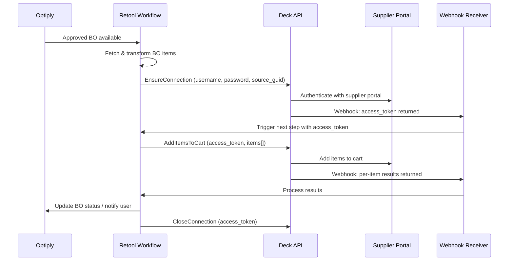

# Deck x Optiply: Supplier Portal Automation - Context & Implementation Plan

# Deck x Optiply: Supplier Portal Automation

## 📋 Context for New Traycer Task

This document provides full context for the Deck supplier portal automation project. It is intended to be the **single source of truth** for any new Traycer task, Epic, or execution agent working on this initiative.

**Parent Epic:** epic:1984c48c-49c6-4764-ba8d-45fcab477126 (Agentic Layer Roadmap for Optiply's Product Growth)

**Related Specs:**

- spec:1984c48c-49c6-4764-ba8d-45fcab477126/7e4a929e-6afb-4a99-8900-1a862f434b14 (Epic Brief)
- spec:1984c48c-49c6-4764-ba8d-45fcab477126/f739cd2a-c4a1-40e6-a498-0e6df3c4ac5e (Core Flows)
- Full Deck API docs: file:product-growth-plan/deck-optiply-integration-doc.md

---

## 🎯 Problem Statement

When Optiply generates a **Buy Order (BO)** for a customer:

1. Customer reviews and approves the BO in Optiply ✅
2. BO syncs to customer's ERP ✅
3. **Customer must MANUALLY log into supplier portal and re-enter the same order** ❌

This double data entry is the core pain point. The Deck partnership eliminates step 3 by automating supplier portal interaction using browser automation + AI.

**Current Status:**

- ✅ Contract with Deck signed (February 2026)
- ✅ Kick-off meeting completed
- 🚀 Pilot testing starting now (adding products to supplier portal cart)
- 🎯 Pilot customer: being recruited via Joren (Customer Success)

---

## 🏗️ System Architecture



---

## 🔌 Deck API Reference

**Base URLs:**

- Sandbox: `https://sandbox.deck.co/api/v1/jobs/submit`
- Live: `https://live.deck.co/api/v1/jobs/submit`

**Authentication Headers (use environment variables - never hardcode):**

- `x-deck-client-id`: Store as `DECK_CLIENT_ID` env var
- `x-deck-secret`: Store as `DECK_SECRET` env var

### Job 1: EnsureConnection

**Purpose:** Authenticate with supplier portal, obtain access token

**Input:**

```
username, password, source_guid (supplier portal identifier)
```

**Webhook Response (success):**

```
webhook_code: "EnsureConnection"
output.access_token: "access-production-xxxx"
```

**Webhook Response (error):**

```
webhook_code: "Error"
error.error_code: "INVALID_CREDENTIALS" | "ACTIVE_CONNECTION_EXISTS"
```

**Webhook Response (MFA required):**

```
webhook_code: "MfaRequired"
question: "Enter your MFA code"
→ Must call /api/v1/jobs/mfa/answer with job_guid + answer
```

**⚠️ Important:** If a connection is already active, returns 400 `ACTIVE_CONNECTION_EXISTS`. Must check for this and reuse existing token or close first.

---

### Job 2: AddItemsToCart

**Purpose:** Add BO line items to supplier portal cart

**Input:**

```
access_token (from EnsureConnection webhook)
items[]: { sku, quantity, expected_price (with currency symbol e.g. "€34.22") }
```

**Webhook Response (success):**

```
webhook_code: "AddItemsToCart"
output.items[]: {
  sku, 
  status: "In stock" | "Out of stock" | "Product not found",
  price,
  price_is: "As expected" | "Lower than expected" | "Higher than expected",
  added_to_cart: true | false
}
```

**Key data to capture:**

- Items not added (out of stock, not found) → flag in Optiply
- Price discrepancies → alert user for review
- Partial success → show summary to user

---

### Job 3: CloseConnection

**Purpose:** End session with supplier portal

**Input:** `access_token`

**Response:** No webhook returned. Always call this after AddItemsToCart completes.

---

## 🔄 Retool Implementation Plan

### Why Retool?

- Quick to build without full engineering sprint
- Supports REST API calls natively
- Has **Workflow** feature with webhook triggers (gives you a URL for Deck)
- Can connect to Optiply's database/API directly
- Good for internal pilot tooling before productionizing

---

### How to Get Your Webhook URL in Retool

**This is the URL you give to Deck so they can send webhook responses back to you.**

**Steps:**

1. In Retool, go to **Workflows** (left sidebar)
2. Click **"New Workflow"**
3. In the workflow editor, click the **trigger block** (top of the flow)
4. Select **"Webhook"** as the trigger type
5. Retool will generate a unique URL like:
  ```
   https://api.retool.com/v1/workflows/[workflow-id]/startTrigger?workflowApiKey=[key]
  ```
6. **Copy this URL** and provide it to Deck as your webhook endpoint
7. Deck will POST all webhook responses (EnsureConnection, AddItemsToCart, errors) to this URL

> 💡 **Tip:** Create **one webhook workflow** that handles all webhook types by checking `webhook_code` in the payload. This keeps things simple.

---

### Retool Workflow Architecture

You need **2 Retool Workflows**:

#### Workflow A: "Deck - Submit Order" (Manual or Scheduled Trigger)

This is triggered by a user clicking a button in a Retool App, or on a schedule.

**Steps:**

1. **Fetch approved BOs** from Optiply API (filter: status = approved, not yet sent to supplier)
2. **Transform items** to Deck format:
  - Map Optiply SKU → Deck SKU
  - Map quantity
  - Format expected_price with currency symbol (e.g., `"€34.22"`)
3. **Check for active connection** (optional: query your state store)
4. **Call EnsureConnection** via Deck API
5. **Store job_guid** in Retool DB or query state (to correlate with incoming webhook)
6. **Wait** - the rest happens in Workflow B when webhook arrives

#### Workflow B: "Deck - Webhook Receiver" (Webhook Trigger)

This is the URL you give to Deck. It receives all webhook responses.

**Steps:**

1. **Receive webhook payload** from Deck
2. **Check `webhook_code`:**
  - `"EnsureConnection"` → extract `access_token`, call AddItemsToCart
  - `"AddItemsToCart"` → process results, update Optiply, call CloseConnection
  - `"MfaRequired"` → send alert to user (Slack/email) with MFA prompt
  - `"Error"` → log error, notify user, attempt recovery
3. **Update BO status** in Optiply based on results
4. **Notify user** (Slack message or Retool notification) with summary

---

### Retool App UI (for Pilot)

Build a simple Retool App with:

```wireframe
<!DOCTYPE html>
<html>
<head>
<style>
  body { font-family: sans-serif; margin: 0; background: #f5f5f5; }
  .header { background: #1a1a2e; color: white; padding: 16px 24px; display: flex; align-items: center; gap: 12px; }
  .header h1 { margin: 0; font-size: 18px; }
  .badge { background: #4CAF50; color: white; padding: 3px 10px; border-radius: 12px; font-size: 12px; }
  .container { padding: 24px; max-width: 1100px; margin: 0 auto; }
  .card { background: white; border-radius: 8px; padding: 20px; margin-bottom: 20px; box-shadow: 0 1px 4px rgba(0,0,0,0.08); }
  .card h2 { margin: 0 0 16px; font-size: 15px; color: #333; border-bottom: 1px solid #eee; padding-bottom: 10px; }
  table { width: 100%; border-collapse: collapse; font-size: 13px; }
  th { background: #f8f8f8; text-align: left; padding: 8px 12px; color: #666; font-weight: 600; border-bottom: 2px solid #eee; }
  td { padding: 8px 12px; border-bottom: 1px solid #f0f0f0; }
  .status-approved { background: #e8f5e9; color: #2e7d32; padding: 2px 8px; border-radius: 10px; font-size: 11px; font-weight: 600; }
  .status-sent { background: #e3f2fd; color: #1565c0; padding: 2px 8px; border-radius: 10px; font-size: 11px; font-weight: 600; }
  .status-error { background: #fce4ec; color: #c62828; padding: 2px 8px; border-radius: 10px; font-size: 11px; font-weight: 600; }
  .btn { padding: 8px 16px; border: none; border-radius: 6px; cursor: pointer; font-size: 13px; font-weight: 600; }
  .btn-primary { background: #1a1a2e; color: white; }
  .btn-secondary { background: #f0f0f0; color: #333; }
  .btn-sm { padding: 4px 10px; font-size: 12px; }
  .row { display: flex; gap: 16px; }
  .col { flex: 1; }
  .metric { text-align: center; padding: 12px; }
  .metric .value { font-size: 28px; font-weight: 700; color: #1a1a2e; }
  .metric .label { font-size: 12px; color: #888; margin-top: 4px; }
  .alert { background: #fff8e1; border-left: 4px solid #ffc107; padding: 10px 14px; border-radius: 4px; font-size: 13px; margin-bottom: 16px; }
  .checkbox { width: 14px; height: 14px; }
  .actions { display: flex; gap: 8px; justify-content: flex-end; margin-top: 16px; }
</style>
</head>
<body>
  <div class="header">
    <h1>🛒 Deck Supplier Portal Automation</h1>
    <span class="badge">Pilot</span>
  </div>
  <div class="container">
    <div class="alert">⚠️ Pilot mode: 1 customer active. Review items before submitting to supplier portal.</div>
    <div class="row">
      <div class="col card">
        <div class="metric"><div class="value">3</div><div class="label">Approved BOs Ready</div></div>
      </div>
      <div class="col card">
        <div class="metric"><div class="value">12</div><div class="label">Items to Submit</div></div>
      </div>
      <div class="col card">
        <div class="metric"><div class="value">2</div><div class="label">Sent Today</div></div>
      </div>
      <div class="col card">
        <div class="metric"><div class="value">1</div><div class="label">Needs Review</div></div>
      </div>
    </div>
    <div class="card">
      <h2>📦 Approved Buy Orders - Ready to Send</h2>
      <table>
        <thead>
          <tr>
            <th><input type="checkbox" class="checkbox"></th>
            <th>BO Reference</th>
            <th>Supplier</th>
            <th>Customer</th>
            <th>Items</th>
            <th>Total Value</th>
            <th>Status</th>
            <th>Action</th>
          </tr>
        </thead>
        <tbody>
          <tr>
            <td><input type="checkbox" class="checkbox" checked></td>
            <td>BO-2026-0142</td>
            <td>Supplier A</td>
            <td>Pilot Customer</td>
            <td>4 items</td>
            <td>€1,240.00</td>
            <td><span class="status-approved">Approved</span></td>
            <td><button class="btn btn-secondary btn-sm">View</button></td>
          </tr>
          <tr>
            <td><input type="checkbox" class="checkbox" checked></td>
            <td>BO-2026-0143</td>
            <td>Supplier A</td>
            <td>Pilot Customer</td>
            <td>8 items</td>
            <td>€3,890.00</td>
            <td><span class="status-approved">Approved</span></td>
            <td><button class="btn btn-secondary btn-sm">View</button></td>
          </tr>
          <tr>
            <td><input type="checkbox" class="checkbox"></td>
            <td>BO-2026-0139</td>
            <td>Supplier B</td>
            <td>Pilot Customer</td>
            <td>3 items</td>
            <td>€670.00</td>
            <td><span class="status-sent">Sent</span></td>
            <td><button class="btn btn-secondary btn-sm">View</button></td>
          </tr>
        </tbody>
      </table>
      <div class="actions">
        <button class="btn btn-secondary">Refresh</button>
        <button class="btn btn-primary">🚀 Send Selected to Supplier Portal</button>
      </div>
    </div>
    <div class="card">
      <h2>📊 Last Run Results</h2>
      <table>
        <thead>
          <tr>
            <th>SKU</th>
            <th>Item</th>
            <th>Qty</th>
            <th>Expected Price</th>
            <th>Actual Price</th>
            <th>Stock Status</th>
            <th>Added to Cart</th>
          </tr>
        </thead>
        <tbody>
          <tr>
            <td>11530</td>
            <td>Product A</td>
            <td>2</td>
            <td>€34.22</td>
            <td>€34.22</td>
            <td>✅ In stock</td>
            <td>✅ Yes</td>
          </tr>
          <tr>
            <td>11531</td>
            <td>Product B</td>
            <td>5</td>
            <td>€12.00</td>
            <td>€14.50</td>
            <td>✅ In stock</td>
            <td>⚠️ Price higher</td>
          </tr>
          <tr>
            <td>11532</td>
            <td>Product C</td>
            <td>1</td>
            <td>€89.00</td>
            <td>-</td>
            <td>❌ Out of stock</td>
            <td>❌ No</td>
          </tr>
        </tbody>
      </table>
    </div>
  </div>
</body>
</html>
```

---

## 📊 Data Transformation: Optiply BO → Deck Format

When fetching BOs from Optiply, transform each line item:


| Optiply Field                           | Deck Field       | Notes                                          |
| --------------------------------------- | ---------------- | ---------------------------------------------- |
| `product.sku` or `product.supplier_sku` | `sku`            | Use supplier-specific SKU                      |
| `line_item.quantity`                    | `quantity`       | Integer                                        |
| `line_item.unit_price`                  | `expected_price` | Format as `"€34.22"` (include currency symbol) |


**Key questions to validate with pilot customer:**

- Which SKU does the supplier portal use? (internal SKU vs. supplier SKU)
- Is the expected_price the purchase price or retail price?
- Does the supplier portal require a minimum order quantity?

---

## 🚦 Error Handling & Edge Cases


| Scenario                   | Handling                                                             |
| -------------------------- | -------------------------------------------------------------------- |
| `ACTIVE_CONNECTION_EXISTS` | Check if token is still valid, reuse or call CloseConnection first   |
| `INVALID_CREDENTIALS`      | Alert user, do not retry automatically                               |
| `MfaRequired`              | Pause flow, notify user via Slack/email, wait for MFA input          |
| Item out of stock          | Flag in Optiply, notify user, exclude from BO or suggest alternative |
| Price higher than expected | Show in results UI, let user decide to accept or reject              |
| Job already running (409)  | Wait and retry after delay, or surface to user                       |
| Partial success            | Mark BO as "partially sent", show which items failed                 |


---

## 🎯 Pilot Success Criteria

**Phase 1 (February-March 2026):**

- [ ] 1 pilot customer live with Deck integration
- [ ] End-to-end flow working: BO approved → items added to supplier cart
- [ ] User reviews results in Retool before confirming
- [ ] Error handling working (out of stock, price mismatch)

**Phase 2 (April-June 2026):**

- [ ] 3-5 pilot customers live
- [ ] 90% time reduction validated (20-30 min → 2-3 min per BO)
- [ ] Price discrepancy alerts working
- [ ] Integration productionized (moved from Retool to Optiply platform)

---

## 👥 Team & Contacts


| Role                       | Person          | Responsibility                      |
| -------------------------- | --------------- | ----------------------------------- |
| Product Growth Lead        | Reuben          | Overall initiative, customer pilots |
| CTO                        | Sander          | Technical oversight, main contact   |
| Customer Success (Upsells) | Joren           | Pilot customer recruitment          |
| Deck Partnership           | Deck team       | API support, sandbox access         |
| Pilot Customer             | TBD (via Joren) | First live test                     |


---

## 🔐 Credentials & Environment Setup

> ⚠️ **NEVER hardcode credentials.** Store all secrets as environment variables in Retool.

**Required Retool Environment Variables:**

- `DECK_CLIENT_ID` - Deck client ID
- `DECK_SECRET` - Deck secret key
- `DECK_SUPPLIER_USERNAME` - Supplier portal username (per customer)
- `DECK_SUPPLIER_PASSWORD` - Supplier portal password (per customer)
- `DECK_SOURCE_GUID` - Supplier portal source GUID (per supplier)
- `OPTIPLY_API_KEY` - Optiply API key for fetching BOs

**Environments:**

- Sandbox: `https://sandbox.deck.co` (for testing)
- Live: `https://live.deck.co` (for production)

---

## 📁 Related Files

- file:product-growth-plan/deck-optiply-integration-doc.md - Full Deck API documentation
- file:product-growth-plan/agentic-optiply.md - Agentic Layer Roadmap (parent context)
- product-growth-plan/00-roadmap-overview/management-presentation.md - Management presentation

&nbsp;