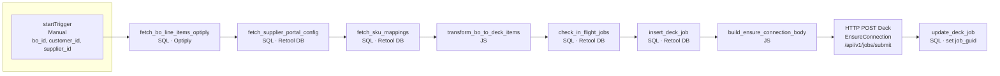

# Workflow A: deck-submit-order

**Purpose:** Start the Deck flow for one buy order: load BO lines, create a `deck_job` row, and call Deck’s **EnsureConnection** API. Deck will later call the webhook (Workflow B) with the access token, and Workflow B will call **AddItemsToCart** and **CloseConnection**.

**Trigger:** Manual — “Run from app” (or Run workflow with input).  
**Inputs:** `bo_id`, `customer_id`, `supplier_id` (from app table selection).

**Deck API called in this workflow:**  

- **EnsureConnection** only — `POST https://sandbox.deck.co/api/v1/jobs/submit` (or live) with `job_code: "EnsureConnection"`.  
- AddItemsToCart and CloseConnection are **not** called here; they are called in **Workflow B** when Deck sends the webhooks.

---

## Flowchart

---

## Block-by-block detail

### 1. startTrigger (Manual / Run from app)

| Property | Value                                                       |
| -------- | ----------------------------------------------------------- |
| Type     | Trigger — Manual or “Run workflow”                          |
| Output   | Run input object with `bo_id`, `customer_id`, `supplier_id` |

Define workflow input parameters: `bo_id` (string), `customer_id` (string), `supplier_id` (string). The app passes these when it runs the workflow (e.g. from the selected table row).

---

### 2. fetch_bo_line_items_optiply

| Property | Value                             |
| -------- | --------------------------------- |
| Type     | SQL query                         |
| Resource | Optiply Postgres                  |
| Script   | `fetch_bo_line_items_optiply.sql` |

**Bindings:**

| Parameter | Value                      |
| --------- | -------------------------- |
| `:bo_id`  | `{{ startTrigger.bo_id }}` |

**Returns:** Rows with `bo_id`, `line_id`, `product_id`, `quantity`, `unit_price`, `optiply_sku`, `supplier_sku`, `product_name`.  
**Connects to:** transform_bo_to_deck_items (and trigger feeds other blocks).

---

### 3. fetch_supplier_portal_config

| Property | Value                              |
| -------- | ---------------------------------- |
| Type     | SQL query                          |
| Resource | Retool DB                          |
| Script   | `fetch_supplier_portal_config.sql` |

**Bindings:**

| Parameter      | Value                            |
| -------------- | -------------------------------- |
| `:supplier_id` | `{{ startTrigger.supplier_id }}` |

**Returns:** One row (or array): `id`, `supplier_id`, `supplier_name`, `source_guid`, `is_active`.  
**Connects to:** build_ensure_connection_body (need `source_guid`).

---

### 4. fetch_sku_mappings

| Property | Value                    |
| -------- | ------------------------ |
| Type     | SQL query                |
| Resource | Retool DB                |
| Script   | `fetch_sku_mappings.sql` |

**Bindings:**

| Parameter      | Value                            |
| -------------- | -------------------------------- |
| `:supplier_id` | `{{ startTrigger.supplier_id }}` |

**Returns:** Rows: `supplier_id`, `optiply_sku`, `supplier_sku`.  
**Connects to:** transform_bo_to_deck_items.

---

### 5. transform_bo_to_deck_items

| Property | Value                           |
| -------- | ------------------------------- |
| Type     | JavaScript                      |
| Script   | `transform_bo_to_deck_items.js` |

**Inputs (query bindings):**

| Input            | Value                                    |
| ---------------- | ---------------------------------------- |
| `lineItems`      | `{{ fetch_bo_line_items_optiply.data }}` |
| `skuMappings`    | `{{ fetch_sku_mappings.data }}`          |
| `currencySymbol` | `"€"` (or from trigger)                  |

**Returns:** `{ items }` — array of `{ sku, quantity, expected_price }` for Deck.  
**Connects to:** insert_deck_job (pass `items`).

---

### 6. check_in_flight_jobs

| Property | Value                      |
| -------- | -------------------------- |
| Type     | SQL query                  |
| Resource | Retool DB                  |
| Script   | `check_in_flight_jobs.sql` |

**Bindings:**

| Parameter      | Value                            |
| -------------- | -------------------------------- |
| `:supplier_id` | `{{ startTrigger.supplier_id }}` |

**Returns:** Rows if this supplier already has a job in `connecting` or `adding_items`.  
**Logic:** If `.data` has length > 0, optionally **branch and stop** (e.g. show error “Supplier already in progress”); else continue to insert_deck_job.

---

### 7. insert_deck_job

| Property | Value                 |
| -------- | --------------------- |
| Type     | SQL query             |
| Resource | Retool DB             |
| Script   | `insert_deck_job.sql` |

**Bindings:**

| Parameter      | Value                                                |
| -------------- | ---------------------------------------------------- |
| `:supplier_id` | `{{ startTrigger.supplier_id }}`                     |
| `:customer_id` | `{{ startTrigger.customer_id }}`                     |
| `:bo_id`       | `{{ startTrigger.bo_id }}`                           |
| `:items`       | `{{ transform_bo_to_deck_items.data.items }}` (JSON) |

**Returns:** Inserted row; need `id` for the next update.  
**Connects to:** update_deck_job (need `id`), build_ensure_connection_body (needs `source_guid` from step 3).

---

### 8. build_ensure_connection_body

| Property | Value                             |
| -------- | --------------------------------- |
| Type     | JavaScript                        |
| Script   | `build_ensure_connection_body.js` |

**Inputs:**

| Input         | Value                                                                                               |
| ------------- | --------------------------------------------------------------------------------------------------- |
| `source_guid` | `{{ fetch_supplier_portal_config.data[0].source_guid }}` or `.data.source_guid` depending on shape |
| `username`    | From env / secrets, e.g. `{{ secrets.DECK_SUPPLIER_USERNAME }}`                                     |
| `password`    | From env / secrets, e.g. `{{ secrets.DECK_SUPPLIER_PASSWORD }}`                                     |

**Returns:** `{ body }` — object for Deck: `{ job_code: "EnsureConnection", input: { username, password, source_guid } }`.  
**Connects to:** HTTP POST Deck.

---

### 9. HTTP POST Deck — EnsureConnection

| Property | Value                                                                        |
| -------- | ---------------------------------------------------------------------------- |
| Type     | REST API / HTTP request                                                      |
| Method   | POST                                                                         |
| URL      | `https://sandbox.deck.co/api/v1/jobs/submit` (or `https://live.deck.co/...`) |

**Headers:**

| Header             | Value              |
| ------------------ | ------------------ |
| `x-deck-client-id` | Env / secret       |
| `x-deck-secret`    | Env / secret       |
| `Content-Type`     | `application/json` |

**Body:** `{{ build_ensure_connection_body.data.body }}`

**Response:** Deck returns a **job_guid** (and possibly 409 if another job is running). Save `response.body.job_guid` for the next block.  
**Deck then:** Sends a **webhook** to Workflow B with `webhook_code: "EnsureConnection"` and `output.access_token`. Workflow B will call the **AddItemsToCart** endpoint.

**Connects to:** update_deck_job.

---

### 10. update_deck_job (set job_guid)

| Property | Value                 |
| -------- | --------------------- |
| Type     | SQL query             |
| Resource | Retool DB             |
| Script   | `update_deck_job.sql` |

**Bindings:**

| Parameter   | Value                                                                            |
| ----------- | -------------------------------------------------------------------------------- |
| `:id`       | `{{ insert_deck_job.data.id }}` (or `.data[0].id`)                               |
| `:job_guid` | `{{ post_ensure_connection.body.job_guid }}` or whatever the HTTP block is named |

Leave `:access_token`, `:status`, `:results`, `:error_message` unbound so the query leaves them unchanged.

**Returns:** Updated row.  
**End of workflow.**

---

## Data flow summary

| Step | Block                        | Key output used later                                   |
| ---- | ---------------------------- | ------------------------------------------------------- |
| 1    | startTrigger                 | bo_id, customer_id, supplier_id                         |
| 2    | fetch_bo_line_items_optiply  | Line items for transform                                |
| 3    | fetch_supplier_portal_config | source_guid for EnsureConnection body                   |
| 4    | fetch_sku_mappings           | Mappings for transform                                  |
| 5    | transform_bo_to_deck_items   | items (for insert + later AddItemsToCart in Workflow B) |
| 6    | check_in_flight_jobs         | If rows → stop; else continue                           |
| 7    | insert_deck_job              | id, and job row with items stored                       |
| 8    | build_ensure_connection_body | body for POST                                           |
| 9    | HTTP POST EnsureConnection   | job_guid (Deck sends webhook → Workflow B)              |
| 10   | update_deck_job              | Persist job_guid so webhook can correlate               |

---

## Where AddItemsToCart is called

**Not in this workflow.** Workflow A only calls **EnsureConnection**.  
**AddItemsToCart** is called in **Workflow B** when Deck sends the EnsureConnection webhook; see **WORKFLOW_B_deck_webhook_receiver.md**.