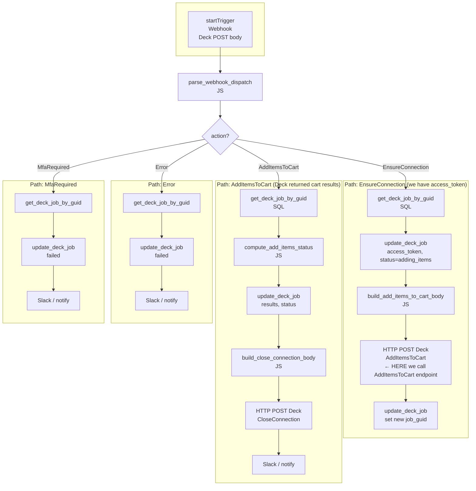

# Workflow B: deck-webhook-receiver

**Purpose:** Receive webhooks from Deck and drive the rest of the flow: when Deck says “connection ready” (EnsureConnection), call the **AddItemsToCart** endpoint; when Deck returns cart results (AddItemsToCart webhook), update the job and call **CloseConnection**.

**Trigger:** Webhook — Deck POSTs to this workflow’s URL.  
**Input:** Full webhook JSON body (`job_guid`, `webhook_code`, `output` or `error`).

---

## How the webhook “queue” works: one POST = one run

Deck does **not** send a single request with a queue of events. It sends **one HTTP POST per event**. Each POST **triggers a new run** of this workflow.

So the workflow **is triggered over and over again** — once per webhook:

| Order | What Deck sends | Workflow run | Branch taken |
|-------|------------------|--------------|--------------|
| 1st | EnsureConnection (with `access_token`) | **Run 1** | EnsureConnection → we save token, call AddItemsToCart API, update job_guid → run ends |
| 2nd | AddItemsToCart (with per-item results) | **Run 2** (new run) | AddItemsToCart → we save results, call CloseConnection, notify → run ends |

There is no in-memory queue inside the workflow. Each run is **stateless**: it receives one body, parses it, branches, and does one path. The only shared state is the **database** (`deck_jobs`): Run 1 writes `access_token` and `job_guid`; Run 2 reads that row by `job_guid` to get the token for CloseConnection and to store results.

**If multiple webhooks arrive close together:** Retool may run multiple instances of the workflow in parallel (one per POST). That’s fine because each run is keyed by `job_guid` and updates different columns or the same row in a safe order (EnsureConnection run updates one row; AddItemsToCart run updates the same row by a different `job_guid` after we’ve stored the AddItemsToCart job_guid). Deck’s normal sequence is: first EnsureConnection, later AddItemsToCart, so we don’t rely on an internal queue — we rely on **one webhook at a time** and the **DB as the only shared state**.

---

**Deck APIs called in this workflow:**

1. **AddItemsToCart** — called in the **EnsureConnection** branch (after we receive the access token).  
   - **Where:** Block “HTTP POST Deck — AddItemsToCart” (E4 in the flowchart).  
   - **Endpoint:** `POST https://sandbox.deck.co/api/v1/jobs/submit` (or live) with `job_code: "AddItemsToCart"` and `input: { access_token, items }`.

2. **CloseConnection** — called in the **AddItemsToCart** branch (after we store results).  
   - **Where:** Block “HTTP POST Deck — CloseConnection” (A5).  
   - **Endpoint:** Same base URL, `job_code: "CloseConnection"`, `input: { access_token }`.

---

## Flowchart

---

## Where each Deck endpoint is called

| Deck job / endpoint | Called in which branch | Block name / step |
|---------------------|------------------------|--------------------|
| **AddItemsToCart**  | **EnsureConnection**   | **HTTP POST Deck — AddItemsToCart** (E4). After we get `access_token` from the webhook and load the job’s `items`, we POST to Deck with `job_code: "AddItemsToCart"`. |
| **CloseConnection** | **AddItemsToCart**     | **HTTP POST Deck — CloseConnection** (A5). After we store `results` and `status`, we close the session with the token from the job row. |
| EnsureConnection    | —                      | Not called here; it’s called in **Workflow A**. This workflow only **receives** the EnsureConnection webhook and then calls AddItemsToCart. |

---

## Block-by-block detail

### 1. startTrigger (Webhook)

| Property | Value |
|----------|--------|
| Type | Webhook trigger |
| Output | Request body — use `startTrigger.body` or `startTrigger.data` (depending on how Retool exposes the webhook payload) |

Deck sends JSON like:

- EnsureConnection success: `{ job_guid, webhook_code: "EnsureConnection", output: { access_token } }`
- AddItemsToCart result: `{ job_guid, webhook_code: "AddItemsToCart", output: { items: [...] } }`
- Error: `{ job_guid, webhook_code: "Error", error: { error_code, error_message } }`
- MfaRequired: `{ job_guid, webhook_code: "MfaRequired" }`

**Connects to:** parse_webhook_dispatch.

---

### 2. parse_webhook_dispatch

| Property | Value |
|----------|--------|
| Type | JavaScript |
| Script | `parse_webhook_dispatch.js` |

**Input:**

| Input | Value |
|-------|--------|
| `webhookPayload` | `{{ startTrigger.body }}` or `{{ startTrigger.data }}` |

**Returns:** `{ webhook_code, job_guid, action, access_token, output, error }`.  
`action` is one of: `EnsureConnection`, `AddItemsToCart`, `Error`, `MfaRequired`, `Unknown`.

**Connects to:** Branch block.

---

### 3. Branch (Condition)

| Property | Value |
|----------|--------|
| Type | Branch / Condition |
| Condition | `{{ parse_webhook_dispatch.data.action }}` (or check `webhook_code`) |

**Outgoing edges:**

- `EnsureConnection` → get_deck_job_by_guid (EnsureConnection path)
- `AddItemsToCart` → get_deck_job_by_guid (AddItemsToCart path)
- `Error` → get_deck_job_by_guid (Error path)
- `MfaRequired` → get_deck_job_by_guid (MfaRequired path)

---

## Path: EnsureConnection (then call AddItemsToCart)

When Deck confirms the connection, we look up our job, save the token, build the AddItemsToCart request, and **call the AddItemsToCart endpoint**.

### E1. get_deck_job_by_guid

| Property | Value |
|----------|--------|
| Type | SQL query |
| Resource | Retool DB |
| Script | `get_deck_job_by_guid.sql` |

**Bindings:**

| Parameter | Value |
|-----------|--------|
| `:job_guid` | `{{ parse_webhook_dispatch.data.job_guid }}` |

**Returns:** One row: `id`, `job_guid`, `supplier_id`, `customer_id`, `bo_id`, `items`, `access_token`, `status`, etc. We need `id`, `items` (and later will set `access_token`).

**Connects to:** E2, E3.

---

### E2. update_deck_job (store access_token, status = adding_items)

| Property | Value |
|----------|--------|
| Type | SQL query |
| Resource | Retool DB |
| Script | `update_deck_job.sql` |

**Bindings:**

| Parameter | Value |
|-----------|--------|
| `:id` | `{{ get_deck_job_by_guid.data.id }}` (or `.data[0].id`) |
| `:access_token` | `{{ parse_webhook_dispatch.data.access_token }}` |
| `:status` | `'adding_items'` |

**Connects to:** E3.

---

### E3. build_add_items_to_cart_body

| Property | Value |
|----------|--------|
| Type | JavaScript |
| Script | `build_add_items_to_cart_body.js` |

**Inputs:**

| Input | Value |
|-------|--------|
| `access_token` | `{{ parse_webhook_dispatch.data.access_token }}` |
| `items` | `{{ get_deck_job_by_guid.data.items }}` (the array we stored in Workflow A) |

**Returns:** `{ body }` — `{ job_code: "AddItemsToCart", input: { access_token, items } }`.

**Connects to:** E4.

---

### E4. HTTP POST Deck — AddItemsToCart (call AddItemsToCart endpoint)

| Property | Value |
|----------|--------|
| Type | REST API / HTTP request |
| Method | POST |
| URL | `https://sandbox.deck.co/api/v1/jobs/submit` (or live) |

**Headers:** `x-deck-client-id`, `x-deck-secret`, `Content-Type: application/json`.

**Body:** `{{ build_add_items_to_cart_body.data.body }}`

**Response:** Deck returns a **new job_guid** for this AddItemsToCart job. Deck will later POST the **AddItemsToCart webhook** (per-item results) to this same workflow; that webhook will have this new `job_guid`. We must store it on our row so we can correlate, or we look up by the **original** job’s id when we receive the AddItemsToCart webhook (the webhook’s job_guid will be the AddItemsToCart one; we may need to store a mapping or store the AddItemsToCart job_guid on the same row — see tech plan: “update deck_job with new job_guid”).

**Connects to:** E5.

---

### E5. update_deck_job (set new job_guid for AddItemsToCart)

| Property | Value |
|----------|--------|
| Type | SQL query |
| Resource | Retool DB |
| Script | `update_deck_job.sql` |

**Bindings:**

| Parameter | Value |
|-----------|--------|
| `:id` | Same job row id (E1) |
| `:job_guid` | `{{ post_add_items_to_cart.body.job_guid }}` (name of the HTTP block in E4) |

So the next webhook (AddItemsToCart result) will have this `job_guid`. When we receive it, we look up by this `job_guid` — but that would return the row we just updated. So we need to be able to find the **same logical job** when the AddItemsToCart webhook arrives. Options: (a) Store the AddItemsToCart job_guid in a column and when we get the webhook, look up by that job_guid (then we’d need a way to find our row — e.g. we store add_items_job_guid on the row), or (b) Look up by job_guid in get_deck_job_by_guid; when the AddItemsToCart webhook comes, its job_guid is the one we stored in E5. So the row’s job_guid becomes the AddItemsToCart job’s guid; get_deck_job_by_guid(job_guid from webhook) will find that row. Good.

**End of EnsureConnection path.**

---

## Path: AddItemsToCart (then call CloseConnection)

When Deck sends the webhook with the cart results, we update the job, then call **CloseConnection**.

### A1. get_deck_job_by_guid

| Property | Value |
|----------|--------|
| Same as E1; use **job_guid from the AddItemsToCart webhook** (the one we stored in E5). |

**Bindings:** `:job_guid` ← `{{ parse_webhook_dispatch.data.job_guid }}` (this is the webhook’s job_guid, which is the AddItemsToCart job we stored).

**Returns:** Row with `access_token` (for CloseConnection), `id`, etc.

---

### A2. compute_add_items_status

| Property | Value |
|----------|--------|
| Type | JavaScript |
| Script | `compute_add_items_status.js` |

**Input:**

| Input | Value |
|-------|--------|
| `addItemsOutput` | `{{ parse_webhook_dispatch.data.output }}` (the `output` from the AddItemsToCart webhook) |

**Returns:** `{ status, failedCount, priceMismatchCount }` — `status` is `'completed'` or `'needs_review'`.

**Connects to:** A3.

---

### A3. update_deck_job (results + status)

| Property | Value |
|----------|--------|
| Bindings: `:id` from A1, `:results` = full webhook output (parse_webhook_dispatch.data.output or trigger body), `:status` = A2.data.status. |

**Connects to:** A4.

---

### A4. build_close_connection_body

| Property | Value |
|----------|--------|
| Type | JavaScript |
| Script | `build_close_connection_body.js` |

**Input:** `access_token` ← `{{ get_deck_job_by_guid.data.access_token }}` (from the row we loaded in A1).

**Returns:** `{ body }` — `{ job_code: "CloseConnection", input: { access_token } }`.

**Connects to:** A5.

---

### A5. HTTP POST Deck — CloseConnection

| Property | Value |
|----------|--------|
| Type | REST API |
| Method | POST |
| URL | Same `/api/v1/jobs/submit` |
| Body | `{{ build_close_connection_body.data.body }}` |

Deck does not send a webhook back for CloseConnection.

**Connects to:** A6 (optional Slack).

---

### A6. Slack / notify

Optional: send a summary (items added, failed, price mismatches) to Slack.

---

## Path: Error

- **Err1:** get_deck_job_by_guid by `parse_webhook_dispatch.data.job_guid`.  
- **Err2:** update_deck_job — `status = 'failed'`, `error_message` = `parse_webhook_dispatch.data.error.error_message`.  
- **Err3:** Slack / notify.

---

## Path: MfaRequired

- **Mfa1:** get_deck_job_by_guid.  
- **Mfa2:** update_deck_job — `status = 'failed'`, `error_message` = `'MFA required - not supported in pilot'`.  
- **Mfa3:** Slack / notify.

---

## Data flow summary

| Branch | Key blocks | Deck API called |
|--------|------------|------------------|
| EnsureConnection | Parse → get job → update (token) → build AddItems body → **HTTP AddItemsToCart** → update job_guid | **AddItemsToCart** (E4) |
| AddItemsToCart | Parse → get job → compute status → update (results) → build Close body → **HTTP CloseConnection** → notify | **CloseConnection** (A5) |
| Error / MfaRequired | get job → update failed → notify | None |
