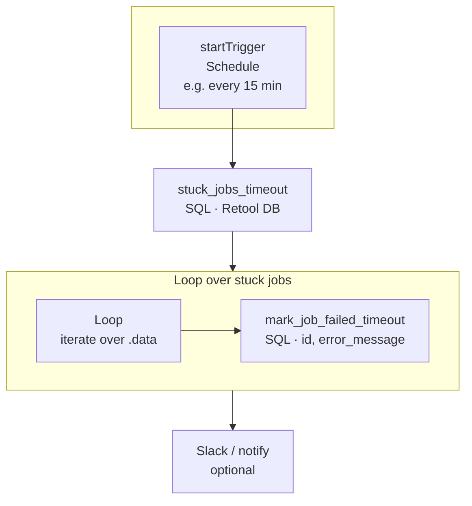

# Workflow C: deck-job-timeout-check

**Purpose:** Find `deck_jobs` that have been stuck in `connecting` or `adding_items` for more than 10 minutes (e.g. webhook never arrived or Deck failed), mark them as `failed`, and optionally notify (e.g. Slack).

**Trigger:** Schedule (e.g. every 15 minutes).  
**Deck API called:** None. This workflow only reads and updates the Retool DB.

---

## Flowchart

Linear start, then a **loop** over the query result; inside the loop, one update per row; after the loop, optional Slack.

---

## Block-by-block detail

### 1. startTrigger (Schedule)

| Property | Value |
|----------|--------|
| Type | Schedule trigger |
| Example | Every 15 minutes (cron or interval) |

No input parameters.  
**Connects to:** stuck_jobs_timeout.

---

### 2. stuck_jobs_timeout

| Property | Value |
|----------|--------|
| Type | SQL query |
| Resource | Retool DB |
| Script | `stuck_jobs_timeout.sql` |

**Query (concept):** Select from `deck_jobs` where `status IN ('connecting', 'adding_items')` and `updated_at < now() - interval '10 minutes'`.

**Bindings:** None (or add a parameter for the timeout interval if you want it configurable).

**Returns:** Array of rows; each row has at least `id`, `job_guid`, `supplier_id`, `status`, `updated_at`.

**Connects to:** Loop block (iterate over this query’s `.data`).

---

### 3. Loop (over stuck jobs)

| Property | Value |
|----------|--------|
| Type | Loop |
| Iterate over | `{{ stuck_jobs_timeout.data }}` |

Each iteration exposes one element (e.g. `loop1.currentRow` or your loop block’s current item) with `id`, `job_guid`, etc.

**Connects to:** mark_job_failed_timeout (inside loop), then after loop to Slack.

---

### 4. mark_job_failed_timeout (inside loop)

| Property | Value |
|----------|--------|
| Type | SQL query |
| Resource | Retool DB |
| Script | `mark_job_failed_timeout.sql` |

**Bindings:**

| Parameter | Value |
|-----------|--------|
| `:id` | `{{ loop.currentRow.id }}` (or whatever the loop block exposes for the current row) |
| `:error_message` | `'Timeout: no webhook received'` |

**Returns:** Updated row (optional).  
Runs once per stuck job.

**Connects to:** (next iteration or exit loop) → then Slack.

---

### 5. Slack / notify (after loop)

| Property | Value |
|----------|--------|
| Type | Slack / HTTP / notification |
| When | After the loop completes |

**Payload (example):** List of timed-out job ids, e.g. `{{ stuck_jobs_timeout.data.map(r => r.id) }}` or a summary message.  
Optional; can be omitted in pilot.

---

## Data flow summary

| Step | Block | Output / purpose |
|------|--------|-------------------|
| 1 | startTrigger | Fires on schedule |
| 2 | stuck_jobs_timeout | Rows: jobs stuck > 10 min |
| 3 | Loop | One iteration per row |
| 4 | mark_job_failed_timeout | Set status = failed, error_message |
| 5 | Slack | Notify with list of failed job ids |

---

## No Deck API calls

This workflow does **not** call any Deck endpoint. It only:

- Reads from Retool DB (`deck_jobs`).
- Writes to Retool DB (`update deck_jobs set status = 'failed', error_message = ...`).
- Optionally sends a notification.

All Deck API calls (EnsureConnection, **AddItemsToCart**, CloseConnection) are in **Workflow A** and **Workflow B** only.
