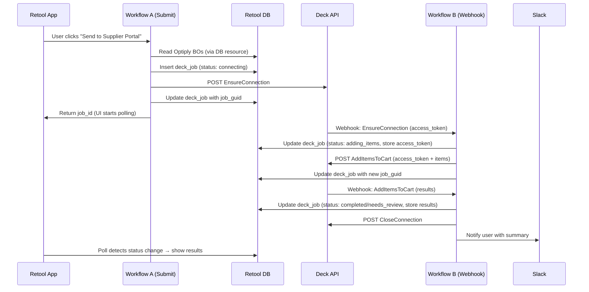
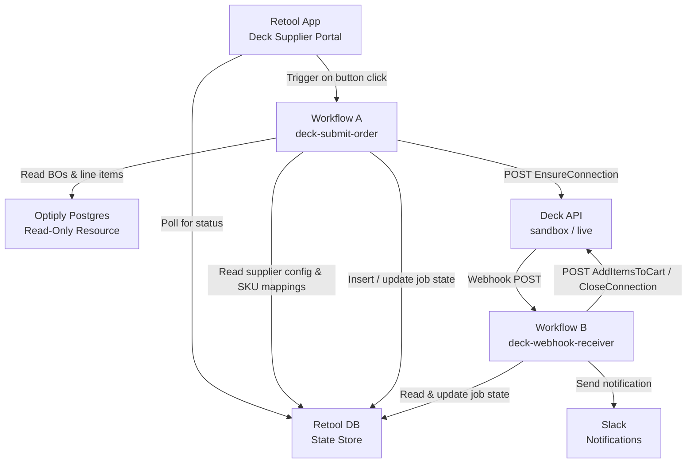

# Tech Plan: Deck x Optiply Retool Workflow Architecture

# Tech Plan: Deck x Optiply Retool Workflow Architecture

**Context:** spec:1984c48c-49c6-4764-ba8d-45fcab477126/19b44f75-004f-45d0-a8ba-d18855fadf6a  
**Deck API Docs:** file:product-growth-plan/deck-optiply-integration-doc.md

---

## 1. Architectural Approach

### Core Pattern: Event-Driven State Machine

Deck's API is fundamentally **async and webhook-driven** — jobs are submitted and results arrive later via webhook. This means the integration cannot be a simple request-response. Instead, it is designed as an **event-driven state machine** where Retool DB acts as the shared state store between two separate workflow executions.



### Key Architectural Decisions


| Decision            | Choice                                    | Rationale                                                                  |
| ------------------- | ----------------------------------------- | -------------------------------------------------------------------------- |
| Optiply data access | Direct Postgres connection                | Fast for pilot, no API overhead                                            |
| State store         | Retool DB                                 | Simple, built-in, no external dependencies                                 |
| Credentials         | Retool env vars                           | 1 pilot customer, keep it simple                                           |
| Webhook handler     | Single Workflow B for all webhook types   | Deck sends all webhooks to one URL; branch on `webhook_code`               |
| Multi-supplier      | `supplier_portal_config` table from day 1 | Multiple portals required; `source_guid` must be configurable per supplier |
| Notifications       | Retool App polling + Slack                | User notified in-app and async                                             |
| MFA                 | Not supported in pilot                    | Ensure pilot supplier portal has no MFA                                    |


### Critical Constraint: Multi-Supplier from Day 1

A batch of BOs may span multiple suppliers. Each supplier has its own Deck `source_guid` (portal identifier) and its own SKU format. This means:

- **One Deck job per supplier** — BOs are grouped by supplier before submission
- `**supplier_portal_config` table** must exist from day 1 (even with env var credentials)
- `**sku_mappings` table** maps Optiply internal SKUs to supplier-specific SKUs per supplier

### Failure Modes & Recovery


| Failure                    | Detection                                                                                   | Recovery                                                                     |
| -------------------------- | ------------------------------------------------------------------------------------------- | ---------------------------------------------------------------------------- |
| `ACTIVE_CONNECTION_EXISTS` | 400 response from EnsureConnection                                                          | Check for existing `connecting` jobs before submitting; reuse or close first |
| Webhook never arrives      | Scheduled cleanup workflow checks for jobs stuck in `connecting` or `adding_items` > 10 min | Mark as `failed`, send Slack alert                                           |
| Partial item success       | `added_to_cart: false` on any item in AddItemsToCart webhook                                | Status → `needs_review`, highlight failed items in UI                        |
| Deck API error             | `webhook_code: "Error"`                                                                     | Status → `failed`, store error message, Slack alert                          |
| Optiply DB unreachable     | Query fails in Workflow A                                                                   | Surface error to user in Retool App immediately                              |


---

## 2. Data Model

### Retool DB Tables

#### `deck_jobs` — State Machine

The central table tracking every Deck job through its lifecycle.

```
deck_jobs
─────────────────────────────────────────────────────
id              uuid          PRIMARY KEY
job_guid        string        Deck's job identifier (used to correlate webhooks)
supplier_id     string        Optiply supplier ID (which portal this job targets)
customer_id     string        Optiply customer ID
bo_ids          jsonb         Array of Optiply BO IDs included in this job
items           jsonb         Transformed items array (sku, quantity, expected_price)
access_token    string        From EnsureConnection webhook (used for AddItemsToCart)
status          string        Enum: pending | connecting | adding_items | completed | needs_review | failed
results         jsonb         Full AddItemsToCart webhook response (per-item results)
error_message   string        Error details if status = failed
created_at      timestamp
updated_at      timestamp
```

**Status transitions:**

```
pending → connecting → adding_items → completed
                                    → needs_review
                    → failed
         → failed
```

#### `supplier_portal_config` — Per-Supplier Deck Configuration

```
supplier_portal_config
─────────────────────────────────────────────────────
id              uuid          PRIMARY KEY
supplier_id     string        Optiply supplier ID (foreign key reference)
supplier_name   string        Human-readable name
source_guid     string        Deck's portal identifier (required for EnsureConnection)
is_active       boolean       Whether this supplier is enabled for Deck automation
created_at      timestamp
```

> **Note:** Credentials (`username`, `password`) are stored as Retool env vars for the pilot. In production, these move to a secure vault or Optiply's credential store.

#### `sku_mappings` — Optiply SKU → Supplier SKU

```
sku_mappings
─────────────────────────────────────────────────────
id              uuid          PRIMARY KEY
supplier_id     string        Which supplier this mapping applies to
optiply_sku     string        Internal Optiply SKU
supplier_sku    string        SKU as the supplier portal expects it
created_at      timestamp
```

### Optiply DB (Read-Only via Retool Resource)

Retool connects directly to Optiply's Postgres. The following tables are queried:


| Table             | Fields Used                                                | Purpose                     |
| ----------------- | ---------------------------------------------------------- | --------------------------- |
| `buy_orders`      | `id`, `status`, `supplier_id`, `customer_id`, `created_at` | Fetch approved BOs          |
| `buy_order_lines` | `buy_order_id`, `product_id`, `quantity`, `unit_price`     | Fetch line items per BO     |
| `products`        | `id`, `sku`, `supplier_sku`, `name`                        | Resolve SKUs and prices     |
| `suppliers`       | `id`, `name`                                               | Display supplier name in UI |


**Filter for approved BOs:**

- `buy_orders.status = 'approved'`
- `buy_orders.id NOT IN (SELECT unnest(bo_ids) FROM deck_jobs WHERE status NOT IN ('failed'))` — exclude BOs already in-flight or completed

---

## 3. Component Architecture

### Overview



---

### Component 1: Retool App — "Deck Supplier Portal"

**Purpose:** The user-facing interface for the pilot. Allows the analyst to select approved BOs, trigger submission to supplier portals, and review results.

**Panels:**

1. **Approved BOs Table** — queries Optiply DB directly for `status = approved` BOs not yet submitted. Grouped by supplier. Analyst selects which BOs to send.
2. **Submit Button** — triggers Workflow A with selected BO IDs and customer ID. Disabled while a job for the same supplier is in-flight.
3. **Job Status Panel** — polls `deck_jobs` table every 15 seconds. Shows status badge per job (`Connecting`, `Adding Items`, `Completed`, `Needs Review`, `Failed`).
4. **Results Panel** — when a job reaches `completed` or `needs_review`, shows per-item results: stock status, price comparison, added-to-cart flag. Highlights items needing attention.

---

### Component 2: Workflow A — `deck-submit-order`

**Trigger:** Manual (button click in Retool App)  
**Input:** `bo_ids[]`, `customer_id`

**Steps:**

1. **Fetch BO line items** — query Optiply DB: join `buy_order_lines` + `products` for the given `bo_ids`
2. **Group by supplier** — split items by `supplier_id` (one Deck job per supplier)
3. **For each supplier group:**
  a. **Look up `supplier_portal_config**` — get `source_guid`, check `is_active`  
   b. **Map SKUs** — query `sku_mappings` table; fall back to `products.supplier_sku` if no mapping exists  
   c. **Transform items** — format `expected_price` as `"€XX.XX"` (include currency symbol)  
   d. **Check for in-flight jobs** — query `deck_jobs` for existing `connecting` or `adding_items` jobs for this supplier; block if found  
   e. **Insert `deck_job**` — status: `connecting`, store `bo_ids`, `items`, `supplier_id`, `customer_id`  
   f. **Call Deck EnsureConnection** — POST to Deck API with `username` (env var), `password` (env var), `source_guid`  
   g. **Update `deck_job**` — store `job_guid` returned from Deck

**Output:** Array of `deck_job` IDs (one per supplier) for the UI to track

---

### Component 3: Workflow B — `deck-webhook-receiver`

**Trigger:** Webhook (URL provided to Deck — generated by Retool)  
**Input:** Deck webhook payload (`job_guid`, `webhook_code`, `output` or `error`)

**Steps:**

1. **Parse payload** — extract `job_guid`, `webhook_code`
2. **Look up `deck_job**` — query `deck_jobs` by `job_guid`
3. **Branch on `webhook_code`:**

**Branch: `EnsureConnection**`

- Extract `access_token` from `output`
- Update `deck_job`: `access_token = token`, `status = adding_items`
- Call Deck `AddItemsToCart` with `access_token` + stored `items`
- Update `deck_job` with new `job_guid` (AddItemsToCart creates a new job)

**Branch: `AddItemsToCart**`

- Extract per-item results from `output.items`
- Determine status: `completed` if all items added, `needs_review` if any `added_to_cart: false` or `price_is != "As expected"`
- Update `deck_job`: `results = output`, `status = completed | needs_review`
- Call Deck `CloseConnection` with stored `access_token`
- Send Slack notification with summary (items added, items failed, price discrepancies)

**Branch: `Error**`

- Update `deck_job`: `status = failed`, `error_message = error.error_message`
- Send Slack alert with error details and job context

**Branch: `MfaRequired**` *(not expected in pilot)*

- Update `deck_job`: `status = failed`, `error_message = "MFA required - not supported in pilot"`
- Send Slack alert

---

### Component 4: Scheduled Cleanup Workflow — `deck-job-timeout-check`

**Trigger:** Scheduled (every 15 minutes)  
**Purpose:** Detect jobs stuck in `connecting` or `adding_items` for more than 10 minutes (webhook never arrived)

**Steps:**

1. Query `deck_jobs` where `status IN ('connecting', 'adding_items')` AND `updated_at < now() - 10 minutes`
2. For each stuck job: update `status = failed`, `error_message = "Timeout: no webhook received"`
3. Send Slack alert per stuck job

---

### Component 5: Retool DB Resources

**Tables to create in Retool DB:**

- `deck_jobs` (state machine — see Data Model)
- `supplier_portal_config` (per-supplier Deck config)
- `sku_mappings` (SKU translation per supplier)

**Seed data for pilot:**

- Insert 1 row in `supplier_portal_config` with the pilot supplier's `source_guid`
- Insert SKU mappings for pilot supplier's product catalog

---

### Environment Variables (Retool)


| Variable                 | Value                          | Notes                                      |
| ------------------------ | ------------------------------ | ------------------------------------------ |
| `DECK_CLIENT_ID`         | `[from Deck]`                  | Shared across all suppliers                |
| `DECK_SECRET`            | `[from Deck]`                  | Shared across all suppliers                |
| `DECK_SUPPLIER_USERNAME` | `[pilot supplier login]`       | Pilot only — move to DB for multi-customer |
| `DECK_SUPPLIER_PASSWORD` | `[pilot supplier password]`    | Pilot only — move to DB for multi-customer |
| `SLACK_WEBHOOK_URL`      | `[Slack incoming webhook]`     | For notifications                          |
| `OPTIPLY_DB_CONNECTION`  | `[Postgres connection string]` | Configured as Retool Resource              |


> ⚠️ **Rotate credentials** shared in previous chat messages before configuring these env vars.

---

### Migration Path: Pilot → Production


| Concern       | Pilot Approach               | Production Approach                            |
| ------------- | ---------------------------- | ---------------------------------------------- |
| Credentials   | Retool env vars (1 customer) | Optiply credential vault, fetched per customer |
| Data access   | Direct Optiply DB            | Optiply REST API                               |
| State store   | Retool DB                    | Optiply DB (BO status visible natively)        |
| UI            | Retool App (internal)        | Native Optiply UI                              |
| Notifications | Slack                        | In-app Optiply notifications                   |
| MFA           | Not supported                | Retool App modal input                         |


&nbsp;