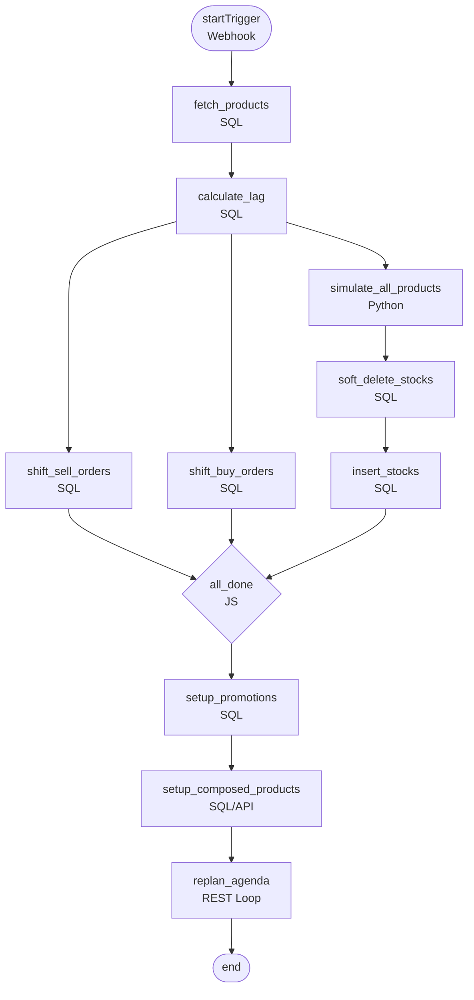
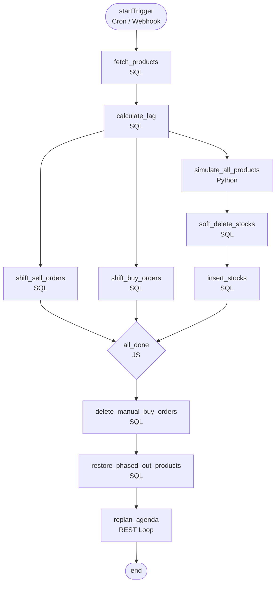

# Retool Workflow Builder Guide — Creator & Maintainer

## Purpose

This is your hands-on build guide. For every block in both Retool Workflows, it tells you: what type to create, what to name it, exactly what code/query/URL goes inside, and how to wire it to the next block. Follow it top-to-bottom in Retool.

---

## Workflow 1: Creator

**Trigger type:** Webhook (manual)
**Purpose:** Shift all existing order dates to end at today, regenerate stock history, set up promotions + composed products, replan agenda.

---

### Block connection map



> **Parallel fan-out after `calculate_lag`:** `simulate_all_products`, `shift_sell_orders`, and `shift_buy_orders` all start at the same time. `all_done` is a JS block that waits for all three branches to finish before proceeding.

---

### Block 1 — `startTrigger`

| Field | Value |
|---|---|
| Type | Webhook trigger |
| Name | `startTrigger` |

No code needed. Retool generates the webhook URL automatically. Optionally pass `{ "dry_run": true }` in the body to test without writing.

---

### Block 2 — `fetch_products`

| Field | Value |
|---|---|
| Type | SQL query |
| Name | `fetch_products` |
| Runs after | `startTrigger` |

```sql
SELECT
  wp.id            AS product_id,
  wp.uuid          AS product_uuid,
  wp.webshop_id,
  w.uuid           AS webshop_uuid,
  wp.name,
  wp.selling_price,
  wp.purchase_price,
  sp.supplier_id,
  s.uuid           AS supplier_uuid,
  sp.delivery_time
FROM webshop_products wp
JOIN webshops w ON w.id = wp.webshop_id
JOIN supplier_products sp ON sp.product_id = wp.id
JOIN suppliers s ON s.id = sp.supplier_id
WHERE wp.webshop_id = 1380
  AND wp.id IN (
    28666283, 28666284, 28666285, 28666286, 28666287,
    28666288, 28666289, 28666290, 28666291, 28666292,
    28666293, 28666294, 28666295, 28666296, 28666297,
    28666298, 28666299, 28666300, 28666301, 28666302,
    28666303, 28666304, 28666305, 28666306, 28666307,
    28666308, 28666309, 28666310, 28666311, 28666312,
    28666313, 28666314, 28666315, 28666316
  )
  AND wp.deleted_at IS NULL
```

**Output used by:** `simulate_all_products` (product list), `replan_agenda` (supplier_uuid list)

---

### Block 3 — `calculate_lag`

| Field | Value |
|---|---|
| Type | SQL query |
| Name | `calculate_lag` |
| Runs after | `fetch_products` |

```sql
SELECT (CURRENT_DATE - MAX(date)::date) AS lag_days
FROM stocks
WHERE webshop_id = 1380
  AND deleted_at IS NULL
```

**Output:** single row `{ lag_days: N }`. Reference as `{{ calculate_lag.data[0].lag_days }}` in downstream blocks.

> ⚠️ If `lag_days = 0`, all shift blocks are no-ops (safe). If `lag_days < 0`, add a JS guard block to skip shifts and log a warning.

---

### Block 4 — `simulate_all_products`

| Field | Value |
|---|---|
| Type | Python block |
| Name | `simulate_all_products` |
| Runs after | `calculate_lag` (in parallel with shifts) |

**Input:** `fetch_products.data` (list of product rows)

**Logic summary** (pure Python, no numpy/pandas):
- Loop over each product
- Parse archetype from product name: text inside `(...)` → e.g. `"Lipstick (Seasonal Summer)"` → `"Seasonal Summer"`
- Run 365-day daily simulation:
  - Apply demand curve for archetype (Stable, Seasonal, Trend, Stockout Prone, etc.)
  - Clamp stock to `max(0, stock)` every day — no negatives
  - ROP = `lead_time × avg_daily × 1.5` (safety buffer)
  - Seasonal: raise ROP to `× 2.5` starting 60 days before peak
  - Stockout Prone: cut ROP to `0.8 ×` in last 90 days (intentional stockouts)
- Output: list of stock rows

**Return value:**
```python
return {
  "stocks": [
    {
      "product_id": 28666307,
      "product_uuid": "0e006d66-...",
      "webshop_id": 1380,
      "webshop_uuid": "b6aba3eb-...",
      "on_hand": 91,
      "date": "2026-02-01 00:00:02"
    },
    ...  # ~11,680 rows total
  ]
}
```

**Output used by:** `soft_delete_stocks` → `insert_stocks`

---

### Block 5 — `shift_sell_orders`

| Field | Value |
|---|---|
| Type | SQL query |
| Name | `shift_sell_orders` |
| Runs after | `calculate_lag` (in parallel) |

```sql
UPDATE sell_orders
SET placed     = placed + ({{ calculate_lag.data[0].lag_days }} * INTERVAL '1 day'),
    updated_at = NOW()
WHERE webshop_id = 1380;

UPDATE sell_order_lines
SET placed     = placed + ({{ calculate_lag.data[0].lag_days }} * INTERVAL '1 day'),
    updated_at = NOW()
WHERE webshop_id = 1380;
```

---

### Block 6 — `shift_buy_orders`

| Field | Value |
|---|---|
| Type | SQL query |
| Name | `shift_buy_orders` |
| Runs after | `calculate_lag` (in parallel) |

```sql
UPDATE buy_orders
SET placed                 = placed + ({{ calculate_lag.data[0].lag_days }} * INTERVAL '1 day'),
    expected_delivery_date = expected_delivery_date + ({{ calculate_lag.data[0].lag_days }} * INTERVAL '1 day'),
    completed              = CASE
                               WHEN completed IS NOT NULL
                               THEN completed + ({{ calculate_lag.data[0].lag_days }} * INTERVAL '1 day')
                               ELSE NULL
                             END,
    updated_at             = NOW()
WHERE webshop_id = 1380;

UPDATE buy_order_lines
SET updated_at = NOW()
WHERE webshop_id = 1380;
```

---

### Block 7 — `soft_delete_stocks`

| Field | Value |
|---|---|
| Type | SQL query |
| Name | `soft_delete_stocks` |
| Runs after | `simulate_all_products` |

```sql
UPDATE stocks
SET deleted_at = NOW()
WHERE webshop_id = 1380
  AND deleted_at IS NULL;
```

---

### Block 8 — `insert_stocks`

| Field | Value |
|---|---|
| Type | SQL query |
| Name | `insert_stocks` |
| Runs after | `soft_delete_stocks` |

Build the INSERT dynamically in a JS block before this, or use Retool's bulk insert pattern. The SQL shape is:

```sql
INSERT INTO stocks
  (product_id, product_uuid, webshop_id, webshop_uuid, on_hand, date)
VALUES
  (28666307, '0e006d66-...', 1380, 'b6aba3eb-...', 91, '2026-02-01 00:00:02'),
  (28666307, '0e006d66-...', 1380, 'b6aba3eb-...', 88, '2026-01-31 00:00:02'),
  -- ... ~11,680 rows
```

> **Retool tip:** Use a JS block (`build_stocks_insert`) before this block to transform `simulate_all_products.data.stocks` into a single SQL string, then reference it in the SQL block as a raw query. Alternatively use `jsonb_to_recordset` with `build_stocks_insert.data.record_set` as in [retool-blocks/insert_stocks.sql](../retool-blocks/insert_stocks.sql).

---

### Blocks 8b–8e — BOs and receipt lines (API loops)

After the simulation runs, create buy orders and receipt lines (item deliveries) via the **Optiply Public API**, not SQL. Use one JS block to build request bodies from simulation output, then two **Retool Loop** blocks to POST them.

| Block | Type | Runs after | Purpose |
|-------|------|------------|--------|
| `build_buy_order_api_bodies` | JS | `simulate_stocks` | Build `buy_order_bodies` (JSON:API) and `item_deliveries_meta` from `simulate_stocks.data` |
| **Loop: POST buy orders** | Retool Loop | `build_buy_order_api_bodies` | POST each body to `https://api.optiply.com/v1/buyOrders?accountId=1380` |
| `build_receipt_line_bodies` | JS | Loop above | From Loop responses, extract `buyOrderLineId`; build `receipt_line_bodies` for receipt lines |
| **Loop: POST receipt lines** | Retool Loop | `build_receipt_line_bodies` | POST each body to `https://api.optiply.com/v1/receiptLines?accountId=1380` |

**API request shapes**

- **POST /v1/buyOrders?accountId=** — Header: `Content-Type: application/vnd.api+json`. Body (one buy order per request; lines in same body):
  ```json
  {
    "data": {
      "type": "buyOrders",
      "attributes": {
        "orderLines": [
          { "quantity": 1, "subtotalValue": 1, "productId": 5983558, "expectedDeliveryDate": "2023-07-29T03:04:29Z" }
        ],
        "placed": "2020-06-09T09:04:29Z",
        "expectedDeliveryDate": "2020-07-29T09:04:29Z",
        "totalValue": 31.08,
        "supplierId": 119092,
        "assembly": false
      }
    }
  }
  ```
- **POST /v1/receiptLines?accountId=** — Header: `Content-Type: application/vnd.api+json`. Body (one receipt line per request):
  ```json
  {
    "data": {
      "type": "receiptLines",
      "attributes": {
        "occurred": "2020-05-25T21:22:25Z",
        "quantity": 48,
        "buyOrderLineId": 40321894
      }
    }
  }
  ```

**Setup in Retool:** Copy [build_buy_order_api_bodies.js](../retool-blocks/build_buy_order_api_bodies.js) and [build_receipt_line_bodies.js](../retool-blocks/build_receipt_line_bodies.js). In `build_receipt_line_bodies`, set the variable that holds the **Loop block’s output** (e.g. `post_buy_orders_loop`) to the actual name of your “POST buy orders” Loop block so the script can read the array of responses and extract `buyOrderLineId` from each. If your API returns a different response shape, adjust `getBuyOrderLineIdFromResponse` in that block. Use a delay (e.g. 200 ms) between Loop iterations to respect rate limits.

---

### Block 9 — `all_done` (join gate)

| Field | Value |
|---|---|
| Type | JavaScript block |
| Name | `all_done` |
| Runs after | `shift_sell_orders` + `shift_buy_orders` + `insert_stocks` (all three) |

```js
// This block just acts as a join gate — waits for all three parallel branches
// Retool: set "Run after" to shift_sell_orders, shift_buy_orders, insert_stocks
return { done: true };
```

---

### Block 10 — `setup_promotions`

| Field | Value |
|---|---|
| Type | SQL query |
| Name | `setup_promotions` |
| Runs after | `all_done` |
| Status | ⚠️ Schema TBD — stub until confirmed |

```sql
-- STUB: replace with real INSERT once promotions schema is confirmed
SELECT 'promotions_stub' AS status;
```

---

### Block 11 — `setup_composed_products`

| Field | Value |
|---|---|
| Type | SQL query or REST |
| Name | `setup_composed_products` |
| Runs after | `setup_promotions` |
| Status | ⚠️ Schema TBD — stub until confirmed |

```sql
-- STUB: replace with real INSERT/API call once composed products schema is confirmed
SELECT 'composed_products_stub' AS status;
```

---

### Block 12 — `replan_agenda`

| Field | Value |
|---|---|
| Type | REST API loop (Retool "Loop" block) |
| Name | `replan_agenda` |
| Runs after | `setup_composed_products` |

**Loop over:** unique suppliers from `fetch_products.data` (deduplicate on `supplier_uuid`)

**Each iteration:**
```
Method:  POST
URL:     https://api.optiply.com/api/buy-order/v2/{{ webshop_uuid }}/supplier/{{ item.supplier_uuid }}/order-moment/re-plan
Headers: Authorization: Bearer {{ access_token }}
Body:    {} (empty or TBD — confirm with Optiply)
```

> Use `delayInMs: 200` between iterations to avoid rate limits.

---

## Workflow 2: Maintainer

**Trigger type:** Cron (02:00 UTC daily) + manual webhook for testing
**Purpose:** Keep the demo live every day — shift dates, regenerate stocks, clean up exec changes, replan agenda.

---

### Block connection map



> The Maintainer is structurally identical to the Creator up to `all_done`. The difference is what comes after: cleanup instead of setup.

---

### Blocks 1–9 (identical to Creator)

`startTrigger` → `fetch_products` → `calculate_lag` → [`simulate_all_products` + `shift_sell_orders` + `shift_buy_orders`] → `soft_delete_stocks` → `insert_stocks` → `all_done`

All SQL and Python code is **exactly the same** as the Creator. In Retool, you can duplicate the Creator workflow and modify only the blocks below.

**One difference on `startTrigger`:** set it as a Cron trigger (`0 2 * * *`) with a secondary webhook trigger for manual runs.

---

### Block 10 — `delete_manual_buy_orders`

| Field | Value |
|---|---|
| Type | SQL query |
| Name | `delete_manual_buy_orders` |
| Runs after | `all_done` |

```sql
-- Soft-delete buy orders placed manually by account execs after the last Creator run
UPDATE buy_orders
SET deleted_at = NOW(),
    updated_at = NOW()
WHERE webshop_id = 1380
  AND placed > '{{ simulation_end_date }}'
  AND deleted_at IS NULL;

-- Also soft-delete their lines
UPDATE buy_order_lines
SET deleted_at = NOW(),
    updated_at = NOW()
WHERE buy_order_id IN (
  SELECT id FROM buy_orders
  WHERE webshop_id = 1380
    AND placed > '{{ simulation_end_date }}'
);
```

> `simulation_end_date` is a Retool environment variable set by the Creator at run time (= `CURRENT_DATE` when Creator last ran). Store it as a Retool global variable or pass it via a shared DB config table.

---

### Block 11 — `restore_phased_out_products`

| Field | Value |
|---|---|
| Type | SQL query |
| Name | `restore_phased_out_products` |
| Runs after | `delete_manual_buy_orders` |
| Status | ⚠️ Restore API endpoint TBD — SQL fallback below |

```sql
-- SQL fallback: restore any whitelisted products that were phased out during a demo
UPDATE webshop_products
SET status     = 'enabled',
    updated_at = NOW()
WHERE webshop_id = 1380
  AND id IN (
    28666283, 28666284, 28666285, 28666286, 28666287,
    28666288, 28666289, 28666290, 28666291, 28666292,
    28666293, 28666294, 28666295, 28666296, 28666297,
    28666298, 28666299, 28666300, 28666301, 28666302,
    28666303, 28666304, 28666305, 28666306, 28666307,
    28666308, 28666309, 28666310, 28666311, 28666312,
    28666313, 28666314, 28666315, 28666316
  )
  AND status != 'enabled';
```

---

### Block 12 — `replan_agenda`

Identical to Creator's `replan_agenda` block. Same URL, same loop, same headers.

---

## Shared variables reference

| Variable | Set by | Used by | Value |
|---|---|---|---|
| `lag_days` | `calculate_lag` output | `shift_sell_orders`, `shift_buy_orders` | `CURRENT_DATE - MAX(stocks.date)` |
| `simulation_end_date` | Creator `startTrigger` run time | Maintainer `delete_manual_buy_orders` | `CURRENT_DATE` at Creator run |
| `access_token` | Retool environment variable | `replan_agenda` | Optiply Bearer token |
| `webshop_uuid` | `fetch_products` output | `replan_agenda` URL | `b6aba3eb-4412-4b3c-a261-2073f7fdb152` |

---

## Build order (fastest path to Monday)

| Step | Block(s) | Time |
|---|---|---|
| 1 | `fetch_products` — run it, verify 32 rows | 15 min |
| 2 | `calculate_lag` — run it, verify lag_days looks right | 5 min |
| 3 | `shift_sell_orders` + `shift_buy_orders` — run both, check dates in DB | 20 min |
| 4 | `simulate_all_products` Python block — paste code from T1 execution, test with 1 product | 30 min |
| 5 | `soft_delete_stocks` + `insert_stocks` — run, verify 11,680 rows | 20 min |
| 6 | Wire `all_done` join gate | 5 min |
| 7 | `replan_agenda` REST loop — test with 1 supplier | 15 min |
| 8 | Full Creator end-to-end run | 15 min |
| 9 | Duplicate → Maintainer, add `delete_manual_buy_orders` + `restore_phased_out_products` | 20 min |
| 10 | Set Maintainer cron, test manual trigger | 10 min |

**Total: ~2.5 hrs** for a working end-to-end system.

---

## Open items (stubs in place, fill in when ready)

| Block | What's missing |
|---|---|
| `setup_promotions` | Promotions table INSERT schema |
| `setup_composed_products` | Composed products schema / API method |
| `restore_phased_out_products` | Optiply API endpoint for re-enabling products (SQL fallback already in place) |
| `replan_agenda` body | Confirm if POST body should be empty or has a payload |