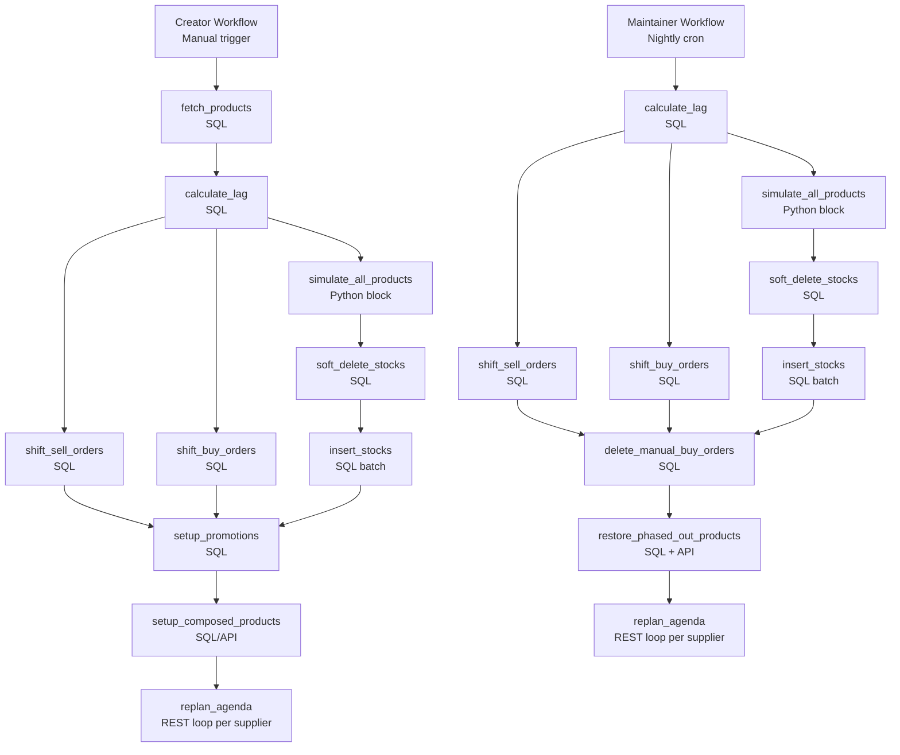

# Tech Plan — Optiply Demo Account Simulator

## 1. Architectural Approach

### Core decisions


| Decision             | Choice                                     | Rationale                                                                                                                 |
| -------------------- | ------------------------------------------ | ------------------------------------------------------------------------------------------------------------------------- |
| Platform             | Pure Retool Workflows                      | No external services to deploy or maintain; easy to debug and run blocks in isolation                                     |
| Simulation engine    | Python block inside Retool                 | Existing sell/buy order data is already realistic; simulation only needed to regenerate stock levels per product          |
| Sell & buy orders    | SQL date shift only (`UPDATE ... SET placed = placed + lag`) | Data already exists in DB with realistic patterns; no need to re-insert — just shift dates to end at today |
| Stocks               | Soft-delete + re-insert (simulation output) | Stock levels must be recalculated daily to stay consistent with shifted order dates; soft-delete preserves audit trail   |
| Agenda replan        | Optiply Public API (per supplier)          | Only the API can trigger a replan; must run after date shifts so advice reflects current dates                            |
| Lag calculation      | Dynamic: `CURRENT_DATE - MAX(stocks.date)` | Single source of truth for shift amount; used identically in both Creator and Maintainer                                  |
| Manual BO detection  | Date-based: `placed > simulation_end_date` | Simple, reliable; simulation end date is always `CURRENT_DATE` at Creator run time, stored as a workflow state variable   |


### Legacy note (repo vs plan)

The repository under file:demo-account-simulator/ contains a legacy hybrid approach (Python FastAPI + Cloud Run) documented in file:demo-account-simulator/docs/. This Epic’s plan is **pure Retool Workflows**; treat the Python service code as reference only (logic to port), not something to deploy.

### Terminology mapping

- **“Shop 1380” (business language)** = `webshop_id = 1380` (DB) = `accountId=1380` (Optiply Public API query param)
- **Product** = `webshop_products` row (DB) and referenced by `product_id` in simulation outputs
- **Supplier product** = `supplier_products` row (DB) and referenced via `supplierId` in the Public API

### Key constraints

- **Retool Python block limits**: No `numpy`/`pandas` available in Retool's Python sandbox. Simulation math must use pure Python (standard library only). The existing `simulation.py` uses `numpy` only for `np.exp` (seasonal Gaussian) and `np.random.normal` (noise) — both replaceable with `math.exp` and `random.gauss`.
- **Retool workflow timeout**: Long-running Python blocks (365 days × 32 products) must complete within Retool's block timeout (~2 min). At ~11,680 iterations this is well within range.
- **Stocks insert pattern**: Soft-delete first (`UPDATE stocks SET deleted_at = NOW() WHERE webshop_id = 1380 AND deleted_at IS NULL`), then INSERT new rows. No `ON CONFLICT` needed since old rows are soft-deleted before insert. Used identically in both Creator and Maintainer.

### Failure modes


| Failure                           | Recovery                                                                                                                                 |
| --------------------------------- | ---------------------------------------------------------------------------------------------------------------------------------------- |
| Creator fails mid-shift           | Re-run Creator; date shifts are idempotent if lag is recalculated fresh; stocks soft-delete + re-insert is safe to re-run               |
| Creator fails mid-stocks-insert   | Re-run Creator; soft-delete runs first so no duplicate rows; safe to re-run                                                             |
| Maintainer fails mid-shift        | SQL shifts are idempotent if lag recalculated fresh each run; safe to re-run                                                             |
| Account exec phases out a product | Maintainer detects `status != 'enabled'` for whitelisted products and restores via Optiply API (endpoint **TBD**) or direct SQL fallback |


---

## 2. Data Model

### Entities managed by the Creator

```
sell_orders      → SQL date shift (UPDATE placed + lag; data already exists)
sell_order_lines → SQL date shift (UPDATE placed + lag)
buy_orders       → SQL date shift (UPDATE placed + expected_delivery_date + lag)
buy_order_lines  → SQL date shift (UPDATE dates + lag)
stocks           → soft-delete existing rows + INSERT new rows from simulation output
promotions       → direct SQL insert (for Seasonal, Influencer Spikes archetypes)
composed_products→ SQL/API (assembly products linking component products)
```

### Stocks schema (confirmed)


| Column         | Type      | Notes                                         |
| -------------- | --------- | --------------------------------------------- |
| `product_id`   | int       | Whitelisted product ID                        |
| `product_uuid` | uuid      | From `webshop_products.uuid`                  |
| `webshop_id`   | int       | Always `1380`                                 |
| `webshop_uuid` | uuid      | Always `b6aba3eb-4412-4b3c-a261-2073f7fdb152` |
| `on_hand`      | int       | Simulated stock level (≥ 0)                   |
| `date`         | timestamp | `YYYY-MM-DD 00:00:02` format                  |


**Note:** treat `product_uuid` and `webshop_uuid` as values fetched from the DB (source of truth). The constant `webshop_uuid` shown above is expected for Shop 1380 but should not be relied on if it differs.

**Insert pattern:** soft-delete first, then insert:
```sql
-- Step 1: soft-delete existing rows for this product
UPDATE stocks SET deleted_at = NOW()
WHERE product_id = {{product_id}} AND deleted_at IS NULL;

-- Step 2: insert new rows
INSERT INTO stocks (product_id, product_uuid, webshop_id, webshop_uuid, on_hand, date)
VALUES ({{product_id}}, {{product_uuid}}, 1380, {{webshop_uuid}}, {{on_hand}}, {{date}});
```

### Sell & buy orders — date shift pattern (confirmed)

Existing data is shifted in-place. Both Creator and Maintainer use the same dynamic lag:

```sql
-- sell_orders
UPDATE sell_orders
SET placed = placed + (lag_days * INTERVAL '1 day'), updated_at = NOW()
WHERE webshop_id = 1380;

-- sell_order_lines
UPDATE sell_order_lines
SET placed = placed + (lag_days * INTERVAL '1 day'), updated_at = NOW()
WHERE webshop_id = 1380;

-- buy_orders (also shift expected_delivery_date and completed)
UPDATE buy_orders
SET placed = placed + (lag_days * INTERVAL '1 day'),
    expected_delivery_date = expected_delivery_date + (lag_days * INTERVAL '1 day'),
    completed = CASE WHEN completed IS NOT NULL THEN completed + (lag_days * INTERVAL '1 day') ELSE NULL END,
    updated_at = NOW()
WHERE webshop_id = 1380;

-- buy_order_lines (shift any date fields)
UPDATE buy_order_lines
SET updated_at = NOW()
WHERE webshop_id = 1380;
```

### Promotions schema

> ⚠️ **Open item**: User to provide working INSERT example for `promotions`. Expected: product reference, start/end date, discount or multiplier.

### Composed products schema

Configured once during Creator run. Links "parent" product to component products with quantities. Schema and method (SQL or API) to be confirmed from user's existing setup.

### Simulation output → DB mapping

```
simulation.stocks[]  → soft-delete existing + INSERT INTO stocks
(sell_orders and buy_orders are NOT generated by simulation — existing data is date-shifted)
```

---

## 3. Component Architecture

### Overview



### Creator Workflow — block-by-block


| Block                     | Type      | Responsibility                                                                                                                                                                                  |
| ------------------------- | --------- | ----------------------------------------------------------------------------------------------------------------------------------------------------------------------------------------------- |
| `startTrigger`            | Webhook   | Manual trigger; accepts optional `dry_run` param                                                                                                                                                |
| `fetch_products`          | SQL       | Fetch 32 whitelisted products: `id`, `uuid`, `shop_id`, `webshop_uuid`, `name`, `selling_price`, `purchase_price`, `supplier_id`, `delivery_time` from `webshop_products` + `supplier_products` |
| `simulate_all_products`   | Python    | 365-day loop per product; parses archetype from `name`; outputs `stocks[]`, `sell_orders[]`, `buy_orders[]`                                                                                     |
| `wipe_demo_data`          | SQL       | Soft-delete: `UPDATE stocks SET deleted_at = NOW()`, same for `sell_orders`, `sell_order_lines`, `buy_orders`, `buy_order_lines` where `webshop_id = 1380`                                      |
| `insert_stocks`           | SQL       | Single large `INSERT ... VALUES (...)` with `ON CONFLICT DO UPDATE`; all 11,680 rows in one statement (Retool handles large SQL fine)                                                           |
| `insert_sell_orders`      | SQL       | Batch insert sell order headers + lines                                                                                                                                                         |
| `post_buy_orders`         | REST loop | Iterate `buy_orders[]`; `POST /buyOrders?accountId=1380`; store returned `id` for line item posting; `delayInMs: 200`                                                                           |
| `post_buy_order_lines`    | REST loop | Iterate buy order lines using IDs from previous step; `POST /buyOrderLines`                                                                                                                     |
| `setup_promotions`        | SQL       | Insert promotion records for Seasonal and Influencer Spikes products                                                                                                                            |
| `setup_composed_products` | SQL/API   | Configure assembly/production product relationships                                                                                                                                             |
| `replan_agenda`           | REST loop | Call the Optiply “agenda replan” endpoint per supplier (**endpoint + payload TBD; use your working example**)                                                                                   |


### Maintainer Workflow — block-by-block


| Block                         | Type      | Responsibility                                                                                                             |
| ----------------------------- | --------- | -------------------------------------------------------------------------------------------------------------------------- |
| `startTrigger`                | Cron      | Nightly schedule (e.g. 02:00 UTC); also triggerable manually via webhook for testing                                       |
| `calculate_lag`               | SQL       | `SELECT (CURRENT_DATE - MAX(date)::date) AS lag_days FROM stocks WHERE webshop_id = 1380 AND deleted_at IS NULL`           |
| `simulate_all_products`       | Python    | Same simulation block as Creator — regenerates `stocks[]` for all 32 products based on today's date                       |
| `shift_sell_orders`           | SQL       | `UPDATE sell_orders SET placed = placed + lag_days * INTERVAL '1 day', updated_at = NOW() WHERE webshop_id = 1380`; same for `sell_order_lines` |
| `shift_buy_orders`            | SQL       | `UPDATE buy_orders SET placed = placed + lag, expected_delivery_date = expected_delivery_date + lag, completed = completed + lag WHERE webshop_id = 1380`; same for `buy_order_lines` |
| `soft_delete_stocks`          | SQL       | `UPDATE stocks SET deleted_at = NOW() WHERE webshop_id = 1380 AND deleted_at IS NULL`                                     |
| `insert_stocks`               | SQL       | Insert fresh stock rows from simulation output — same pattern as Creator                                                   |
| `delete_manual_buy_orders`    | SQL       | Soft-delete BOs where `placed > simulation_end_date` and `webshop_id = 1380`; also soft-delete their lines                |
| `restore_phased_out_products` | SQL + API | Detect whitelisted products where `status != 'enabled'`; restore via Optiply API (endpoint TBD) or direct SQL fallback    |
| `replan_agenda`               | REST loop | `POST https://api.optiply.com/api/buy-order/v2/{webshop_uuid}/supplier/{supplier_uuid}/order-moment/re-plan` per supplier  |


### Simulation Python block — logic summary

The `simulate_all_products` Python block ports file:demo-account-simulator/python-approach/src/simulation.py with two changes:

1. Replace `numpy` calls with `math.exp` and `random.gauss` (Retool has no numpy)
2. Return a single dict `{ "stocks": [...] }` — sell_orders and buy_orders are **not** generated (existing DB data is date-shifted instead)

**Data quality fixes vs. previous attempts:**

- ROP uses `lead_time × avg_daily × 1.5` safety buffer — reorders trigger early enough to prevent unintended stockouts
- Seasonal products pre-order 60 days before peak (Gaussian peak day − 60)
- Stock level is clamped to `max(0, stock)` at every step — no negative stock ever written
- Stockouts only occur for `Stockout Prone` archetype (ROP deliberately cut to 80% of lead-time demand in last 90 days)
- Sell quantity capped at available stock: `sold = min(demand, sim_stock)`

### Archetype → KPI mapping (demo narrative)


| Archetype                   | Products    | KPI signal shown                                     |
| --------------------------- | ----------- | ---------------------------------------------------- |
| Stable Fast / Slow          | ~6 products | Healthy service level, consistent turnover           |
| Seasonal Summer / Winter    | ~4 products | Demand peaks, pre-season POs visible in agenda       |
| Stockout Prone              | ~3 products | Low service level — shows the problem Optiply solves |
| Positive / Negative Trend   | ~4 products | Clear trend line on sales chart                      |
| New Launch                  | ~2 products | Zero history then spike; initial PO                  |
| Obsolete                    | ~2 products | Zero recent sales, overstock                         |
| Lumpy / Sporadic            | ~4 products | Irregular demand, open POs                           |
| Outlier / Influencer Spikes | ~2 products | Sudden demand spikes with promotions                 |
| Composed / Assembly         | ~2 products | Production POs, component consumption                |
| Multi-Supplier              | ~3 products | Multiple suppliers, lead time variance               |


&nbsp;
