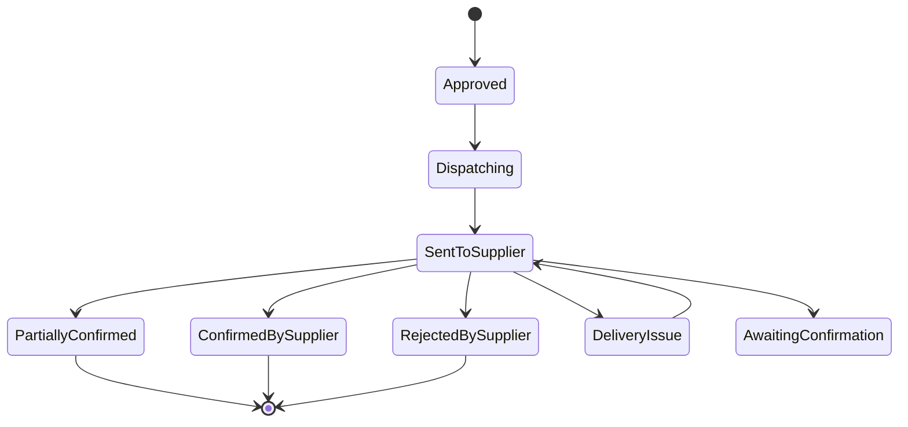

# Core Flows — EDI Order Dispatch & Supplier Onboarding

> Referenced from `spec:210b4706-8155-4e68-9744-6e6a758830a0/2c39769c-e3ef-44d9-b88c-fe65f42fedc8` (Epic Brief). For EDI technical background see `spec:210b4706-8155-4e68-9744-6e6a758830a0/18a5b92c-d3b6-489b-b17b-9e4d9c318ff4`.

---

## BO Status States

Every Buy Order in Optiply moves through the following dispatch states. These are visible to the customer in the BO detail view.



| Status | Customer-facing label | Meaning |
|---|---|---|
| `Approved` | Approved | BO approved, dispatch pending |
| `Dispatching` | Sending to supplier… | EDI message being transmitted |
| `SentToSupplier` | Sent to supplier | EDIFACT ORDERS delivered to VAN |
| `ConfirmedBySupplier` | Confirmed by supplier | Full ORDRSP received |
| `PartiallyConfirmed` | Partially confirmed | ORDRSP received; quantities auto-adjusted |
| `RejectedBySupplier` | Rejected by supplier | Supplier declined the order |
| `DeliveryIssue` | Delivery issue — being resolved | Transmission failed; ops investigating |
| `AwaitingConfirmation` | Awaiting supplier confirmation | No ORDRSP after 48 hours |

---

## Flow 1 — Automatic Order Dispatch

**Description:** When a customer approves a Buy Order in Optiply, it is automatically dispatched to the supplier via EDI — no human step required. The customer sees the status update in real time.

**Trigger:** Customer clicks "Approve" on a Buy Order in Optiply.

**Steps:**

1. BO status moves to `Approved`.
2. System checks the supplier's dispatch channel flag:
   - **EDI-capable** → this flow continues.
   - **Portal-only** → Deck browser automation flow fires instead.
   - **Not configured** → BO stays at `Approved`; ops is alerted to configure the supplier.
3. BO status moves to `Dispatching`. A spinner/badge appears on the BO.
4. The order is sent to the EDI service (Orderful or Zenbridge) as a structured JSON payload.
5. The EDI service translates the order to EDIFACT ORDERS and routes it via the VAN to the supplier's mailbox.
6. On successful delivery to the VAN, BO status moves to `Sent to supplier`. The timestamp is recorded.
7. Customer sees the updated status badge on the BO — no action required.

```wireframe
<!DOCTYPE html>
<html>
<head>
<style>
  body { font-family: sans-serif; margin: 0; background: #f5f5f5; font-size: 13px; }
  .header { background: #1a1a2e; color: white; padding: 14px 24px; font-size: 15px; font-weight: 600; }
  .container { padding: 24px; max-width: 860px; margin: 0 auto; }
  .card { background: white; border-radius: 8px; padding: 20px 24px; margin-bottom: 16px; box-shadow: 0 1px 3px rgba(0,0,0,0.08); }
  .row { display: flex; justify-content: space-between; align-items: flex-start; }
  .label { color: #888; font-size: 11px; text-transform: uppercase; letter-spacing: 0.5px; margin-bottom: 4px; }
  .value { font-size: 14px; font-weight: 500; color: #222; }
  .badge { display: inline-flex; align-items: center; gap: 6px; padding: 4px 12px; border-radius: 20px; font-size: 12px; font-weight: 600; }
  .badge-sent { background: #e3f2fd; color: #1565c0; }
  .badge-confirmed { background: #e8f5e9; color: #2e7d32; }
  .badge-partial { background: #fff8e1; color: #f57f17; }
  .badge-rejected { background: #fce4ec; color: #c62828; }
  .badge-issue { background: #fce4ec; color: #c62828; }
  .timeline { display: flex; gap: 0; margin-top: 20px; }
  .step { flex: 1; text-align: center; position: relative; }
  .step-dot { width: 12px; height: 12px; border-radius: 50%; background: #1a1a2e; margin: 0 auto 6px; }
  .step-dot.inactive { background: #ddd; }
  .step-line { position: absolute; top: 5px; left: 50%; right: -50%; height: 2px; background: #1a1a2e; z-index: 0; }
  .step-line.inactive { background: #ddd; }
  .step:last-child .step-line { display: none; }
  .step-label { font-size: 10px; color: #555; }
  .step-label.active { color: #1a1a2e; font-weight: 600; }
  .divider { border: none; border-top: 1px solid #f0f0f0; margin: 16px 0; }
  .lines-table { width: 100%; border-collapse: collapse; margin-top: 12px; }
  .lines-table th { text-align: left; padding: 6px 8px; color: #888; font-size: 11px; text-transform: uppercase; border-bottom: 2px solid #f0f0f0; }
  .lines-table td { padding: 8px; border-bottom: 1px solid #f5f5f5; }
  .meta { display: flex; gap: 32px; }
</style>
</head>
<body>
  <div class="header">Optiply — Buy Order Detail</div>
  <div class="container">
    <div class="card">
      <div class="row">
        <div>
          <div class="label">Buy Order</div>
          <div class="value" style="font-size:18px;">BO-2026-0142</div>
        </div>
        <span class="badge badge-sent">✉ Sent to supplier</span>
      </div>
      <hr class="divider">
      <div class="meta">
        <div><div class="label">Supplier</div><div class="value">Supplier A</div></div>
        <div><div class="label">Sent at</div><div class="value">24 Feb 2026, 09:04</div></div>
        <div><div class="label">Total value</div><div class="value">€1,240.00</div></div>
        <div><div class="label">Lines</div><div class="value">4 items</div></div>
      </div>
      <div class="timeline" style="margin-top:24px;">
        <div class="step">
          <div class="step-line"></div>
          <div class="step-dot"></div>
          <div class="step-label active">Approved</div>
        </div>
        <div class="step">
          <div class="step-line"></div>
          <div class="step-dot"></div>
          <div class="step-label active">Sent to supplier</div>
        </div>
        <div class="step">
          <div class="step-line inactive"></div>
          <div class="step-dot inactive"></div>
          <div class="step-label">Awaiting confirmation</div>
        </div>
        <div class="step">
          <div class="step-dot inactive"></div>
          <div class="step-label">Confirmed</div>
        </div>
      </div>
    </div>
    <div class="card">
      <div class="label" style="margin-bottom:8px;">Order lines</div>
      <table class="lines-table">
        <thead><tr><th>SKU</th><th>Product</th><th>Ordered qty</th><th>Unit price</th></tr></thead>
        <tbody>
          <tr><td>8710123456789</td><td>Product A</td><td>50</td><td>€12.50</td></tr>
          <tr><td>8710987654321</td><td>Product B</td><td>20</td><td>€34.00</td></tr>
          <tr><td>8710111222333</td><td>Product C</td><td>100</td><td>€5.80</td></tr>
          <tr><td>8710444555666</td><td>Product D</td><td>15</td><td>€22.00</td></tr>
        </tbody>
      </table>
    </div>
  </div>
</body>
</html>
```

---

## Flow 2 — ORDRSP Acknowledgement

**Description:** The supplier's ERP sends an order response (ORDRSP) back via the VAN. Optiply receives it automatically and updates the BO — no customer action required in most cases.

**Trigger:** EDI service receives an inbound ORDRSP from the supplier and fires a webhook.

**Steps:**

1. Webhook arrives with the parsed ORDRSP payload.
2. System matches the ORDRSP to the original BO by PO reference number.
3. System evaluates the response type:

   **a. Full confirmation** — all lines confirmed at ordered quantities:
   - BO status → `Confirmed by supplier`. Green badge. No customer action needed.

   **b. Partial confirmation** — one or more lines have reduced quantities:
   - BO quantities are automatically updated to the confirmed amounts.
   - BO status → `Partially confirmed`. Amber badge.
   - Customer sees the adjusted quantities on the BO lines with a note: *"Quantities adjusted to supplier confirmation."*
   - No customer action required; Optiply's replenishment logic handles the shortfall.

   **c. Full rejection** — supplier declines the entire order:
   - BO status → `Rejected by supplier`. Red badge.
   - Customer receives an in-app notification: *"[Supplier A] rejected order BO-2026-0142. Please review."*
   - Customer can view the rejection reason (if provided) and re-order or reassign to another supplier.

4. Retool ops dashboard records the full ORDRSP detail (line-by-line, with original vs. confirmed quantities).

```wireframe
<!DOCTYPE html>
<html>
<head>
<style>
  body { font-family: sans-serif; margin: 0; background: #f5f5f5; font-size: 13px; }
  .header { background: #1a1a2e; color: white; padding: 14px 24px; font-size: 15px; font-weight: 600; }
  .container { padding: 24px; max-width: 860px; margin: 0 auto; }
  .card { background: white; border-radius: 8px; padding: 20px 24px; margin-bottom: 16px; box-shadow: 0 1px 3px rgba(0,0,0,0.08); }
  .row { display: flex; justify-content: space-between; align-items: flex-start; }
  .label { color: #888; font-size: 11px; text-transform: uppercase; letter-spacing: 0.5px; margin-bottom: 4px; }
  .value { font-size: 14px; font-weight: 500; color: #222; }
  .badge-partial { display: inline-flex; align-items: center; gap: 6px; padding: 4px 12px; border-radius: 20px; font-size: 12px; font-weight: 600; background: #fff8e1; color: #f57f17; }
  .divider { border: none; border-top: 1px solid #f0f0f0; margin: 16px 0; }
  .lines-table { width: 100%; border-collapse: collapse; margin-top: 12px; }
  .lines-table th { text-align: left; padding: 6px 8px; color: #888; font-size: 11px; text-transform: uppercase; border-bottom: 2px solid #f0f0f0; }
  .lines-table td { padding: 8px; border-bottom: 1px solid #f5f5f5; }
  .adjusted { color: #f57f17; font-weight: 600; }
  .note { background: #fff8e1; border-left: 3px solid #ffc107; padding: 10px 14px; border-radius: 4px; font-size: 12px; color: #555; margin-top: 12px; }
  .meta { display: flex; gap: 32px; }
  .timeline { display: flex; gap: 0; margin-top: 24px; }
  .step { flex: 1; text-align: center; position: relative; }
  .step-dot { width: 12px; height: 12px; border-radius: 50%; background: #1a1a2e; margin: 0 auto 6px; }
  .step-line { position: absolute; top: 5px; left: 50%; right: -50%; height: 2px; background: #1a1a2e; }
  .step:last-child .step-line { display: none; }
  .step-label { font-size: 10px; color: #1a1a2e; font-weight: 600; }
</style>
</head>
<body>
  <div class="header">Optiply — Buy Order Detail</div>
  <div class="container">
    <div class="card">
      <div class="row">
        <div>
          <div class="label">Buy Order</div>
          <div class="value" style="font-size:18px;">BO-2026-0142</div>
        </div>
        <span class="badge-partial">⚠ Partially confirmed</span>
      </div>
      <hr class="divider">
      <div class="meta">
        <div><div class="label">Supplier</div><div class="value">Supplier A</div></div>
        <div><div class="label">Confirmed at</div><div class="value">24 Feb 2026, 14:22</div></div>
        <div><div class="label">Confirmed value</div><div class="value">€1,098.00</div></div>
      </div>
      <div class="timeline" style="margin-top:24px;">
        <div class="step"><div class="step-line"></div><div class="step-dot"></div><div class="step-label">Approved</div></div>
        <div class="step"><div class="step-line"></div><div class="step-dot"></div><div class="step-label">Sent</div></div>
        <div class="step"><div class="step-dot"></div><div class="step-label">Partially confirmed</div></div>
      </div>
    </div>
    <div class="card">
      <div class="label" style="margin-bottom:8px;">Order lines — supplier response</div>
      <table class="lines-table">
        <thead><tr><th>Product</th><th>Ordered qty</th><th>Confirmed qty</th><th>Unit price</th></tr></thead>
        <tbody>
          <tr><td>Product A</td><td>50</td><td>50</td><td>€12.50</td></tr>
          <tr><td>Product B</td><td>20</td><td class="adjusted">10 ↓</td><td>€34.00</td></tr>
          <tr><td>Product C</td><td>100</td><td>100</td><td>€5.80</td></tr>
          <tr><td>Product D</td><td>15</td><td>15</td><td>€22.00</td></tr>
        </tbody>
      </table>
      <div class="note">Quantities adjusted to supplier confirmation. Product B: 10 of 20 units confirmed. Optiply will account for the shortfall in the next replenishment cycle.</div>
    </div>
  </div>
</body>
</html>
```

---

## Flow 3 — Supplier EDI Onboarding

**Description:** A customer initiates EDI ordering for a supplier via a form on the supplier's detail page. Because EDI setup involves many variables — network preferences, message types, third-party tech teams — Optiply's integration team schedules a short meeting with the customer and the supplier's EDI contact before doing any technical configuration. After the meeting, Optiply sets up the connection, runs a test cycle, and activates the link. The customer tracks progress passively in-app and receives an email when live.

**Trigger:** Customer navigates to a supplier's detail page in Optiply and clicks **"Enable EDI ordering."**

**Steps:**

1. Customer opens a supplier's detail page in Optiply. The supplier shows dispatch channel: *"Not configured"* or *"Manual."*
2. Customer clicks **"Enable EDI ordering."** A form slides open inline on the page.
3. Customer fills in the form:
   - **Your GLN** — the customer's own 13-digit GS1 buyer identifier (with a hint: *"Don't have one? We'll help you register."*)
   - **Supplier GLN** — the supplier's 13-digit GS1 identifier
   - **EDI network** — dropdown: Transus / Descartes / Other (with a free-text field if Other)
   - **Message types needed** — checkboxes: Purchase orders (ORDERS) · Order acknowledgements (ORDRSP) · Delivery notices (DESADV) · Invoices (INVOIC). ORDERS and ORDRSP are pre-checked and required.
   - **EDI contact at supplier** — name and email. A note reads: *"Many suppliers use a third-party tech team for EDI — if so, provide their contact details here."
4. Customer submits the form. The supplier's dispatch channel updates to **"EDI onboarding — Requested."** The customer sees a confirmation message: *"Request received. Our integration team will be in touch to schedule a short call with you and your supplier's EDI contact."*
5. Optiply's integration team receives a Slack notification with all form data. They reach out to the customer and the supplier's EDI contact to schedule a meeting.
6. Customer sees the status tracker on the supplier page update to **"In progress."** A passive note reads: *"Our team will be in touch to schedule a call with you and your supplier's EDI team. This usually takes 1–3 business days to arrange."
7. The meeting takes place — Optiply integration team, customer, and supplier's EDI contact (or their third-party tech team). The meeting covers: network confirmation, message types, any supplier-specific requirements, and expected go-live timeline.
8. After the meeting, Optiply's integration team configures the trading relationship in the EDI service (Transus/Orderful) and updates the Retool mapping for any supplier-specific fields. Status updates to **"Setting up."**
9. Test messages are exchanged between Optiply and the supplier's EDI system. Status updates to **"Testing."** The customer sees: *"Test messages are being exchanged with [Supplier A]'s EDI team."
10. Once testing passes, the connection goes live. Status updates to **"Live."** The customer receives an email: *"EDI ordering is now active for [Supplier A]. Future approved orders will be sent automatically."
11. Supplier's dispatch channel in Optiply updates to **"EDI."** All subsequent approved BOs for this supplier are dispatched automatically via Flow 1.

**Onboarding status states (customer-facing):**

| Status | Label shown | What it means |
|---|---|---|
| `Requested` | Requested | Form submitted; team notified |
| `InProgress` | In progress — team will be in touch | Meeting being arranged |
| `SettingUp` | Setting up | Meeting done; technical config underway |
| `Testing` | Testing | Test messages being exchanged with supplier |
| `Live` | Live ✓ | EDI ordering active |

```wireframe
<!DOCTYPE html>
<html>
<head>
<style>
  body { font-family: sans-serif; margin: 0; background: #f5f5f5; font-size: 13px; }
  .header { background: #1a1a2e; color: white; padding: 14px 24px; font-size: 15px; font-weight: 600; }
  .breadcrumb { font-size: 11px; color: #aaa; padding: 10px 24px; background: #1a1a2e; border-top: 1px solid rgba(255,255,255,0.1); }
  .container { padding: 24px; max-width: 800px; margin: 0 auto; }
  .card { background: white; border-radius: 8px; padding: 20px 24px; margin-bottom: 16px; box-shadow: 0 1px 3px rgba(0,0,0,0.08); }
  .row { display: flex; justify-content: space-between; align-items: center; }
  .label { color: #888; font-size: 11px; text-transform: uppercase; letter-spacing: 0.5px; margin-bottom: 4px; }
  .value { font-size: 14px; font-weight: 500; color: #222; }
  .badge-none { display: inline-block; padding: 3px 10px; border-radius: 20px; font-size: 11px; background: #f0f0f0; color: #888; }
  .badge-live { display: inline-block; padding: 3px 10px; border-radius: 20px; font-size: 11px; background: #e8f5e9; color: #2e7d32; font-weight: 600; }
  .badge-progress { display: inline-block; padding: 3px 10px; border-radius: 20px; font-size: 11px; background: #e3f2fd; color: #1565c0; font-weight: 600; }
  .badge-testing { display: inline-block; padding: 3px 10px; border-radius: 20px; font-size: 11px; background: #fff8e1; color: #f57f17; font-weight: 600; }
  .divider { border: none; border-top: 1px solid #f0f0f0; margin: 16px 0; }
  .btn { padding: 8px 18px; border: none; border-radius: 6px; cursor: pointer; font-size: 13px; font-weight: 600; }
  .btn-primary { background: #1a1a2e; color: white; }
  .btn-secondary { background: #f0f0f0; color: #333; }
  .btn-outline { background: white; color: #1a1a2e; border: 1.5px solid #1a1a2e; padding: 7px 16px; border-radius: 6px; font-size: 12px; font-weight: 600; cursor: pointer; }
  .form-group { margin-bottom: 16px; }
  .form-label { display: block; font-size: 12px; font-weight: 600; color: #444; margin-bottom: 6px; }
  .form-input { width: 100%; padding: 8px 12px; border: 1px solid #ddd; border-radius: 6px; font-size: 13px; box-sizing: border-box; }
  .form-select { width: 100%; padding: 8px 12px; border: 1px solid #ddd; border-radius: 6px; font-size: 13px; box-sizing: border-box; background: white; }
  .form-hint { font-size: 11px; color: #999; margin-top: 4px; }
  .form-hint a { color: #1565c0; text-decoration: none; }
  .checkbox-group { display: flex; flex-direction: column; gap: 8px; margin-top: 4px; }
  .checkbox-row { display: flex; align-items: center; gap: 8px; font-size: 13px; color: #333; }
  .checkbox-row input { width: 14px; height: 14px; }
  .checkbox-row .tag { font-size: 10px; background: #e3f2fd; color: #1565c0; padding: 1px 6px; border-radius: 8px; font-weight: 600; }
  .tracker { display: flex; gap: 0; margin-top: 8px; }
  .t-step { flex: 1; text-align: center; position: relative; }
  .t-dot { width: 14px; height: 14px; border-radius: 50%; margin: 0 auto 6px; }
  .t-dot.done { background: #2e7d32; }
  .t-dot.active { background: #1565c0; }
  .t-dot.pending { background: #ddd; }
  .t-line { position: absolute; top: 6px; left: 50%; right: -50%; height: 2px; }
  .t-line.done { background: #2e7d32; }
  .t-line.pending { background: #ddd; }
  .t-step:last-child .t-line { display: none; }
  .t-label { font-size: 10px; color: #555; }
  .t-label.active { color: #1565c0; font-weight: 600; }
  .t-label.done { color: #2e7d32; }
  .section-title { font-size: 13px; font-weight: 600; color: #333; margin-bottom: 12px; }
  .channel-row { display: flex; justify-content: space-between; align-items: center; padding: 12px 0; border-bottom: 1px solid #f5f5f5; }
  .info-box { background: #f0f7ff; border-left: 3px solid #1565c0; padding: 10px 14px; border-radius: 4px; font-size: 12px; color: #444; margin-top: 12px; line-height: 1.5; }
  .form-row { display: flex; gap: 16px; }
  .form-row .form-group { flex: 1; }
  .tabs { display: flex; border-bottom: 2px solid #f0f0f0; margin-bottom: 20px; gap: 0; }
  .tab { padding: 8px 16px; font-size: 13px; color: #888; cursor: pointer; border-bottom: 2px solid transparent; margin-bottom: -2px; }
  .tab.active { color: #1a1a2e; font-weight: 600; border-bottom-color: #1a1a2e; }
  .supplier-meta { display: flex; gap: 32px; margin-top: 4px; }
  .supplier-meta-item { font-size: 12px; color: #888; }
  .supplier-meta-item span { color: #333; font-weight: 500; }
</style>
</head>
<body>
  <div class="header">Optiply</div>
  <div class="breadcrumb">Suppliers › Supplier A › Settings</div>
  <div class="container">

    <!-- Supplier header -->
    <div class="card">
      <div class="row">
        <div>
          <div class="value" style="font-size:17px;font-weight:700;">Supplier A</div>
          <div class="supplier-meta">
            <div class="supplier-meta-item">GLN: <span>8798765000023</span></div>
            <div class="supplier-meta-item">Network: <span>Transus</span></div>
            <div class="supplier-meta-item">EDI contact: <span>jan@suppliera.nl</span></div>
          </div>
        </div>
      </div>
      <div class="tabs" style="margin-top:16px;margin-bottom:0;">
        <div class="tab">General</div>
        <div class="tab">Products</div>
        <div class="tab active">Order dispatch</div>
        <div class="tab">History</div>
      </div>
    </div>

    <!-- EDI status card — In Progress state -->
    <div class="card">
      <div class="section-title">EDI ordering</div>
      <div class="channel-row">
        <div>
          <div class="value">EDI connection status</div>
          <div style="font-size:11px;color:#888;margin-top:2px;">Automatic EDIFACT purchase orders via Transus network</div>
        </div>
        <span class="badge-progress">⏳ In progress</span>
      </div>
      <div style="margin-top:16px;">
        <div class="label" style="margin-bottom:10px;">Onboarding progress</div>
        <div class="tracker">
          <div class="t-step">
            <div class="t-line done"></div>
            <div class="t-dot done"></div>
            <div class="t-label done">Requested</div>
          </div>
          <div class="t-step">
            <div class="t-line pending"></div>
            <div class="t-dot active"></div>
            <div class="t-label active">In progress</div>
          </div>
          <div class="t-step">
            <div class="t-line pending"></div>
            <div class="t-dot pending"></div>
            <div class="t-label">Setting up</div>
          </div>
          <div class="t-step">
            <div class="t-line pending"></div>
            <div class="t-dot pending"></div>
            <div class="t-label">Testing</div>
          </div>
          <div class="t-step">
            <div class="t-dot pending"></div>
            <div class="t-label">Live</div>
          </div>
        </div>
        <div class="info-box" style="margin-top:14px;">Our integration team will be in touch to schedule a short call with you and Supplier A's EDI contact. This usually takes 1–3 business days to arrange.</div>
      </div>
    </div>

    <!-- Enable EDI form — shown when no EDI request exists yet -->
    <div class="card">
      <div class="section-title">Enable EDI ordering for a supplier</div>
      <div class="form-row">
        <div class="form-group">
          <label class="form-label">Your GLN (buyer) <span style="color:#c62828;">*</span></label>
          <input class="form-input" type="text" placeholder="e.g. 8712345000016" data-element-id="buyer-gln-input">
          <div class="form-hint">Your 13-digit GS1 buyer identifier. <a href="#">Don't have one? We'll help you register.</a></div>
        </div>
        <div class="form-group">
          <label class="form-label">Supplier GLN <span style="color:#c62828;">*</span></label>
          <input class="form-input" type="text" placeholder="e.g. 8798765000023" data-element-id="supplier-gln-input">
          <div class="form-hint">Ask your supplier's EDI team if unsure.</div>
        </div>
      </div>
      <div class="form-group">
        <label class="form-label">EDI network <span style="color:#c62828;">*</span></label>
        <select class="form-select" data-element-id="network-select">
          <option>Transus</option>
          <option>Descartes</option>
          <option>Other — I'll specify below</option>
        </select>
        <div class="form-hint">Not sure? Ask your supplier which network they use. Most Dutch suppliers are on Transus.</div>
      </div>
      <div class="form-group">
        <label class="form-label">Message types needed <span style="color:#c62828;">*</span></label>
        <div class="checkbox-group">
          <label class="checkbox-row"><input type="checkbox" checked disabled> Purchase orders (ORDERS) <span class="tag">Required</span></label>
          <label class="checkbox-row"><input type="checkbox" checked disabled> Order acknowledgements (ORDRSP) <span class="tag">Required</span></label>
          <label class="checkbox-row"><input type="checkbox"> Delivery notices (DESADV)</label>
          <label class="checkbox-row"><input type="checkbox"> Invoices (INVOIC)</label>
        </div>
        <div class="form-hint" style="margin-top:8px;">ORDERS and ORDRSP are always included. Select additional message types if your supplier supports them.</div>
      </div>
      <div class="form-row">
        <div class="form-group">
          <label class="form-label">EDI contact name <span style="color:#c62828;">*</span></label>
          <input class="form-input" type="text" placeholder="e.g. Jan de Vries" data-element-id="contact-name-input">
        </div>
        <div class="form-group">
          <label class="form-label">EDI contact email <span style="color:#c62828;">*</span></label>
          <input class="form-input" type="email" placeholder="e.g. edi@supplier.nl" data-element-id="contact-email-input">
        </div>
      </div>
      <div class="form-hint" style="margin-bottom:16px;">💡 Many suppliers use a third-party tech team for EDI — if so, provide their contact details above.</div>
      <div style="display:flex;gap:10px;justify-content:flex-end;">
        <button class="btn btn-secondary" data-element-id="cancel-btn">Cancel</button>
        <button class="btn btn-primary" data-element-id="submit-btn">Request EDI connection →</button>
      </div>
    </div>

  </div>
</body>
</html>
```

---

## Flow 4 — Error & Failure Handling

**Description:** When an EDI transmission fails or a supplier doesn't respond within the expected window, the system escalates automatically — first to ops, then to the customer if unresolved.

**Trigger:** One of three failure conditions:
- **A. Transmission failure** — EDI service returns an error or the VAN rejects the message
- **B. Timeout** — no ORDRSP received within 48 hours of sending
- **C. Full rejection** — supplier sends an ORDRSP with a rejection code

### Scenario A — Transmission Failure

1. EDI service returns an error on the `POST /transactions` call.
2. System auto-retries once after 5 minutes.
3. If retry succeeds → flow continues normally from Flow 1 step 5.
4. If retry fails → BO status moves to `Delivery issue — being resolved`.
5. Ops team receives a Slack alert immediately with: BO reference, supplier, error code, customer name.
6. Ops investigates and can manually retry from the Retool ops dashboard.
7. If unresolved after **2 hours**: customer receives an in-app notification — *"We're having trouble sending your order to [Supplier A]. Our team is on it."*
8. Once ops resolves it, BO status returns to `Sent to supplier` and the normal flow resumes.

### Scenario B — ORDRSP Timeout

1. After **24 hours** with no ORDRSP: ops receives a Slack alert.
2. After **48 hours**: BO status moves to `Awaiting supplier confirmation`. Customer sees an amber badge.
3. Customer receives an in-app notification — *"[Supplier A] hasn't confirmed order BO-2026-0142 yet. We're following up."*
4. Ops chases the supplier's EDI team directly.
5. Once ORDRSP arrives, normal Flow 2 processing resumes.

### Scenario C — Full Rejection

1. ORDRSP arrives with rejection code (BGM function `28`).
2. BO status → `Rejected by supplier`. Red badge.
3. Customer receives an in-app notification immediately — *"[Supplier A] rejected order BO-2026-0142."*
4. Customer can view the rejection reason on the BO (if the supplier included a free-text reason).
5. Customer can re-order from a different supplier or contact their account manager.

---

## Flow 5 — Ops Monitoring Dashboard (Retool)

**Description:** Internal Optiply ops view with two tabs: **Transactions** (live EDI message monitoring) and **Onboarding** (supplier EDI onboarding request queue). Used for monitoring, debugging, manual intervention, and managing the onboarding pipeline from form submission through go-live.

**Entry point:** Retool app — accessible to Optiply ops team only.

**Transactions tab capabilities:**
- Transaction list: date, customer, supplier, BO reference, message type, status, last updated
- Filter by: status, customer, supplier, date range
- Click into any transaction to see the full EDIFACT message (raw) and parsed ORDRSP detail
- Manual retry button on failed transactions
- ORDRSP line-by-line view: ordered qty vs. confirmed qty per line
- Alert history: shows which Slack alerts were sent and when

**Onboarding tab capabilities:**
- Request queue: all pending onboarding requests with customer, supplier, network, message types, EDI contact
- Status column showing current onboarding stage (Requested / In Progress / Setting Up / Testing / Live)
- Meeting status indicator: whether a meeting has been scheduled yet
- Ops can update the status of each request as they progress through the pipeline
- Notes field per request for internal ops comments (e.g. "Meeting scheduled for 3 March with Jan de Vries")

```wireframe
<!DOCTYPE html>
<html>
<head>
<style>
  body { font-family: sans-serif; margin: 0; background: #f5f5f5; font-size: 13px; }
  .header { background: #1a1a2e; color: white; padding: 14px 24px; font-size: 15px; font-weight: 600; display: flex; align-items: center; gap: 16px; }
  .header span { font-size: 12px; opacity: 0.6; font-weight: 400; }
  .nav-tabs { background: #13132a; display: flex; padding: 0 24px; }
  .nav-tab { padding: 10px 18px; font-size: 12px; color: rgba(255,255,255,0.5); cursor: pointer; border-bottom: 2px solid transparent; }
  .nav-tab.active { color: white; border-bottom-color: white; font-weight: 600; }
  .container { padding: 20px 24px; }
  .stats { display: flex; gap: 12px; margin-bottom: 16px; }
  .stat-card { background: white; border-radius: 8px; padding: 12px 16px; flex: 1; box-shadow: 0 1px 3px rgba(0,0,0,0.06); }
  .stat-value { font-size: 22px; font-weight: 700; color: #1a1a2e; }
  .stat-label { font-size: 11px; color: #888; margin-top: 2px; }
  .filters { display: flex; gap: 10px; margin-bottom: 16px; align-items: center; }
  .filter-select { padding: 6px 10px; border: 1px solid #ddd; border-radius: 6px; font-size: 12px; background: white; }
  .filter-input { padding: 6px 10px; border: 1px solid #ddd; border-radius: 6px; font-size: 12px; width: 180px; }
  .table-card { background: white; border-radius: 8px; box-shadow: 0 1px 3px rgba(0,0,0,0.06); overflow: hidden; margin-bottom: 20px; }
  .table-card-header { padding: 12px 16px; border-bottom: 1px solid #f0f0f0; font-size: 13px; font-weight: 600; color: #333; display: flex; justify-content: space-between; align-items: center; }
  .alert-dot { width: 8px; height: 8px; background: #c62828; border-radius: 50%; display: inline-block; margin-right: 6px; }
  table { width: 100%; border-collapse: collapse; font-size: 12px; }
  th { background: #f8f8f8; text-align: left; padding: 9px 12px; color: #666; font-weight: 600; border-bottom: 2px solid #eee; }
  td { padding: 9px 12px; border-bottom: 1px solid #f5f5f5; vertical-align: middle; }
  .badge { display: inline-block; padding: 2px 8px; border-radius: 10px; font-size: 11px; font-weight: 600; }
  .b-sent { background: #e3f2fd; color: #1565c0; }
  .b-confirmed { background: #e8f5e9; color: #2e7d32; }
  .b-partial { background: #fff8e1; color: #f57f17; }
  .b-failed { background: #fce4ec; color: #c62828; }
  .b-waiting { background: #f3e5f5; color: #6a1b9a; }
  .b-requested { background: #f0f0f0; color: #555; }
  .b-inprogress { background: #e3f2fd; color: #1565c0; }
  .b-setup { background: #fff8e1; color: #f57f17; }
  .b-testing { background: #fff3e0; color: #e65100; }
  .b-live { background: #e8f5e9; color: #2e7d32; }
  .b-meeting-yes { background: #e8f5e9; color: #2e7d32; font-size: 10px; }
  .b-meeting-no { background: #fce4ec; color: #c62828; font-size: 10px; }
  .btn-sm { padding: 3px 10px; border: none; border-radius: 4px; cursor: pointer; font-size: 11px; font-weight: 600; background: #1a1a2e; color: white; }
  .btn-retry { background: #fce4ec; color: #c62828; border: none; border-radius: 4px; padding: 3px 10px; font-size: 11px; font-weight: 600; cursor: pointer; }
  .btn-update { background: #e3f2fd; color: #1565c0; border: none; border-radius: 4px; padding: 3px 10px; font-size: 11px; font-weight: 600; cursor: pointer; }
  tr:hover td { background: #fafafa; }
  .notes { font-size: 11px; color: #888; font-style: italic; max-width: 180px; overflow: hidden; text-overflow: ellipsis; white-space: nowrap; }
</style>
</head>
<body>
  <div class="header">
    EDI Operations Dashboard
    <span>Retool — Internal only</span>
  </div>
  <div class="nav-tabs">
    <div class="nav-tab active" data-element-id="tab-transactions">Transactions</div>
    <div class="nav-tab" data-element-id="tab-onboarding">Onboarding requests <span style="background:#c62828;color:white;border-radius:8px;padding:1px 6px;font-size:10px;margin-left:4px;">4</span></div>
  </div>
  <div class="container">

    <!-- TRANSACTIONS TAB -->
    <div class="stats">
      <div class="stat-card"><div class="stat-value">142</div><div class="stat-label">Sent today</div></div>
      <div class="stat-card"><div class="stat-value">128</div><div class="stat-label">Confirmed</div></div>
      <div class="stat-card"><div class="stat-value">9</div><div class="stat-label">Awaiting ORDRSP</div></div>
      <div class="stat-card"><div class="stat-value" style="color:#c62828;">3</div><div class="stat-label">Failures</div></div>
    </div>
    <div class="filters">
      <input class="filter-input" placeholder="Search BO reference…" data-element-id="search">
      <select class="filter-select" data-element-id="status-filter"><option>All statuses</option><option>Sent</option><option>Confirmed</option><option>Failed</option><option>Awaiting</option></select>
      <select class="filter-select" data-element-id="customer-filter"><option>All customers</option><option>Customer A</option><option>Customer B</option></select>
      <select class="filter-select" data-element-id="date-filter"><option>Today</option><option>Last 7 days</option><option>Last 30 days</option></select>
    </div>
    <div class="table-card">
      <table>
        <thead>
          <tr><th>BO Reference</th><th>Customer</th><th>Supplier</th><th>Sent at</th><th>Message</th><th>Status</th><th>Action</th></tr>
        </thead>
        <tbody>
          <tr>
            <td>BO-2026-0142</td><td>Customer A</td><td>Supplier A</td><td>09:04</td><td>ORDERS + ORDRSP</td>
            <td><span class="badge b-partial">Partially confirmed</span></td>
            <td><button class="btn-sm" data-element-id="view-1">View</button></td>
          </tr>
          <tr>
            <td>BO-2026-0143</td><td>Customer A</td><td>Supplier B</td><td>09:12</td><td>ORDERS</td>
            <td><span class="badge b-waiting">Awaiting ORDRSP</span></td>
            <td><button class="btn-sm" data-element-id="view-2">View</button></td>
          </tr>
          <tr>
            <td>BO-2026-0139</td><td>Customer B</td><td>Supplier C</td><td>08:55</td><td>ORDERS</td>
            <td><span class="badge b-failed">Failed</span></td>
            <td><button class="btn-retry" data-element-id="retry-1">Retry</button></td>
          </tr>
          <tr>
            <td>BO-2026-0138</td><td>Customer B</td><td>Supplier A</td><td>08:30</td><td>ORDERS + ORDRSP</td>
            <td><span class="badge b-confirmed">Confirmed</span></td>
            <td><button class="btn-sm" data-element-id="view-3">View</button></td>
          </tr>
        </tbody>
      </table>
    </div>

    <!-- ONBOARDING TAB (shown when tab is clicked) -->
    <div class="table-card">
      <div class="table-card-header">
        <span><span class="alert-dot"></span>Onboarding requests — 4 active</span>
        <span style="font-size:11px;color:#888;">Sorted by: most recent</span>
      </div>
      <table>
        <thead>
          <tr>
            <th>Customer</th>
            <th>Supplier</th>
            <th>Network</th>
            <th>Messages</th>
            <th>EDI contact</th>
            <th>Meeting</th>
            <th>Status</th>
            <th>Notes</th>
            <th>Action</th>
          </tr>
        </thead>
        <tbody>
          <tr>
            <td>Customer A</td>
            <td>Supplier D</td>
            <td>Transus</td>
            <td>ORDERS, ORDRSP</td>
            <td>jan@supplierd.nl</td>
            <td><span class="badge b-meeting-no">✗ Not yet</span></td>
            <td><span class="badge b-requested">Requested</span></td>
            <td class="notes">Received 25 Feb — awaiting contact</td>
            <td><button class="btn-update" data-element-id="update-1">Update</button></td>
          </tr>
          <tr>
            <td>Customer B</td>
            <td>Supplier E</td>
            <td>Transus</td>
            <td>ORDERS, ORDRSP, DESADV</td>
            <td>edi@techpartner.nl</td>
            <td><span class="badge b-meeting-yes">✓ 3 Mar 14:00</span></td>
            <td><span class="badge b-inprogress">In progress</span></td>
            <td class="notes">3rd party tech team: TechPartner BV</td>
            <td><button class="btn-update" data-element-id="update-2">Update</button></td>
          </tr>
          <tr>
            <td>Customer A</td>
            <td>Supplier F</td>
            <td>Descartes</td>
            <td>ORDERS, ORDRSP</td>
            <td>edi@supplierf.nl</td>
            <td><span class="badge b-meeting-yes">✓ Done</span></td>
            <td><span class="badge b-setup">Setting up</span></td>
            <td class="notes">Configuring Transus relationship</td>
            <td><button class="btn-update" data-element-id="update-3">Update</button></td>
          </tr>
          <tr>
            <td>Customer C</td>
            <td>Supplier G</td>
            <td>Transus</td>
            <td>ORDERS, ORDRSP, INVOIC</td>
            <td>jan@supplierg.nl</td>
            <td><span class="badge b-meeting-yes">✓ Done</span></td>
            <td><span class="badge b-testing">Testing</span></td>
            <td class="notes">2nd test message sent, awaiting ACK</td>
            <td><button class="btn-update" data-element-id="update-4">Update</button></td>
          </tr>
        </tbody>
      </table>
    </div>

  </div>
</body>
</html>
```
