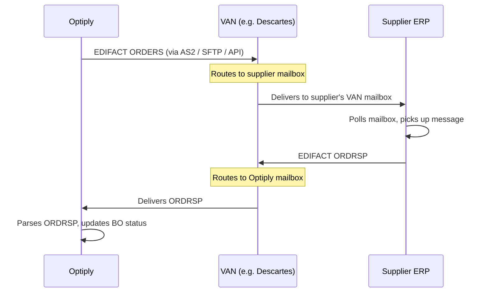
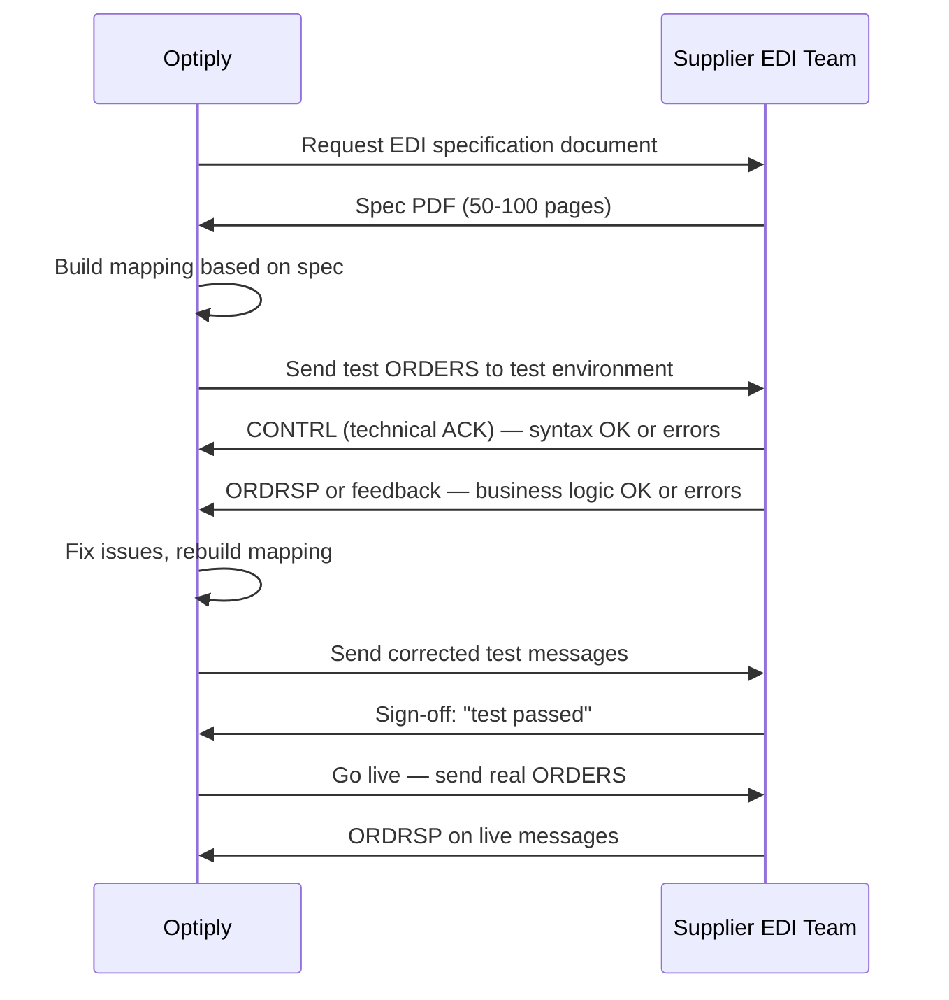
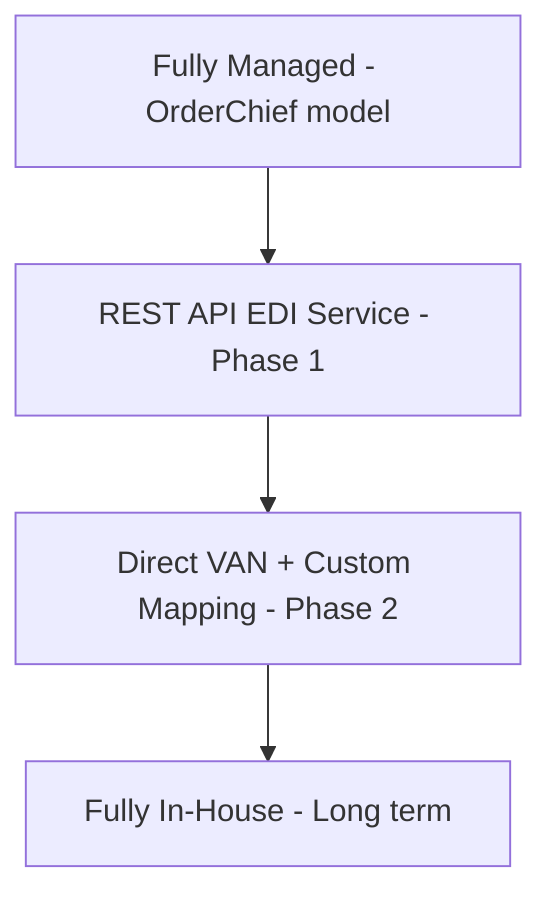
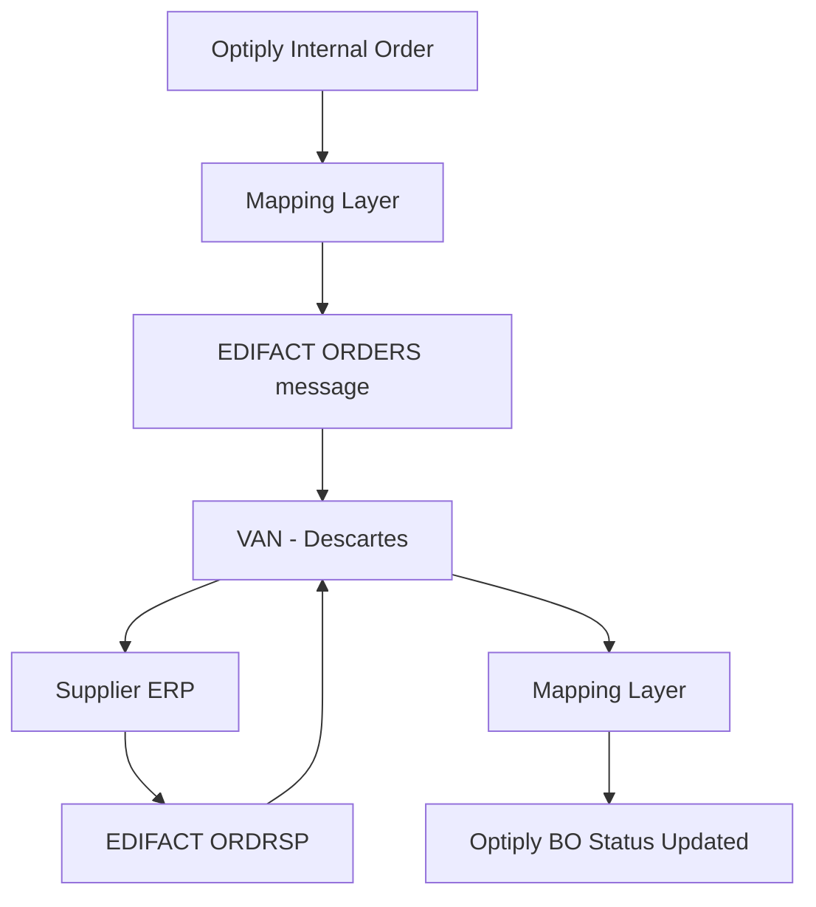

# EDI Explained — What It Is, How It Works & Why It's Hard

> **Purpose:** A complete technical primer on EDI for anyone working on the Optiply EDI initiative. Read this before touching any implementation. Referenced from spec:210b4706-8155-4e68-9744-6e6a758830a0/2c39769c-e3ef-44d9-b88c-fe65f42fedc8.
>
> **Last updated:** February 2026. Includes actual Semso/OrderChief spend data and EU-centric service provider comparison.

---

## 1. What Is EDI and Why Does It Exist?

EDI stands for **Electronic Data Interchange**. It is the automated, machine-to-machine exchange of structured business documents between organisations — without any human involvement in the transmission itself.

### The problem it solves

Imagine a retailer with 200 suppliers. Every week they place purchase orders. Without EDI, someone logs into each supplier's portal, or sends an email, or picks up the phone. This is slow, error-prone, and impossible to scale.

EDI replaces that manual process with a direct pipe between two computer systems. The buyer's system generates a purchase order in a standardised format; the supplier's system receives it, parses it, and creates the order automatically in their ERP — no human touches it on either side.

### Why a *standard* matters

Without a standard, every buyer-supplier pair needs a custom integration. Company A sends JSON, Company B expects XML, Company C wants a CSV. You'd need a different integration for every relationship.

With a standard, you build **one** integration and it works with every trading partner who speaks the same standard. This is the entire value proposition of EDI.

### The two dominant standards


| Standard    | Region                            | Used for                                   |
| ----------- | --------------------------------- | ------------------------------------------ |
| **EDIFACT** | Europe, Asia, international trade | Most European suppliers, retail, logistics |
| **X12**     | North America                     | US/Canada retail, healthcare, finance      |


Since Optiply's suppliers are primarily European, **EDIFACT** is the relevant standard.

---

## 2. The EDIFACT Standard in Depth

EDIFACT (Electronic Data Interchange For Administration, Commerce and Transport) is maintained by the United Nations Economic Commission for Europe (UN/ECE). It has been around since the 1980s and is deeply embedded in European supply chains.

### Message types

Each business document has a named message type:


| Message  | Direction        | What it represents                        |
| -------- | ---------------- | ----------------------------------------- |
| `ORDERS` | Buyer → Supplier | Purchase order                            |
| `ORDRSP` | Supplier → Buyer | Order response / acknowledgement          |
| `DESADV` | Supplier → Buyer | Despatch advice (advance shipping notice) |
| `INVOIC` | Supplier → Buyer | Invoice                                   |
| `PRICAT` | Supplier → Buyer | Price catalogue                           |
| `CONTRL` | Either direction | Technical acknowledgement (syntax check)  |
| `APERAK` | Either direction | Application error acknowledgement         |


**For Optiply's Phase 1 scope:** `ORDERS` (outbound) + `ORDRSP` (inbound).

### EDIFACT versions

EDIFACT is versioned. Common versions you will encounter:


| Version | Notes                                        |
| ------- | -------------------------------------------- |
| `D96A`  | Very common in older European retail EDI     |
| `D01B`  | Widely used in modern European supply chains |
| `D03A`  | Newer; some large retailers mandate this     |


The version is declared inside every message. A supplier's EDI spec document will tell you which version they require. **You cannot mix versions** — if a supplier expects `D01B` and you send `D96A`, the message will be rejected.

### The segment structure

An EDIFACT message is made up of **segments** — lines of structured data. Each segment:

- Starts with a 3-letter segment tag (e.g. `BGM`, `DTM`, `NAD`)
- Contains data elements separated by `+`
- Ends with a `'` (apostrophe) as the segment terminator

Sub-elements within a data element are separated by `:`.

---

## 3. A Real EDIFACT ORDERS Message — Annotated

Below is a complete, realistic EDIFACT ORDERS message for a purchase order with two line items. Every segment is explained.

```
UNB+UNOC:3+8712345000016:14+8798765000023:14+260224:0900+000042'
```

**UNB — Interchange envelope header**

- `UNOC:3` — character set UNOC (Latin-1), syntax version 3
- `8712345000016:14` — sender's GLN (Optiply customer), qualifier `14` = EAN/GLN
- `8798765000023:14` — receiver's GLN (supplier)
- `260224:0900` — date `24 Feb 2026`, time `09:00`
- `000042` — interchange control reference (unique per transmission)

```
UNH+1+ORDERS:D:01B:UN'
```

**UNH — Message header**

- `1` — message reference number within this interchange
- `ORDERS:D:01B:UN` — message type `ORDERS`, directory `D`, version `01B`, controlling agency `UN`

```
BGM+220+PO-2026-0142+9'
```

**BGM — Beginning of message**

- `220` — document/message name code: `220` = Purchase Order
- `PO-2026-0142` — the purchase order number (your internal reference)
- `9` — message function: `9` = Original

```
DTM+137:20260224:102'
```

**DTM — Date/time/period**

- `137` — date/time qualifier: `137` = Document/message date/time
- `20260224` — the date: 24 February 2026
- `102` — format: `102` = CCYYMMDD

```
DTM+2:20260303:102'
```

**DTM — Requested delivery date**

- `2` — qualifier: `2` = Delivery date/time, requested
- `20260303` — requested delivery: 3 March 2026

```
NAD+BY+8712345000016::9'
```

**NAD — Name and address (Buyer)**

- `BY` — party qualifier: `BY` = Buyer
- `8712345000016` — buyer's GLN
- `::9` — identification code qualifier: `9` = EAN/GLN

```
NAD+SU+8798765000023::9'
```

**NAD — Name and address (Supplier)**

- `SU` — party qualifier: `SU` = Supplier
- `8798765000023` — supplier's GLN

```
NAD+DP+8712345000078::9'
```

**NAD — Name and address (Delivery party)**

- `DP` — party qualifier: `DP` = Delivery party (the warehouse receiving the goods)
- `8712345000078` — delivery location GLN (can differ from buyer GLN)

```
CUX+2:EUR:4'
```

**CUX — Currencies**

- `2:EUR:4` — currency qualifier `2` (invoicing currency), `EUR`, rate type `4` (fixed)

```
LIN+1++8710123456789:SRV'
```

**LIN — Line item (first product)**

- `1` — line item number
- `` — (empty: no sub-line number)
- `8710123456789:SRV` — product EAN-13 barcode, qualifier `SRV` = EAN/UCC

```
QTY+21:50:PCE'
```

**QTY — Quantity**

- `21` — quantity qualifier: `21` = Ordered quantity
- `50` — quantity: 50 units
- `PCE` — unit of measure: pieces

```
PRI+AAA:12.50:CT'
```

**PRI — Price**

- `AAA` — price qualifier: `AAA` = Calculation net
- `12.50` — unit price
- `CT` — price type: `CT` = Unit price

```
LIN+2++8710987654321:SRV'
QTY+21:20:PCE'
PRI+AAA:34.00:CT'
```

**Second line item** — same structure, different product EAN, quantity 20, price €34.00

```
UNS+S'
```

**UNS — Section control** — separates the detail section from the summary section

```
CNT+2:2'
```

**CNT — Control total**

- `2:2` — qualifier `2` (number of line items), value `2` (there are 2 line items)
- This is a validation check — the receiver counts the LIN segments and must match

```
UNT+18+1'
```

**UNT — Message trailer**

- `18` — number of segments in this message (including UNH and UNT)
- `1` — message reference number (must match UNH)

```
UNZ+1+000042'
```

**UNZ — Interchange trailer**

- `1` — number of messages in this interchange
- `000042` — must match the control reference in UNB

---

## 4. A Real EDIFACT ORDRSP Message — Annotated

The supplier sends back an `ORDRSP` (Order Response) to confirm, reject, or partially accept the order. This is what Optiply needs to receive and parse.

```
UNB+UNOC:3+8798765000023:14+8712345000016:14+260224:1045+000043'
UNH+1+ORDRSP:D:01B:UN'
BGM+231+PO-2026-0142+4'
```

**BGM for ORDRSP**

- `231` — document name code: `231` = Order acknowledgement
- `PO-2026-0142` — references the original PO number
- `4` — message function: `4` = Change (partial acceptance); `27` = Confirmation; `28` = Rejection

```
DTM+137:20260224:102'
RFF+ON:PO-2026-0142'
```

**RFF — Reference**

- `ON:PO-2026-0142` — reference qualifier `ON` = Order number, value = the original PO

```
NAD+SU+8798765000023::9'
NAD+BY+8712345000016::9'
```

```
LIN+1++8710123456789:SRV'
QTY+21:50:PCE'
QTY+12:50:PCE'
```

**QTY qualifiers in ORDRSP**

- `21` — ordered quantity (echoed back): 50
- `12` — despatch quantity (confirmed to ship): 50 — full confirmation

```
LIN+2++8710987654321:SRV'
QTY+21:20:PCE'
QTY+12:10:PCE'
```

**Partial acceptance on line 2**

- Ordered: 20 units
- Confirmed to ship: 10 units — supplier can only fulfil half

```
UNS+S'
CNT+2:2'
UNT+16+1'
UNZ+1+000043'
```

**What Optiply must do with this ORDRSP:**

- Line 1: fully confirmed → mark as confirmed in the BO
- Line 2: partially confirmed (10 of 20) → flag for customer review, suggest re-order or alternative supplier for the remaining 10

---

## 5. The VAN — How Messages Actually Travel

Generating a valid EDIFACT message is only half the problem. You also need to **deliver** it to the supplier's system. This is where the VAN (Value Added Network) comes in.



### What a VAN does

A VAN is a private, managed network for B2B message exchange. Think of it as a secure postal service for EDI:

- **Mailboxes**: Every participant has a mailbox identified by their GLN
- **Routing**: You address a message to a GLN; the VAN routes it to the right mailbox
- **Protocol translation**: You might send via HTTPS/API; the supplier might receive via SFTP — the VAN handles the translation
- **Guaranteed delivery**: Messages are stored until the recipient picks them up; delivery is confirmed
- **Audit trail**: Every message sent and received is logged with timestamps

### Transport protocols

The connection between your system and the VAN uses one of these protocols:


| Protocol           | Description                                              | Common use                              |
| ------------------ | -------------------------------------------------------- | --------------------------------------- |
| **AS2**            | HTTP-based, with digital signatures and encryption       | Most common for direct VAN connections  |
| **SFTP**           | Secure FTP — drop files into a folder, VAN picks them up | Simpler but less real-time              |
| **HTTPS/REST API** | Modern VANs and EDI services expose a REST API           | Fastest to integrate (Phase 1 approach) |
| **X.400**          | Legacy email-based protocol                              | Older suppliers only                    |


For Phase 1 (using a REST API EDI service like Orderful), the transport is simply HTTPS — you POST JSON and the service handles everything below.

### Major VANs in Europe

| VAN | Notes |
|---|---|
| **Transus** ⭐ | Dutch market leader; 100,000+ partners; most Optiply clients use this network |
| **Descartes** | Largest pan-European VAN; used by OrderChief today |
| **OpenText (GXS)** | Global; strong in retail and automotive |
| **Cleo** | Strong in logistics and 3PL |
| **Seeburger** | Popular in German-speaking markets |
| **Comarch** | Strong in Eastern Europe and retail |

Most large suppliers are connected to multiple VANs, or their VAN has interconnects with others. **For Optiply specifically, Transus is the most important VAN** — the majority of Optiply's customers and their suppliers are already connected there.

---

## 6. The GLN — The Identity System of EDI

Every party in an EDI exchange is identified by a **GLN (Global Location Number)** — a 13-digit number issued by GS1.

```
8 7 1 2 3 4 5 0 0 0 0 1 6
└─────────────────────┘ └─┘
  Company prefix         Check digit
```

GLNs are used in:

- `NAD` segments to identify buyer, supplier, and delivery location
- `UNB` to identify sender and receiver at the interchange level
- VAN routing — the VAN uses GLNs to know which mailbox to deliver to

### Why GLNs matter for Optiply

Every Optiply **customer** acting as a buyer needs a GLN. If a customer doesn't have one, you must either:

1. Register one for them via GS1 Netherlands (~€100–200/year)
2. Use a "sub-GLN" under Optiply's own GS1 prefix (if Optiply has one)
3. Use a workaround agreed with the supplier (some accept internal codes)

This is a real onboarding cost and time factor. It must be part of the customer onboarding checklist.

---

## 7. The Mapping Layer — Where the Real Complexity Lives

The VAN routes messages. The mapping layer **creates** them. This is the hardest part.

### What mapping means

"Mapping" is the process of translating your internal data format into a valid EDIFACT message for a specific supplier, and back again for inbound messages.

**Example: Optiply internal order → EDIFACT ORDERS**


| Optiply internal field         | EDIFACT segment       | Notes                     |
| ------------------------------ | --------------------- | ------------------------- |
| `buy_order.reference`          | `BGM+220+{reference}` | PO number                 |
| `buy_order.order_date`         | `DTM+137:{date}:102`  | Format: CCYYMMDD          |
| `buy_order.requested_delivery` | `DTM+2:{date}:102`    | &nbsp;                    |
| `customer.gln`                 | `NAD+BY+{gln}::9`     | Must be registered GLN    |
| `supplier.gln`                 | `NAD+SU+{gln}::9`     | From supplier master data |
| `delivery_location.gln`        | `NAD+DP+{gln}::9`     | Warehouse GLN             |
| `line_item.ean`                | `LIN+{n}++{ean}:SRV`  | EAN-13 barcode            |
| `line_item.quantity`           | `QTY+21:{qty}:PCE`    | Qualifier 21 = ordered    |
| `line_item.unit_price`         | `PRI+AAA:{price}:CT`  | &nbsp;                    |


### Why every supplier is different

This is the core difficulty. EDIFACT is a *flexible* standard — it defines what segments are available, but suppliers choose which ones they require, which qualifiers they use, and which product identifiers they accept.

**Real examples of per-supplier variation:**


| Variation          | Supplier A                      | Supplier B                             |
| ------------------ | ------------------------------- | -------------------------------------- |
| EDIFACT version    | `D96A`                          | `D01B`                                 |
| Product identifier | EAN-13 in `LIN`                 | Supplier's own article number in `PIA` |
| Price required?    | Yes, `PRI` mandatory            | No, price omitted                      |
| Contract reference | `RFF+CT:{contract_no}` required | Not used                               |
| Delivery location  | Single GLN                      | Per-line-item GLN in `LOC` segment     |
| Quantity qualifier | `21` (ordered)                  | `47` (invoiced) — even on a PO         |
| Currency segment   | `CUX` required                  | Not used                               |


Each of these differences requires a separate mapping configuration. With 10–50 suppliers, you have 10–50 configurations to build, test, and maintain. When a supplier upgrades their ERP, their requirements change and you must update your mapping.

**This is exactly what OrderChief was doing — and what Optiply needs to own.**

---

## 8. The Testing Process — Why Onboarding Takes Weeks

You cannot just send a live EDIFACT message and see if it works. Every new supplier connection requires a formal testing cycle:



This cycle typically takes **2–6 weeks per supplier**, depending on how responsive their EDI team is. Large retailers (e.g. Albert Heijn, Jumbo) have dedicated EDI teams and move faster. Smaller suppliers may have no EDI expertise in-house and rely on their ERP vendor.

---

## 9. Error Handling — The Acknowledgement Stack

A proper EDI implementation has multiple layers of acknowledgement, each catching different types of failure:

### Layer 1: Technical ACK — `CONTRL`

Sent immediately upon receipt. Checks syntax only — does the message conform to EDIFACT structure?

```
UNB+UNOC:3+8798765000023:14+8712345000016:14+260224:0901+000044'
UNH+1+CONTRL:D:01B:UN'
UCI+000042+8712345000016:14+8798765000023:14+8'
```

- `UCI` segment: `000042` = references the interchange, `8` = accepted

If rejected, the `UCI` contains an error code:

- `4` = Rejected — the entire interchange is invalid
- Error codes like `7` = "Invalid interchange sender identification", `14` = "Invalid value"

### Layer 2: Functional ACK — `ORDRSP`

Sent after the supplier's ERP has processed the order. This is the business-level response — it tells you whether the order was accepted, rejected, or partially fulfilled (as shown in Section 4).

### What can go wrong and what it means


| Error                             | Likely cause                                | Fix                                                 |
| --------------------------------- | ------------------------------------------- | --------------------------------------------------- |
| `CONTRL` error code `7`           | Wrong sender GLN in `UNB`                   | Check customer's GLN in master data                 |
| `CONTRL` error code `14`          | Invalid data value (e.g. wrong date format) | Check `DTM` format codes                            |
| No `CONTRL` received              | VAN routing failure or supplier system down | Check VAN logs; retry after timeout                 |
| `ORDRSP` with `BGM` function `28` | Order rejected                              | Check rejection reason in `FTX` (free text) segment |
| `ORDRSP` with partial quantities  | Supplier can't fulfil full quantity         | Flag lines for customer review                      |
| No `ORDRSP` received              | Supplier's ERP didn't process it            | Chase supplier EDI team; set timeout alert          |


---

## 10. Common Pitfalls and Gotchas

These are the things that catch every team building EDI for the first time:

### Segment count validation

The `UNT` segment contains the total number of segments in the message. If you add or remove a segment during development and forget to update this count, the message will be rejected with a `CONTRL` error. Always generate this count programmatically — never hardcode it.

### The apostrophe in data

The `'` character is the segment terminator. If any of your data contains an apostrophe (e.g. a product name like "O'Brien's Sauce"), it must be escaped with a `?` release character: `O?'Brien?'s Sauce`. Failing to escape this will corrupt the message structure.

### Trailing spaces

Some older EDI parsers are sensitive to trailing spaces in data elements. Strip all trailing whitespace from field values before generating the message.

### Date formats

EDIFACT supports multiple date format codes in `DTM`:

- `102` = CCYYMMDD (most common)
- `203` = CCYYMMDDHHMM
- `718` = CCYYMMDD-CCYYMMDD (date range)

Using the wrong format code for a date value is a common source of `CONTRL` rejections.

### The `UNOC` vs `UNOA` character set

- `UNOA` — uppercase ASCII only. No lowercase letters, no special characters.
- `UNOC` — Latin-1. Allows lowercase and Western European characters (é, ü, ñ, etc.)

If you declare `UNOA` in `UNB` but your data contains lowercase letters, some strict parsers will reject the message. Always use `UNOC` unless a supplier explicitly requires `UNOA`.

### Interchange control reference uniqueness

The control reference in `UNB` (e.g. `000042`) must be unique per sender-receiver pair. It's typically a sequential counter. If you send two messages with the same control reference, the second may be rejected as a duplicate.

---

## 11. EDI Service Providers — Build vs. Buy Options

For a company like Optiply, the choice is not binary between "build everything" and "use a managed service." The practical spectrum looks like this:



### REST API EDI Services (Phase 1 candidates)

These services expose a REST API. You POST a JSON order; they generate EDIFACT and route it via their network. You own the mapping from your internal format to their JSON schema — but they handle all EDIFACT complexity and VAN routing.

#### ⭐ Transus Direct API (Primary candidate for Optiply)

| Attribute | Detail |
|---|---|
| **Pricing** | EDI Premium: €199.90/month — includes REST API access |
| **API** | REST API; send XML/CSV → Transus translates to EDIFACT and routes |
| **Inbound** | Inbound ORDRSP delivery (verify webhook support) |
| **EDIFACT messages** | Full EDIFACT support |
| **European presence** | Dutch company; market leader in Netherlands; 100,000+ partners |
| **Key advantage** | Most Optiply clients already on Transus — zero supplier re-onboarding |
| **Key risk** | API capabilities need verification — programmatic trigger and ORDRSP webhook support |
| **Onboarding** | Potentially days if clients are already connected |

**Cost vs. OrderChief:**
- Today (~400 orders/month): €199.90 vs. ~€408 — **immediate 50% saving**
- At scale (2,000 orders/month): €199.90 vs. ~€2,000 — **saves ~€1,800/month**

#### Orderful (US-founded, EU-hosted)


| Attribute             | Detail                                                                                                |
| --------------------- | ----------------------------------------------------------------------------------------------------- |
| **Pricing**           | $399/month (Integrated plan) — flat fee, unlimited trading partners, unlimited transactions           |
| **API**               | REST; POST JSON → EDIFACT translation automatic                                                       |
| **Inbound**           | Webhooks for ORDRSP and other inbound messages                                                        |
| **EDIFACT messages**  | ORDERS, ORDRSP, INVOIC, DESADV, CONTRL, PRICAT                                                        |
| **European presence** | Orderful EU launched; EU data residency available                                                     |
| **Network size**      | 10,000+ trading partners; historically US-centric, expanding in Europe                                |
| **Mosaic**            | AI zero-mapping product (v4.0 API) — eliminates per-supplier mapping; pricing unclear                 |
| **Key risk**          | Verify European supplier coverage — suppliers currently on Descartes may not be on Orderful's network |
| **Onboarding**        | 1–2 weeks if suppliers are on network; 2–6 weeks if not                                               |


**Cost vs. OrderChief:**

- Today (~400 orders/month): $399 vs. ~€408 — roughly break-even
- At scale (2,000 orders/month): $399 vs. ~€2,000 — saves ~€1,600/month

#### Zenbridge (EU-native)


| Attribute             | Detail                                                                                  |
| --------------------- | --------------------------------------------------------------------------------------- |
| **Pricing**           | Micro: $450/month (1,000 tx, 3 partners) • Small: $850/month (10,000 tx, 15 partners)   |
| **API**               | REST; EDI-as-API; supports EDIFACT and X12                                              |
| **Inbound**           | Webhook delivery for inbound messages                                                   |
| **EDIFACT messages**  | Full EDIFACT support                                                                    |
| **European presence** | EU-native; built specifically for European B2B                                          |
| **Key advantage**     | Likely better coverage of Dutch/European suppliers than Orderful                        |
| **Key risk**          | Micro plan only covers 3 trading partners — need Small ($850/month) for 10–50 suppliers |
| **Onboarding**        | 2–4 weeks                                                                               |


#### Comarch EDI (EU, Polish)


| Attribute             | Detail                                                                     |
| --------------------- | -------------------------------------------------------------------------- |
| **Pricing**           | Quote required; flat-rate between EDICOMNet users                          |
| **API**               | Full B2B platform with REST API                                            |
| **European presence** | Deeply embedded in European retail; strong in Netherlands, Germany, Poland |
| **Key advantage**     | Best European supplier coverage; widely used by large retailers            |
| **Key risk**          | Enterprise-focused; may be slow to onboard and expensive for SMB           |


#### Seeburger (German)


| Attribute             | Detail                                                                 |
| --------------------- | ---------------------------------------------------------------------- |
| **Pricing**           | Quote required; subscription or pay-per-use                            |
| **European presence** | Strong in DACH region (Germany, Austria, Switzerland)                  |
| **Key advantage**     | Deep EDIFACT expertise; widely used in German manufacturing and retail |
| **Key risk**          | Enterprise-focused; complex onboarding                                 |


### Direct VAN + Custom Mapping (Phase 2 target)

Become a direct member of a VAN (Descartes or equivalent). Build your own EDIFACT translation microservice. This is the lowest long-term cost and gives full control.


| Attribute         | Detail                                                                                             |
| ----------------- | -------------------------------------------------------------------------------------------------- |
| **VAN fees**      | ~€0.05–0.15/message (vs. €1/order with OrderChief)                                                 |
| **Build time**    | 3–4 months with 1 engineer at 50%                                                                  |
| **What to build** | EDIFACT generation library + per-supplier mapping configs + AS2/SFTP VAN connector + ORDRSP parser |
| **Key advantage** | Full ownership; lowest per-message cost at scale; EDI becomes a product feature                    |
| **Key risk**      | Too slow for the immediate crisis; requires Descartes onboarding (60–90 days)                      |


### Comparison Summary

| Option | Monthly cost (400 orders) | Monthly cost (2,000 orders) | Time to live | EU-native | Own mapping layer | Transus access |
|---|---|---|---|---|---|---|
| OrderChief (current) | ~€408 | ~€2,000 | Already live | ✅ | ❌ | ✅ (via Descartes) |
| **Transus Direct API** ⭐ | **€199.90** | **€199.90** | **Days–1 week** | ✅ | ✅ | ✅ Native |
| Orderful Integrated | ~€370 | ~€370 | 1–2 weeks | ⚠️ EU-hosted | ✅ | ❓ Verify |
| Zenbridge Small | ~€790 | ~€790 | 2–4 weeks | ✅ | ✅ | ❓ Verify |
| Comarch EDI | Quote | Quote | 4–8 weeks | ✅ | ✅ | ❓ Verify |
| Build own + Transus | Engineering only | ~€200 | 3–4 months | ✅ | ✅ | ✅ Native |
| ~~AWS B2B~~ | ~~N/A~~ | ~~N/A~~ | ~~N/A~~ | ❌ | ❌ | ❌ **No EDIFACT** |
| ~~Stedi~~ | ~~$500+ min~~ | ~~$500+ min~~ | ~~N/A~~ | ❌ | ❌ | ❓ EDIFACT preview only |


---

## 12. Key Findings from Strategic Analysis (EDI-deepthink.txt)

A detailed strategic analysis (`file:edi/EDI-deepthink.txt`) evaluated 60+ market data points. Key conclusions relevant to Optiply:

### What the analysis recommended (and what to correct)

| Platform | Analysis recommendation | Optiply reality |
|---|---|---|
| **AWS B2B Data Interchange** | Recommended as cheapest ($0.01/txn) | ❌ **Eliminated** — X12 only, no EDIFACT support |
| **Stedi** | Recommended for speed-to-market | ⚠️ EDIFACT is preview only; $500/month minimum; not production-ready for EU |
| **Orderful** | Recommended for network connectivity | ⚠️ Valid option; verify Transus network access before committing |
| **Zenbridge** | Low-cost challenger | ⚠️ Valid option; verify Transus interconnects |
| **EdiFabric (.NET library)** | Build route for .NET stacks | ✅ Valid for Phase 2 if Optiply has .NET services; zero marginal cost per message |

### The "Embedded EDI" concept (from the analysis)

The analysis introduces a valuable architectural concept: treating EDI as a **background infrastructure layer** invisible to the end user. Key principles:

- **Native UI**: User clicks "Approve" in Optiply. The EDI call happens silently in the background.
- **Synchronous feedback**: Validation errors surface immediately (not 24-48h later like legacy VANs)
- **White-labelled**: The EDI provider is invisible; Optiply owns the UX
- **Gen AI mapping**: LLMs can ingest supplier PDF specs and auto-generate EDIFACT mapping configs — reducing per-supplier onboarding from weeks to hours

This is exactly the model defined in the Core Flows spec (`spec:210b4706-8155-4e68-9744-6e6a758830a0/86cb38ef-f322-4cfb-96dd-cf9061a5787c`).

### The "Strangler Fig" migration pattern

The analysis recommends a phased migration that avoids a hard cutover:
1. **Sidecar**: Run new EDI path in parallel with OrderChief for 1-2 pilot customers. Compare outputs.
2. **Expand**: Migrate customers in batches. Keep OrderChief as fallback.
3. **Cutover**: Decommission OrderChief once all customers are migrated and validated.

This is the safest approach given the critical timeline and zero-disruption requirement.

---

## 13. Summary: The Full Stack




| Layer                          | What it does                                      | Who should own it                     |
| ------------------------------ | ------------------------------------------------- | ------------------------------------- |
| **Internal order data**        | Optiply's Buy Order in JSON/DB                    | Optiply (already owned)               |
| **Mapping layer**              | Translates internal format ↔ EDIFACT per supplier | **Optiply** (currently OrderChief)    |
| **EDIFACT generation/parsing** | Produces and reads raw EDIFACT text               | EDI library or service                |
| **Transport / VAN**            | Routes messages between parties                   | Third party (Descartes or equivalent) |
| **Supplier ERP**               | Receives and processes the order                  | Supplier (not Optiply's concern)      |


The mapping layer is the intellectual property. The VAN is a commodity. The goal of this initiative is to move the mapping layer from OrderChief into Optiply's control.
