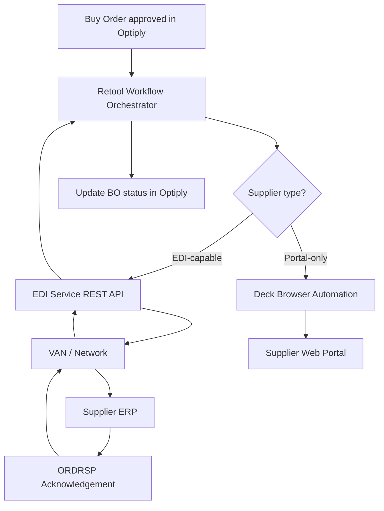

# Epic Brief — In-House EDI Integration

## Summary

Optiply generates purchase orders (Buy Orders) on behalf of its customers. Today, sending those orders to suppliers via EDI is handled entirely by a third-party middleman, OrderChief (invoiced as **Semso**), who charges €1 per order and uses Descartes as the underlying network. Actual spend data shows an average of **~€408/month** (Jan 2025–Feb 2026), peaking at **€745 in September 2025** and trending upward to ~€230/month in early 2026. The relationship with OrderChief is under strain — they are operating at a loss, cannot deliver customisations at the pace Optiply requires, and may terminate the partnership by Q2 2026. This Epic covers replacing OrderChief with a solution that Optiply owns and controls: a two-channel supplier order automation strategy combining EDI (for suppliers with EDI capability) and Deck browser automation (for suppliers with web portals only), orchestrated by Retool Workflows. The goal is simultaneously to reduce per-order cost, gain control over the mapping layer and customisation speed, and build EDI as a product-level capability that Optiply can offer to all customers.

---

## Context & Problem

### Who's Affected

- **Optiply customers** — they place orders in Optiply and expect those orders to reach suppliers automatically. Any disruption to the OrderChief relationship directly disrupts their operations.
- **Optiply product & engineering** — currently have no control over EDI customisations, supplier onboarding speed, or the mapping layer. All of this is locked inside OrderChief.
- **Suppliers (10–50 currently connected)** — they receive EDIFACT messages today via Descartes. A migration must be invisible to them.

### Where in the Product

This sits at the **order dispatch layer** — the step after a customer approves a Buy Order in Optiply and before the supplier receives it. Currently this step is a black box owned by OrderChief. The initiative makes it a first-class Optiply capability.

### Current Pain Points

1. **Vendor dependency & risk** — OrderChief may terminate by Q2 2026. There is no fallback.
2. **Cost at scale** — current spend averages ~€408/month and is trending upward. At the projected 2,000 messages/month in 3 years, this becomes ~€2,000/month. A flat-fee alternative (e.g. Orderful at $399/month) would save ~€1,600/month at that scale.
3. **Customisation bottleneck** — each new supplier or mapping change requires OrderChief's involvement. Their technology and team cannot move at Optiply's pace.
4. **No ownership of mapping specs** — the per-supplier EDIFACT configurations (GLNs, product codes, segment requirements) live inside OrderChief, not Optiply.
5. **Incomplete supplier coverage** — EDI only covers suppliers with EDI capability. Portal-only suppliers still require manual order entry (addressed by the Deck initiative, `file:deck-supplier-portals/context-and-implementation.md`).

### Success Criteria

- OrderChief is fully replaced before Q2 2026 with zero disruption to active customers.
- Optiply owns all supplier mapping configurations.
- New supplier EDI onboarding can be completed without OrderChief involvement.
- Per-message cost is materially lower than €1/order at scale.
- EDI + Deck together cover 100% of the supplier landscape (EDI-capable + portal-only).

---

## Actual Cost Data (Semso / OrderChief Invoices)

| Month | Total Paid | Notes |
|---|---|---|
| Jan 2025 | €673.58 | Two invoices: €498.13 + €175.45 |
| Feb 2025 | €713.80 | Two invoices: €526.25 + €187.55 |
| Mar 2025 | €510.18 | |
| Apr 2025 | €160.93 | Lowest month |
| May 2025 | €591.69 | Three invoices |
| Jun 2025 | €680.02 | Two invoices |
| Jul 2025 | €183.92 | |
| Aug 2025 | €185.13 | |
| Sep 2025 | €745.36 | Peak month; two invoices |
| Oct 2025 | €194.81 | |
| Nov 2025 | €432.27 | Three invoices |
| Dec 2025 | €194.81 | |
| Jan 2026 | €212.17 | |
| Feb 2026 | €229.96 | Partial month; trending up |

**Average monthly spend: ~€408** | **Peak: €745** | **Current trend: ~€220–230/month and rising**

> Note: Multiple invoices per month suggest either multiple customers billed separately or a fixed connection fee + variable per-order component. At €1/order, the average implies ~400 orders/month today.

---

## Cost Comparison: Current vs. Alternatives

> **Key finding:** Most Optiply clients use the **Transus** network (Dutch market leader, 100,000+ partners). This changes the VAN strategy — Transus, not Descartes, is the primary network to target.

| Option | Cost today (~400 orders/month) | Cost at scale (~2,000 orders/month) | Notes |
|---|---|---|---|
| **OrderChief (current)** | ~€408/month | ~€2,000/month | Variable, no control |
| **Transus Direct API** ⭐ | €199.90/month (Premium plan) | €199.90/month | Dutch market leader; most clients already on it; REST API; handles EDIFACT translation |
| **Orderful Integrated** | $399/month (~€370) | $399/month (~€370) | Flat fee, REST API; meeting Monday — verify Transus network access |
| **Zenbridge** | $450–850/month | $450–850/month | EU-native, EDI-as-API; verify Transus interconnects |
| **Comarch EDI** | Quote required | Quote required | European, strong in retail, full-service |
| **Build own + Transus API** | Engineering cost only | ~€200/month VAN fees | Best long-term; 3–4 months to build |
| ~~AWS B2B Data Interchange~~ | ~~N/A~~ | ~~N/A~~ | ❌ **Does not support EDIFACT** — X12 only. Eliminated. |

---

## Constraints

| Constraint | Detail |
|---|---|
| Timeline | Critical — alternative must be live within 1–2 months |
| Engineering capacity | 1 engineer at ~50% alongside other work |
| Tech stack | Mixed microservices; Retool Workflows for orchestration |
| Volume | ~400 orders/month today (actual spend data); ~2,000/month in 3 years |
| Descartes relationship | Indirect only — no direct account or contact today |
| Message types in scope | Outbound `ORDERS` + inbound `ORDRSP` (acknowledgement) |
| Integration team | In-house team uses hotglue (ETL/SaaS sync — not suitable for EDI) |

---

## Two-Channel Strategy



---

## Phased Approach

| Phase | Timeline | Goal | Approach |
|---|---|---|---|
| **Phase 1 — Emergency** | Weeks 1–6 | Replace OrderChief, zero downtime | Use a REST-API-based EDI service (Orderful or Zenbridge). Retool Workflows calls the API. Own the JSON→EDIFACT mapping config. |
| **Phase 2 — Strategic** | Months 6–18 | Own the full stack, reduce per-message cost | Direct VAN partnership (Descartes) + custom EDIFACT translation microservice. EDI becomes a product feature. |

---

## Phase 1 Candidate Services

### ⭐ Transus Direct API (NEW — Primary Candidate)
- **What it is:** Dutch EDI network, market leader in the Netherlands, 100,000+ trading partners
- **Why it matters:** Most of Optiply's clients are already on Transus — zero supplier re-onboarding required
- **Plan:** EDI Premium at €199.90/month — includes REST API access
- **How it works:** Optiply sends XML/CSV to Transus API; Transus translates to EDIFACT and routes to supplier's mailbox; inbound ORDRSP delivered back via webhook
- **Cost:** €199.90/month — cheapest option, immediate saving vs. €408/month current spend
- **Key advantage:** Clients already connected; Dutch company; understands Dutch/EU market
- **Key risk:** Need to verify API capabilities — can Optiply call Transus programmatically on BO approval? Does Transus support inbound ORDRSP webhooks?
- **Action:** Contact Transus sales/technical team this week

### Orderful (US-founded, EU-hosted)
- **Plan:** Integrated at $399/month (~€370) — flat fee, unlimited trading partners, unlimited transactions
- **API:** REST API; POST JSON order → Orderful translates to EDIFACT and routes via their network
- **Inbound:** Webhooks for ORDRSP delivery to your endpoint
- **EDIFACT support:** Full — ORDERS, ORDRSP, INVOIC, DESADV, CONTRL
- **European presence:** Orderful EU launched; EU data residency available
- **Network:** 10,000+ trading partners; primarily US-centric historically, expanding in Europe
- **Mosaic:** AI zero-mapping product (v4.0 API) — eliminates per-supplier mapping work; pricing unclear
- **Key risk:** Verify which of Optiply's current suppliers (on Descartes) are accessible via Orderful's network
- **Onboarding time:** 1–2 weeks if suppliers are on network

### Zenbridge (EU-native)
- **Plan:** Micro at $450/month — 1,000 transactions/month, 3 trading partners included
- **API:** REST API; EDI-as-API approach; supports EDIFACT and X12
- **Inbound:** Webhook delivery for inbound messages
- **EDIFACT support:** Full EDIFACT support
- **European presence:** EU-native company; strong European supplier coverage
- **Key advantage:** Built for European B2B; likely better coverage of Dutch/European suppliers
- **Key risk:** 3 trading partners on Micro plan — need to upgrade for 10–50 suppliers (Small plan at $850/month for 15 partners)
- **Onboarding time:** 2–4 weeks

### Comarch EDI (EU, Polish)
- **Plan:** Quote required — subscription-based, flat-rate between EDICOMNet users
- **API:** Full B2B platform; REST API available
- **European presence:** Deeply embedded in European retail supply chains; strong in Netherlands, Germany, Poland
- **Key advantage:** Likely has the best coverage of existing European suppliers
- **Key risk:** Enterprise-focused; may be slow to onboard and expensive for SMB use case

---

## Immediate Actions (Pre-Development)

1. **Contact Transus** — verify REST API capabilities for programmatic order sending; ask about inbound ORDRSP webhook support; get onboarding timeline. This is now the #1 priority given client network overlap.
2. **Monday: Orderful meeting** — key question: are Dutch suppliers on the Transus network accessible via Orderful? If not, Orderful cannot serve most of Optiply's current suppliers.
3. **Request all supplier mapping specs from OrderChief** — GLNs, product code formats, EDIFACT versions, required segments per supplier. This is Optiply's data and must be retrieved before the relationship deteriorates.
4. **Contact Zenbridge** — verify Transus network interconnects; ask about Dutch supplier coverage.
5. **Respond to OrderChief** — buy time; commit to providing the 3-year forecast and request a 60-day transition window regardless of outcome.

> **Eliminated options:** AWS B2B Data Interchange does **not** support EDIFACT (X12 only) — not viable for European suppliers. Stedi's EDIFACT support is in preview only — not production-ready.

---

## Constraints


| Constraint                                                                                                                                                                                                                                                                                                                                                                                                                                                                                                                                                                                                                                                                                                                                                                                                                                                                                                                                                                                                                                                                                                                                                                                                                                                                                                                                                                                                                                                                                                                                                                                                                                                                                                                                                                                                                                                                                                                                                                                                                                                                                                                                                                                                                                                                                                                                                                                                                                                                                                                                                                                                                                                                                                                                                                                                                                                                                                                                                                                                                                                                                                                                                                                                                                                                                                                                                                                                                                                                                                                                                                                                                                                                                                                                                                                                                                                                                                                                                                                                                                                                                                                                                                                                                                                                                                                                                                                                                                                                                                                                                                                                                                                                                                                                                                                                                                                                                                                                                                                                                                                                                                                                                                                                                                                                                                                                                                                                                                                                                                                                                                                                                                                                                                                                                                                                                                                                                                                                                                                                                                                                                                                                                                                                                                                                                                                                                                                                                                                                                                                                                                                                                                                                                                                                                                                                                                                                                                                                                                                                                                                                                                                                                                                                                                                                                                                                                                                                                                                                                                                                                                                                                                                                                                                                                                                                                                                                                                                                                                                                                                                                                                                                                                                                                                                                                                                                                                                                                                                                                                                                                                                                                                                                                                                                                                                                                                                                                                | Detail |
| --------------------------------------------------------------------------------------------------------------------------------------------------------------------------------------------------------------------------------------------------------------------------------------------------------------------------------------------------------------------------------------------------------------------------------------------------------------------------------------------------------------------------------------------------------------------------------------------------------------------------------------------------------------------------------------------------------------------------------------------------------------------------------------------------------------------------------------------------------------------------------------------------------------------------------------------------------------------------------------------------------------------------------------------------------------------------------------------------------------------------------------------------------------------------------------------------------------------------------------------------------------------------------------------------------------------------------------------------------------------------------------------------------------------------------------------------------------------------------------------------------------------------------------------------------------------------------------------------------------------------------------------------------------------------------------------------------------------------------------------------------------------------------------------------------------------------------------------------------------------------------------------------------------------------------------------------------------------------------------------------------------------------------------------------------------------------------------------------------------------------------------------------------------------------------------------------------------------------------------------------------------------------------------------------------------------------------------------------------------------------------------------------------------------------------------------------------------------------------------------------------------------------------------------------------------------------------------------------------------------------------------------------------------------------------------------------------------------------------------------------------------------------------------------------------------------------------------------------------------------------------------------------------------------------------------------------------------------------------------------------------------------------------------------------------------------------------------------------------------------------------------------------------------------------------------------------------------------------------------------------------------------------------------------------------------------------------------------------------------------------------------------------------------------------------------------------------------------------------------------------------------------------------------------------------------------------------------------------------------------------------------------------------------------------------------------------------------------------------------------------------------------------------------------------------------------------------------------------------------------------------------------------------------------------------------------------------------------------------------------------------------------------------------------------------------------------------------------------------------------------------------------------------------------------------------------------------------------------------------------------------------------------------------------------------------------------------------------------------------------------------------------------------------------------------------------------------------------------------------------------------------------------------------------------------------------------------------------------------------------------------------------------------------------------------------------------------------------------------------------------------------------------------------------------------------------------------------------------------------------------------------------------------------------------------------------------------------------------------------------------------------------------------------------------------------------------------------------------------------------------------------------------------------------------------------------------------------------------------------------------------------------------------------------------------------------------------------------------------------------------------------------------------------------------------------------------------------------------------------------------------------------------------------------------------------------------------------------------------------------------------------------------------------------------------------------------------------------------------------------------------------------------------------------------------------------------------------------------------------------------------------------------------------------------------------------------------------------------------------------------------------------------------------------------------------------------------------------------------------------------------------------------------------------------------------------------------------------------------------------------------------------------------------------------------------------------------------------------------------------------------------------------------------------------------------------------------------------------------------------------------------------------------------------------------------------------------------------------------------------------------------------------------------------------------------------------------------------------------------------------------------------------------------------------------------------------------------------------------------------------------------------------------------------------------------------------------------------------------------------------------------------------------------------------------------------------------------------------------------------------------------------------------------------------------------------------------------------------------------------------------------------------------------------------------------------------------------------------------------------------------------------------------------------------------------------------------------------------------------------------------------------------------------------------------------------------------------------------------------------------------------------------------------------------------------------------------------------------------------------------------------------------------------------------------------------------------------------------------------------------------------------------------------------------------------------------------------------------------------------------------------------------------------------------------------------------------------------------------------------------------------------------------------------------------------------------------------------------------------------------------------------------------------------------------------------------------------------------------------------------------------------------------------------------------------------------------------------------------------------------------------------------------------------------------------------------------------------------------------------------------------------------------------------------------------------------------------------------------------------------------------------------------------------------------------------------------------------------------------------------------------------------------- | ------ |
| Timelin---Two-Channel Strategy```mermaid graph TD A[Buy Order approved in Optiply] --> B[Retool Workflow Orchestrator] B --> C{Supplier type?} C -->|EDI-capable| D[EDI Service REST API] C -->|Portal-only| E[Deck Browser Automation] D --> F[VAN / Network] F --> G[Supplier ERP] G --> H[ORDRSP Acknowledgement] H --> F F --> D D --> B E --> I[Supplier Web Portal] B --> J[Update BO status in Optiply] ```---Phased Approach---Immediate Actions (Pre-Development)- **Request all supplier mapping specs from OrderChief** — GLNs, product code formats, EDIFACT versions, required segments per supplier. This is Optiply's data and must be retrieved before the relationship deteriorates.- **Contact Descartes directly** — begin the direct partnership conversation now so Phase 2 is ready in 6 months.- **Evaluate EDI REST API services** — get quotes and onboarding timelines from Orderful and SPS Commerce for Phase 1.- **Respond to OrderChief** — buy time; commit to providing the 3-year forecast and request a 60-day transition window.------Appendix: How EDI Works — Full ReferenceThis section is a technical primer on EDI for anyone joining this initiative. It explains what EDI is, why it exists, how messages flow, and why it is genuinely difficult to implement.Why EDI ExistsWhen a buyer wants to place a purchase order with a supplier, the naive approach is email, phone, or a web portal. This doesn't scale. When hundreds of customers each place dozens of orders per week with dozens of suppliers, machines must talk to machines — without humans in the loop.EDI (Electronic Data Interchange) is the answer. It is a set of standards that define exactly how a purchase order, invoice, delivery notice, or any other business document should be formatted so that **any two computer systems can exchange it automatically**, regardless of what internal software each party uses.The key word is **standard**. Without a standard, every supplier-buyer pair needs a custom integration. With a standard, you build one integration and it works with everyone who speaks the same standard.The Standard: EDIFACTIn Europe (and internationally), the dominant standard is **EDIFACT** (Electronic Data Interchange For Administration, Commerce and Transport), maintained by the United Nations. In North America, the equivalent is **X12**. Since Optiply's suppliers are primarily European, EDIFACT is what matters here.EDIFACT defines specific **message types** for each business document:**In scope for this initiative:** `ORDERS` (outbound) + `ORDRSP` (inbound).What an EDIFACT Message Actually Looks LikeEDIFACT is not XML, not JSON, not anything modern. It is a compact, delimiter-separated text format:UNB+UNOC:3+OPTIPLY_GLN:14+SUPPLIER_GLN:14+260224:0741+00001' UNH+1+ORDERS:D:01B:UN' BGM+220+PO-2026-0142+9' DTM+137:20260224:102' NAD+BY+8712345678901::9' NAD+SU+8798765432109::9' LIN+1++8710123456789:SRV' QTY+21:50' PRI+AAA:12.50:CT' LIN+2++8710987654321:SRV' QTY+21:20' PRI+AAA:34.00:CT' UNS+S' CNT+2:2' UNT+12+1' UNZ+1+00001'Each line is a **segment**. Each segment has a 3-letter code followed by data elements separated by `+`. The `'` at the end is the segment terminator.The **GLN (Global Location Number)** is a 13-digit GS1 identifier. Every party in the supply chain is identified by a GLN. These must match exactly what the supplier's system expects — there is no fuzzy matching. Optiply's customers need GLNs as the buyer; each supplier has their own GLN.How a Message Flows End-to-End```mermaid sequenceDiagram participant O as Optiply participant M as Mapping Layer participant V as VAN (Descartes) participant S as Supplier ERP O->>M: Internal order (JSON / DB record) M->>V: EDIFACT ORDERS message V->>S: Route to supplier mailbox S->>V: EDIFACT ORDRSP (acknowledgement) V->>M: Route back to Optiply mailbox M->>O: Parsed acknowledgement (confirmed / rejected / partial) ```There are two distinct components:**1. The VAN (Value Added Network)** A VAN is a private postal network for EDI messages — a secure message broker. Each participant has a "mailbox" on the VAN. You send a message addressed to a supplier's GLN; the VAN routes it to their mailbox. The supplier's system polls their mailbox and picks it up. Descartes operates one of the largest VANs in Europe. Suppliers are already connected to one or more VANs — you don't connect to each supplier individually, you connect to the VAN once and reach all of them.**2. The Mapping Layer** The VAN just routes messages — it doesn't care about content. The mapping layer is the software that:- Takes Optiply's internal order format and transforms it into a valid EDIFACT ORDERS message- Knows the specific requirements of each supplier (their GLN, their product codes, their required segments, their EDIFACT version)- Does the reverse for inbound ORDRSP messages**This is what OrderChief was building and maintaining. This is what Optiply needs to own.**Why EDI Is Hard — The Real Difficulties1. Per-Supplier Customisation (The Mapping Problem)EDIFACT is a standard, but it is a *flexible* standard. Every supplier implements it slightly differently:- **Different EDIFACT versions**: D96A, D01B, D03A — each has slightly different segment structures- **Different product identifiers**: Some suppliers want EAN-13 barcodes, others want their own internal article numbers, others want GS1 GTINs- **Different GLN structures**: Some suppliers have one GLN for the whole company, others have separate GLNs per warehouse or delivery location- **Mandatory vs. optional segments**: Supplier A requires a `RFF` (reference) segment with a contract number; Supplier B doesn't know what to do with it- **Qualifier codes**: The `QTY` segment has a qualifier — `21` means "ordered quantity" but some suppliers expect `47` even on a purchase order- **Character sets**: UNOC (Latin-1), UNOA (uppercase ASCII only) — mismatches cause silent failuresEach difference requires a separate mapping configuration per supplier. With 10–50 suppliers, that is 10–50 mappings to build, test, and maintain. When a supplier changes their ERP, their mapping requirements change and Optiply must update accordingly.This is exactly what OrderChief's message refers to when they say *"every piece of customization entails a long-term commitment in terms of maintenance and support."*2. Testing Is SlowThe testing process for each new supplier:- Obtain the supplier's EDI specification document (often a 50-page PDF)- Build the mapping- Send test messages to the supplier's test environment- Wait for their EDI team to validate (can take days or weeks)- Fix issues, repeat- Get sign-off, move to productionThis cycle repeats for every new supplier.3. Error Handling Is OpaqueWhen an EDIFACT message fails, the error response is itself an EDIFACT message — a `CONTRL` (functional acknowledgement) or `APERAK` (application error). These are terse, code-based responses. A `CONTRL` with error code `7` means "invalid interchange sender identification." Interpreting these requires expertise.4. The GLN ProblemEvery party needs a GLN. Optiply's customers need GLNs as the buyer. If a customer doesn't have a GLN, one must be registered via GS1 (~€100–200/year per GLN via GS1 Netherlands). This is an onboarding step that takes time and costs money.5. Acknowledgement LoopsA proper EDI implementation has multiple layers of acknowledgement:- **Technical ACK** (`CONTRL`): "I received your message and it is syntactically valid"- **Functional ACK** (`ORDRSP`): "I processed your order — here is the result"If no `CONTRL` arrives within a timeout window, did the message get lost? Did the VAN fail? Did the supplier's system go down? Retry logic, dead-letter queues, and alerting are required.6. Supplier ResistanceSome suppliers simply do not support EDI. They have a web portal, or they want email, or they want a PDF. This is why Deck exists — it is the fallback for suppliers who are not EDI-capable. EDI and Deck are complementary channels, not competing ones.What OrderChief Was Covering for €1/OrderThe €1/order is not unreasonable for what it covers. The problem is the lack of control and the customisation bottleneck — not the price alone.Optiply's Existing Toolset — Fit AssessmentPhase 1 EDI Service Options (REST API-based)For Phase 1, the fastest path is an EDI service that exposes a REST API — Retool POSTs a JSON order, the service generates EDIFACT and routes it via their VAN. Optiply owns the mapping from its internal format to the service's JSON schema. | &nbsp; |


&nbsp;
