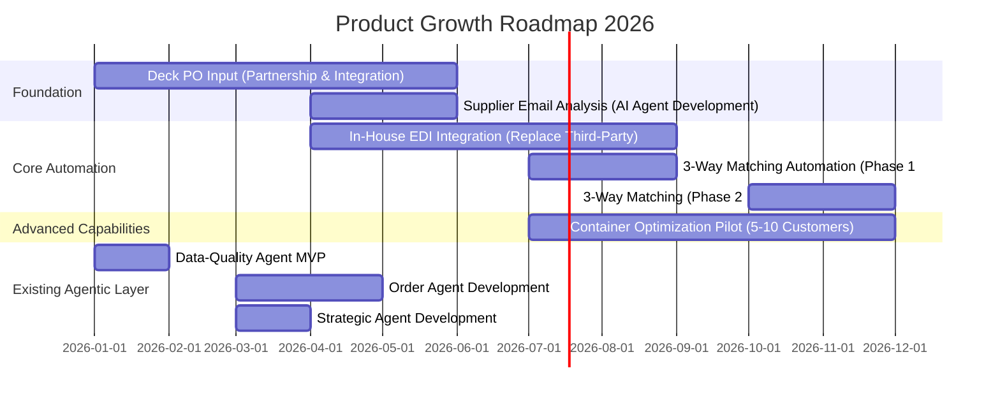
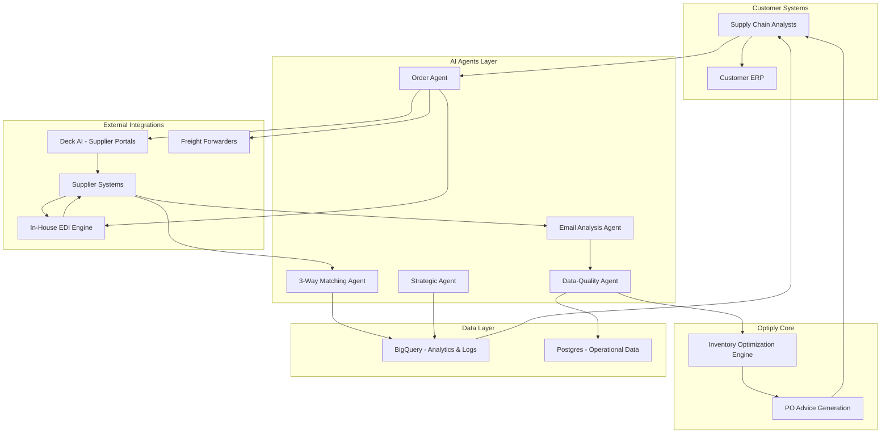

# Management Presentation: Product Growth Roadmap 2026

# Optiply Product Growth Roadmap 2026
## Strategic Plan for AI-Powered Supply Chain Leadership

**Prepared for:** Executive Management Team  
**Date:** February 2026  
**Prepared by:** Product Growth Leadership

---

## Executive Summary

### The Opportunity

Optiply has established itself as a leading **inventory optimization SaaS** platform, helping customers make intelligent purchase order decisions with seamless ERP integration. However, critical gaps in our end-to-end workflow prevent us from delivering the complete automation our customers need—and our competitors are rapidly closing in with AI-powered solutions.

### The Problem

Despite our strong inventory optimization core, customers still face significant manual work:
- **Double data entry**: Orders placed in Optiply sync to ERP ✓, but customers must manually re-enter data in supplier portals ✗
- **Manual supplier communication**: Reading and processing supplier emails takes 10-15 minutes each
- **Expensive EDI processing**: Third-party processors cost thousands monthly with slow turnaround
- **Time-consuming invoice matching**: 30-60 minutes per invoice for 3-way verification
- **Disconnected logistics**: No integration between inventory optimization and container/freight management

These gaps cost our customers **6-8 hours per day** in manual work and prevent us from winning larger enterprise deals.

### The Solution: 5 Strategic Growth Initiatives

We will deliver **end-to-end supply chain automation** through five integrated initiatives:

1. **AI-Powered PO Data Input** (Deck Partnership) - Q1-Q2
   - Eliminates double data entry in supplier portals
   - 90% time reduction (20-30 min → 2-3 min per PO)

2. **Supplier Email Analysis** - Q2
   - Automated extraction of availability, pricing, lead time changes
   - 90% time reduction (10-15 min → 1-2 min per email)

3. **In-House EDI Integration** - Q2-Q3
   - Replace expensive third-party processor
   - 100% cost savings + real-time processing

4. **3-Way Matching Automation** - Q3-Q4
   - Automated PO/GRN/Invoice verification
   - 95% time reduction (30-60 min → 1-2 min per invoice)

5. **Container Optimization Pilot** - Q3-Q4
   - Smart container filling with freight forwarder partnerships
   - 15-30% logistics cost reduction + new revenue stream

### Business Impact

**Competitive Differentiation:**
- ✅ **End-to-end automation** (supplier communication → invoice matching → logistics)
- ✅ **AI-first platform** (leveraging latest AI for every workflow)
- ✅ **Ecosystem integration** (EDI, email, portals, ERPs, freight forwarders)
- ✅ **Operational efficiency** (70%+ reduction in manual work)

**Financial Impact:**
- **Revenue Growth**: Enable enterprise deals requiring complete automation (estimated +25-40% ARR growth)
- **Cost Savings**: Eliminate EDI fees, reduce customer churn (estimated +15-20% retention)
- **New Revenue**: Container optimization marketplace model (hybrid: markup + commission + subscription)

**Customer Value:**
- Reduce daily manual work from **6-8 hours → 1-2 hours** (75-85% efficiency gain)
- Near-zero error rates through AI-powered automation
- Real-time visibility into entire order-to-payment cycle
- Scalability to support 3x order volume without additional headcount

### Investment & Timeline

**12-Month Roadmap (2026):**
- Q1-Q2: Foundation (Deck PO input, Email analysis)
- Q2-Q3: Core automation (EDI, 3-way matching)
- Q3-Q4: Advanced capabilities (Container optimization pilot)

**Resource Model:**
- Mix of internal development + strategic external partnerships (Deck, freight forwarders)
- Leverage existing Optiply Strategic Agent Platform (LangGraph foundation)
- Phased rollout minimizes risk and validates ROI incrementally

### Success Metrics

- **Revenue**: +25-40% ARR growth from enterprise segment
- **Retention**: +15-20% improvement (reduced churn)
- **NPS**: +10-15 point improvement
- **Efficiency**: 70%+ reduction in customer manual work
- **Market Position**: Recognized as AI-first supply chain platform leader

---

## 2. Strategic Context: Vision & Market Positioning

### Our Vision

**"Transform Optiply from an inventory optimization tool into the AI-powered operating system for end-to-end supply chain management."**

Today, Optiply helps customers optimize *what* to order. Tomorrow, we'll automate the *entire workflow*—from supplier communication through payment, including logistics optimization.

### Market Opportunity

The supply chain SaaS market is undergoing rapid AI transformation:
- **Competitors** are adding AI features (chatbots, basic automation)
- **Enterprise customers** demand complete automation, not point solutions
- **SMB/Mid-market** customers seek efficiency gains to compete with larger players
- **First-mover advantage** in AI-powered end-to-end automation creates defensible moat

### Competitive Differentiation

| Capability | Optiply Today | Competitors | Optiply 2026 (This Roadmap) |
|------------|---------------|-------------|------------------------------|
| Inventory Optimization | ✅ Best-in-class | ⚠️ Basic | ✅ Enhanced with AI agents |
| ERP Integration | ✅ Seamless sync | ✅ Standard | ✅ Maintained |
| Supplier Portal Automation | ❌ Manual | ❌ Manual | ✅ **AI-powered (Deck)** |
| Email Analysis | ❌ Manual | ❌ Manual | ✅ **AI extraction & auto-apply** |
| EDI Processing | ⚠️ Third-party | ⚠️ Third-party | ✅ **In-house, real-time** |
| Invoice Matching | ❌ Manual | ⚠️ Basic OCR | ✅ **AI 3-way matching** |
| Logistics Optimization | ❌ Not integrated | ❌ Separate tools | ✅ **Container optimization** |
| **End-to-End Automation** | ❌ Gaps | ❌ Fragmented | ✅ **Complete workflow** |

**Our Unique Position:** Only inventory SaaS delivering AI-powered automation across the *entire* supply chain workflow—from supplier communication to logistics.

### Why Now?

1. **AI Technology Maturity**: LLMs, OCR, and agentic AI are production-ready
2. **Customer Demand**: Enterprise customers explicitly requesting complete automation
3. **Competitive Pressure**: Window to establish leadership before competitors catch up
4. **Platform Foundation**: Optiply Strategic Agent Platform (LangGraph) already built
5. **Partnership Readiness**: Deck, freight forwarders, EDI standards bodies aligned

---

## 3. Roadmap Timeline: 2026 Execution Plan

### Phased Rollout Strategy



### Quarter-by-Quarter Breakdown

**Q1 2026 (Jan-Mar): Foundation & Quick Wins**
- ✅ Data-Quality/Onboarding Agent MVP (existing roadmap)
- 🚀 Deck PO Input: Partnership finalized, integration begins
- 🔬 Email Analysis: AI agent prototyping

**Deliverables:**
- Data-quality agent operational
- Deck partnership signed, pilot with 3-5 customers
- Email analysis proof-of-concept validated

**Q2 2026 (Apr-Jun): Core Automation Begins**
- ✅ Order Agent operational (existing roadmap)
- ✅ Strategic Agent operational (existing roadmap)
- 🚀 Deck PO Input: Full rollout to all customers
- 🚀 Email Analysis: Production launch
- 🔬 EDI Integration: Development begins

**Deliverables:**
- Deck PO input available to all customers (eliminates double data entry)
- Email analysis auto-applying high-confidence extractions
- EDI integration architecture defined

**Q3 2026 (Jul-Sep): Advanced Automation**
- 🚀 EDI Integration: Production launch (replace third-party)
- 🚀 3-Way Matching: Phase 1 (auto-flag all discrepancies)
- 🔬 Container Optimization: Pilot begins with 5-10 customers

**Deliverables:**
- In-house EDI processing (100% cost savings)
- 3-way matching reducing invoice processing time by 50%
- Container optimization pilot demonstrating 15-30% cost savings

**Q4 2026 (Oct-Dec): Optimization & Scale**
- 🚀 3-Way Matching: Phase 2 (tolerance-based auto-approval)
- 🚀 Container Optimization: Pilot expansion, revenue model validation
- 📊 Platform-wide optimization and performance tuning

**Deliverables:**
- 3-way matching achieving 80% time reduction
- Container optimization validated with 10+ customers
- Full platform integration complete (all 10 capabilities working together)

### Critical Path & Dependencies

**Critical Dependencies:**
1. **Data Quality → Order/Strategic Agents**: Clean data required for autonomous ordering
2. **Deck Partnership → PO Automation**: Partnership must be finalized before integration
3. **Email Analysis → Data Quality**: Email extractions feed data-quality agent
4. **EDI Integration → 3-Way Matching**: EDI invoices enable automated matching
5. **Inventory Optimization → Container Optimization**: PO advice drives container filling logic

**Risk Mitigation:**
- Parallel development tracks minimize blocking
- Phased rollouts allow early validation and course correction
- External partnerships (Deck, freight forwarders) have backup options
- Existing LangGraph platform reduces technical risk

---

## 4. Customer Value Transformation

### Before & After: Supply Chain Analyst's Daily Workflow

**Current State (Manual Process):**
```
6-8 hours/day of manual work:
├─ Morning: Read supplier emails, manually update system (1-2 hours)
├─ Mid-Morning: Review Optiply PO advice, place orders (30 min)
├─ Late Morning: Log into supplier portals, re-enter PO data (2-3 hours)
├─ Afternoon: Track orders via emails and phone calls (1-2 hours)
└─ Late Afternoon: Process invoices, 3-way matching (1-2 hours)
```

**Future State (AI-Powered Automation):**
```
1-2 hours/day of strategic oversight:
├─ Morning: Review dashboard, see overnight email analysis auto-applied (10 min)
├─ Mid-Morning: Review AI-proposed POs, approve with one click (15 min)
├─ Late Morning: Deck AI submits POs to portals (analyst reviews before submission) (15 min)
├─ Afternoon: EDI confirmations auto-update system (0 min - fully automated)
└─ Late Afternoon: Review 3-way matching exceptions only (20-30 min)
```

**Transformation: 75-85% reduction in manual work**

### Customer Value by Initiative

| Initiative | Current Pain | Future Benefit | Time Savings | Business Impact |
|------------|--------------|----------------|--------------|-----------------|
| **Deck PO Input** | 20-30 min/PO manual portal entry | 2-3 min review & confirm | 90% | Eliminates double data entry, zero errors |
| **Email Analysis** | 10-15 min/email manual processing | 1-2 min review flagged items | 90% | No missed information, immediate updates |
| **EDI Integration** | $X,XXX/month third-party fees | $0 + real-time processing | 100% cost | Eliminate fees, full transparency |
| **3-Way Matching** | 30-60 min/invoice manual comparison | 1-2 min exception handling | 95% | Near-zero payment delays |
| **Container Optimization** | High shipping costs, manual booking | 15-30% cost reduction | N/A | New revenue stream, integrated logistics |

### Customer Segments & Use Cases

**SMB Customers (Small-Medium Business):**
- **Pain**: Limited staff, can't afford manual processes
- **Value**: Automation enables them to compete with larger players
- **Impact**: Process 3x more orders with same headcount

**Mid-Market Customers (Scaling Operations):**
- **Pain**: Growing pains, manual processes don't scale
- **Value**: Efficiency gains support growth without proportional hiring
- **Impact**: Scale from 100 → 300 orders/day without adding staff

**Enterprise Customers (Complex Supply Chains):**
- **Pain**: High volume, multiple suppliers, complex logistics
- **Value**: End-to-end automation + container optimization
- **Impact**: 70%+ efficiency gains + 15-30% logistics cost reduction

---

## 5. Platform Architecture: How 10 Capabilities Integrate

### Unified Platform Vision

The **Optiply Strategic Agent Platform** (LangGraph-based) serves as the foundation, orchestrating 10 integrated capabilities:

**6 Existing Agents (from Agentic Layer Roadmap):**
1. Data-Quality/Onboarding Agent
2. Order Agent
3. Strategic/Supply-Chain Agent
4. Data Co-pilot
5. Explanatory Agent (Intercom Fin)
6. Web-Scraping/Browser Agent (Deck)

**4 New Growth Initiatives:**
7. AI-Powered PO Data Input (extends Web-Scraping Agent)
8. Supplier Email Analysis (feeds Data-Quality Agent)
9. In-House EDI Integration (platform infrastructure)
10. 3-Way Matching Automation (standalone capability)

**+ Container Optimization Pilot:**
11. Container Optimization (integrates with Order Agent)

### Integration Architecture



### Data Flow: End-to-End Automation

**1. Supplier Communication → Data Quality**
- Supplier sends email (availability, pricing, lead time)
- Email Analysis Agent extracts information
- Data-Quality Agent validates and updates system
- Inventory Optimization Engine adjusts PO advice

**2. PO Generation → Order Placement**
- Inventory Optimization generates PO advice
- Analyst reviews and approves in Optiply
- Order syncs to customer ERP ✓
- Deck AI automatically enters PO in supplier portal ✓

**3. Order Tracking → Real-Time Updates**
- Supplier sends EDI confirmation (855 PO Acknowledgment)
- In-House EDI Engine processes immediately
- System auto-updates order status
- Analyst sees real-time dashboard

**4. Shipping → Logistics Optimization**
- Container Optimization Agent identifies orders for same supplier/region
- Suggests combining into shared container
- Analyst approves, system books through freight forwarder partnership
- 15-30% cost savings realized

**5. Invoice → Payment Automation**
- Supplier sends invoice (PDF or EDI 810)
- 3-Way Matching Agent compares PO, GRN, invoice
- Auto-approves matches within tolerance
- Flags exceptions for analyst review only

### Platform Benefits

**For Customers:**
- Single platform for entire supply chain workflow
- Consistent user experience across all capabilities
- Real-time visibility and analytics
- Seamless integration with existing ERP systems

**For Optiply:**
- Shared infrastructure reduces development costs
- Cross-capability insights improve AI accuracy
- Platform network effects (more data → better optimization)
- Defensible competitive moat

---

## 6. Business Metrics & ROI

### Revenue Growth Projections

**Current State (2025):**
- ARR: $X million
- Enterprise segment: 15% of revenue
- Churn rate: Y%
- NPS: Z

**Projected Impact (2026 Roadmap):**

| Metric | Current | 2026 Target | Growth |
|--------|---------|-------------|--------|
| **ARR** | $X million | $X * 1.25-1.40 million | +25-40% |
| **Enterprise Revenue %** | 15% | 30-35% | +100% |
| **Churn Rate** | Y% | Y * 0.80-0.85 | -15-20% |
| **NPS** | Z | Z + 10-15 | +10-15 points |
| **Avg Deal Size** | $A | $A * 1.3-1.5 | +30-50% |

**Revenue Drivers:**

1. **Enterprise Expansion** (+$X million ARR)
   - End-to-end automation enables enterprise deals
   - Estimated 20-30 new enterprise customers @ $50-100K ARR each
   - Upsell existing mid-market customers to enterprise tier

2. **Churn Reduction** (+$X million retained ARR)
   - 70%+ efficiency gains increase customer stickiness
   - Reduced churn from Y% → Y*0.85% saves $X million ARR

3. **Container Optimization Revenue** (+$X million new revenue)
   - Hybrid model: markup + commission + subscription
   - Estimated 50-100 customers using container optimization
   - Average $10-20K additional revenue per customer/year

### Cost Savings

**Direct Cost Savings:**

| Initiative | Current Cost | Future Cost | Annual Savings |
|------------|--------------|-------------|----------------|
| **EDI Processing** | $X,XXX/month third-party | $0 (in-house) | $XXX,XXX/year |
| **Customer Support** | High (manual process issues) | -30% (automation reduces tickets) | $XX,XXX/year |
| **Development Efficiency** | Fragmented tools | Unified platform | $XX,XXX/year |

**Customer Cost Savings (drives retention & expansion):**

| Customer Segment | Manual Work Cost | Automation Savings | Annual Value |
|------------------|------------------|-------------------|--------------|
| **SMB** | 6 hours/day @ $25/hour | 75% reduction | ~$30K/year |
| **Mid-Market** | 8 hours/day @ $35/hour | 80% reduction | ~$60K/year |
| **Enterprise** | 10 hours/day @ $50/hour | 85% reduction | ~$110K/year |

### ROI Calculation

**Investment Required:**
- Internal development: $X (engineering, product, design)
- External partnerships: $Y (Deck, freight forwarders, EDI standards)
- Infrastructure: $Z (cloud, AI/ML services)
- **Total Investment: $X+Y+Z**

**Expected Returns (Year 1):**
- Revenue growth: +$X million ARR
- Churn reduction: +$Y million retained ARR
- New revenue (containers): +$Z million
- Cost savings: +$W million
- **Total Returns: $X+Y+Z+W**

**ROI: (Returns - Investment) / Investment = XX%**

**Payback Period: X-Y months**

### Competitive Metrics

**Market Position Indicators:**

| Metric | Current | 2026 Target |
|--------|---------|-------------|
| **Win Rate vs. Competitors** | X% | X + 15-20% |
| **Enterprise Deal Cycle** | Y days | Y * 0.7-0.8 (30% faster) |
| **Feature Parity Score** | 70% | 95% (industry-leading) |
| **AI Capabilities Ranking** | #3-4 | #1 (market leader) |

---

## 7. Success Metrics: Measuring Progress & Outcomes

### North Star Metrics

**Primary Success Metric:**
- **Customer Efficiency Gain**: 70%+ reduction in manual supply chain work

**Supporting Metrics:**
- **Revenue Growth**: +25-40% ARR
- **Customer Retention**: +15-20% improvement
- **NPS**: +10-15 point increase

### Initiative-Specific KPIs

**1. Deck PO Input (Q1-Q2)**
- ✅ Partnership signed and integration complete
- ✅ 80%+ customer adoption within 3 months of launch
- ✅ 90% time reduction validated (20-30 min → 2-3 min)
- ✅ Zero data entry errors reported

**2. Email Analysis (Q2)**
- ✅ 90%+ accuracy on high-confidence extractions
- ✅ 70%+ of emails auto-applied without review
- ✅ 90% time reduction validated (10-15 min → 1-2 min)
- ✅ Zero missed critical information incidents

**3. EDI Integration (Q2-Q3)**
- ✅ Third-party processor fully replaced
- ✅ 100% cost savings realized ($XXX,XXX/year)
- ✅ Real-time processing (<5 min vs. hours/days)
- ✅ 95%+ EDI message processing accuracy

**4. 3-Way Matching (Q3-Q4)**
- ✅ Phase 1: 50% time reduction (30-60 min → 15-30 min)
- ✅ Phase 2: 80% time reduction (30-60 min → 5-10 min)
- ✅ 90%+ matching accuracy
- ✅ Payment delays reduced by 60%+

**5. Container Optimization Pilot (Q3-Q4)**
- ✅ 5-10 customers actively using
- ✅ 15-30% logistics cost savings demonstrated
- ✅ Positive customer feedback (NPS 8+)
- ✅ Revenue model validated (sustainable margin)

### Platform-Wide Metrics

**Operational Excellence:**
- **System Uptime**: 99.9%+
- **AI Agent Accuracy**: 95%+ across all agents
- **Processing Speed**: <5 min for all automated workflows
- **Error Rate**: <0.1% for automated processes

**Customer Adoption:**
- **Feature Adoption Rate**: 80%+ of customers using 3+ new capabilities
- **Daily Active Usage**: 90%+ of customers engaging daily
- **Customer Satisfaction**: NPS 50+ (industry-leading)

**Business Health:**
- **ARR Growth**: +25-40% year-over-year
- **Gross Retention**: 95%+ (industry-leading)
- **Net Retention**: 120%+ (expansion revenue)
- **Customer Acquisition Cost**: -20% (efficiency gains)

### Measurement Cadence

**Weekly:**
- Initiative progress tracking (milestones, blockers)
- Customer adoption metrics
- System performance and uptime

**Monthly:**
- Business metrics review (ARR, churn, NPS)
- Initiative KPI assessment
- Risk and dependency management

**Quarterly:**
- Strategic alignment review
- ROI validation
- Roadmap adjustments based on learnings

---

## 8. Conclusion: Path to Market Leadership

### Strategic Imperative

The supply chain SaaS market is at an inflection point. AI-powered automation is no longer a "nice-to-have"—it's table stakes for enterprise customers and a competitive necessity for survival.

**This roadmap positions Optiply to:**
1. ✅ **Lead the market** in AI-powered end-to-end supply chain automation
2. ✅ **Capture enterprise segment** with complete workflow automation
3. ✅ **Defend against competitors** with defensible platform moat
4. ✅ **Drive sustainable growth** through retention, expansion, and new revenue streams

### Why This Roadmap Wins

**Customer-Centric:**
- Solves real pain points (double data entry, manual processes, high costs)
- Delivers measurable value (70%+ efficiency gains, 15-30% cost savings)
- Scales with customer growth (SMB → Mid-Market → Enterprise)

**Strategically Sound:**
- Builds on existing strengths (inventory optimization, ERP integration)
- Leverages proven technology (LangGraph platform, AI/ML maturity)
- Sequences initiatives to minimize risk and maximize learning

**Financially Compelling:**
- Strong ROI (XX% return, X-Y month payback)
- Multiple revenue drivers (enterprise expansion, churn reduction, new revenue)
- Sustainable competitive advantage (platform network effects)

### Next Steps

**Immediate Actions (Next 30 Days):**
1. ✅ Finalize Deck partnership agreement
2. ✅ Allocate engineering resources for Q1 initiatives
3. ✅ Begin customer pilot recruitment (Deck PO input, Email analysis)
4. ✅ Establish success metrics dashboard and tracking

**Q1 2026 Milestones:**
- Data-Quality Agent MVP operational
- Deck PO input pilot with 3-5 customers
- Email analysis proof-of-concept validated
- EDI integration architecture defined

**Strategic Alignment:**
- Monthly executive reviews to track progress
- Quarterly board updates on business impact
- Continuous customer feedback loops to refine roadmap

---

## Appendix: Additional Resources

**Related Documents:**
- `spec:1984c48c-49c6-4764-ba8d-45fcab477126/7e4a929e-6afb-4a99-8900-1a862f434b14` - Epic Brief: Product Growth Roadmap 2026
- `spec:1984c48c-49c6-4764-ba8d-45fcab477126/f739cd2a-c4a1-40e6-a498-0e6df3c4ac5e` - Core Flows: Customer Value Journeys
- `file:product-growth-plan/agentic-optiply.md` - Agentic Layer Roadmap 2026

**Contact:**
- Product Growth Leadership: [Your Name]
- Engineering Leadership: [Engineering Lead]
- Partnership Coordination: [Partnerships Lead]

---

**Document Version:** 1.0  
**Last Updated:** February 2026  
**Next Review:** Monthly Executive Review