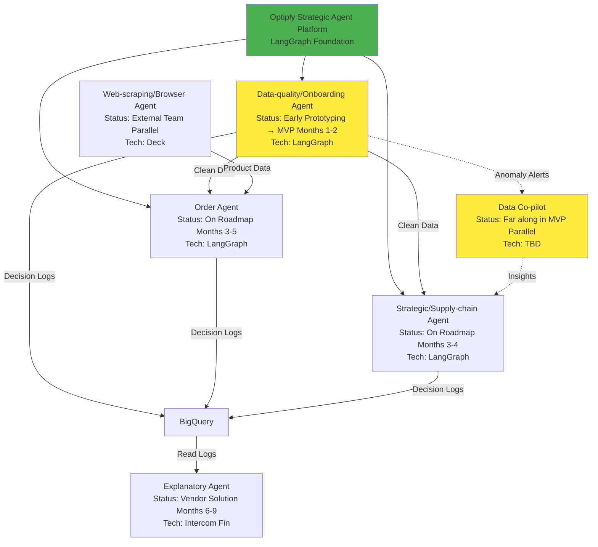

# Agentic Layer Roadmap 2026

# Epic Brief: Agentic Layer Roadmap 2026

## Summary

This Epic defines the strategic roadmap for building a comprehensive agentic layer across Optiply's supply chain operations. The initiative encompasses six specialized AI agents, each addressing distinct operational needs—from data quality and supplier onboarding to autonomous ordering and strategic optimization. The foundation is the **Optiply Strategic Agent Platform**, a LangGraph-based infrastructure already in early prototyping with four workflows operational. Over the course of 2026, we will complete the Data-quality/Onboarding agent MVP (1-2 months), followed by Order and Strategic agents (months 3-4), and integrate external solutions including a Data Co-pilot (parallel MVP development), Explanatory agent (Intercom Fin), and Web-scraping agent (Deck platform). The roadmap balances parallel development tracks, manages critical dependencies (Order and Strategic agents require clean data from Data-quality agent), and addresses vendor constraints while maintaining focus on user adoption and operational efficiency gains.

## Context & Problem

### Who's Affected

**Primary Stakeholders:**

- **Operations Teams**: Daily users who manage supplier data, inventory, orders, and service levels
- **Supply Chain Managers**: Strategic decision-makers who optimize reorder policies and supplier relationships
- **Data Analysts**: Users who query data, run scenarios, and surface insights
- **Engineering Teams**: Backend, frontend, and infrastructure teams building and maintaining the agents
- **Product & Design Teams**: Teams defining user experiences and workflows
- **Executive Leadership**: Stakeholders tracking ROI, adoption, and strategic alignment

**Cross-functional Impact:**

- Engineering teams need clear technical architecture and integration patterns
- Product teams need to understand agent capabilities and user flows
- Operations teams need reliable, production-ready tools that save time
- Leadership needs visibility into progress, dependencies, and resource allocation

### Current Pain Points

**1. Fragmented Development Without Clear Roadmap**

- Multiple agent initiatives (Data-quality, Data Co-pilot, Web-scraping, Explanatory) are progressing in parallel without a unified view
- Teams lack clarity on dependencies, sequencing, and integration points
- Risk of building incompatible solutions or duplicating effort
- No shared understanding of what's already built vs. what needs development

**2. Data Quality Bottleneck**

- Current data quality issues (missing SKUs, incorrect lead times, supplier data gaps) block downstream automation
- Manual data cleanup is time-consuming and error-prone
- Order and Strategic agents cannot operate reliably without clean data
- The Data-quality/Onboarding agent is in early prototyping but not production-ready

**3. Unclear Foundation vs. New Development**

- The **Optiply Strategic Agent Platform** (LangGraph-based infrastructure in file:src/) provides a solid foundation with state management, memory, RAG, workflows, and tools
- However, teams may not realize this foundation exists, leading to potential re-invention
- Existing workflows (`lead_time_setup`, `supplier_onboarding`, `stock_analysis`, `service_level_optimization`) need productionization, not greenfield development

**4. Resource Constraints & Vendor Dependencies**

- Limited engineering capacity requires careful prioritization and sequencing
- External dependencies (Deck for Web-scraping, Intercom Fin for Explanatory agent) introduce coordination overhead
- Tech stack decisions (e.g., Data Co-pilot) are pending based on LangGraph performance validation

**5. Integration Architecture Undefined**

- How agents communicate (direct APIs, shared data stores, events) is not standardized
- BigQuery's role (single source of truth vs. analytics-only) needs clarification
- Decision logging for the Explanatory agent needs to be implemented early
- Cross-agent workflows and data flows are not documented

### Where in the Product

This Epic spans the **entire Optiply platform**, touching:

- **Data Layer**: BigQuery, Postgres, vector stores, supplier portals, inventory/WMS systems
- **Agent Layer**: Six specialized agents with distinct responsibilities
- **Integration Layer**: APIs, event systems, shared data stores
- **User Interface Layer**: Operations UI, analyst tools, approval workflows

### The Core Problem

**We need a clear, shareable roadmap that:**

1. **Maps dependencies** between agents so teams understand sequencing and blockers
2. **Highlights what's already built** (the Strategic Agent Platform) vs. what needs development
3. **Defines integration patterns** for agent-to-agent communication and data flows
4. **Sequences work appropriately** given resource constraints and vendor dependencies
5. **Provides visibility** to engineering, product, operations, and leadership teams
6. **Enables coordination** across parallel development tracks (LangGraph agents, Data Co-pilot, external vendors)

Without this roadmap, teams risk:

- Building incompatible solutions
- Blocking each other due to unclear dependencies
- Duplicating infrastructure work
- Missing integration opportunities
- Failing to deliver value in a coordinated, timely manner

### Success Criteria

**By Month 2:**

- Data-quality/Onboarding agent MVP operational in production
- Operations teams using workflows daily for data cleanup
- BigQuery decision logging established
- LangGraph performance validated (informs Data Co-pilot tech stack decision)
- Data Co-pilot MVP complete (parallel track)

**By Month 4:**

- Order agent placing routine orders autonomously
- Strategic agent providing optimization recommendations
- Clean data pipeline established from Data-quality → Order/Strategic agents

**By Month 8:**

- All six agents operational and integrated
- Cross-agent workflows optimized
- User adoption and satisfaction metrics met (time savings, efficiency gains)

**By Year End:**

- Full agentic layer rolled out across Optiply
- Measurable impact on operational efficiency and data quality
- Platform ready to scale with new agents and capabilities

---

## Agent Overview

**Legend:**

- �� Green: Already built (Platform foundation)
- �� Yellow: Current focus (Months 1-2)
- Solid arrows: Hard dependencies
- Dotted arrows: Soft integration opportunities

---

## Timeline Overview

| Phase       | Timeline    | Focus                     | Deliverables                                                          |
| ----------- | ----------- | ------------------------- | --------------------------------------------------------------------- |
| **Phase 1** | Months 1-2  | Foundation MVPs           | Data-quality agent MVP, Data Co-pilot MVP, BigQuery logging           |
| **Phase 2** | Months 3-4  | Core Operational Agents   | Order agent, Strategic agent                                          |
| **Phase 3** | Months 5-8  | Enhancement & Integration | Data Co-pilot production, Explanatory agent, Web-scraping integration |
| **Phase 4** | Months 9-12 | Optimization & Scale      | Cross-agent workflows, performance tuning, new capabilities           |

---

## Key Risks & Constraints

1. **Critical Path Dependency**: Order and Strategic agents blocked until Data-quality agent MVP complete
2. **Resource Constraints**: Limited engineering capacity requires careful sequencing
3. **Vendor Dependencies**: Deck (Web-scraping), Intercom Fin (Explanatory) introduce coordination overhead
4. **Tech Stack Decisions**: Data Co-pilot tech stack pending LangGraph performance validation
5. **Integration Complexity**: Agent-to-agent communication patterns need standardization

---

## References

- Platform codebase: file:src/
- Existing workflows: file:src/workflows/
- State management: file:src/state.py
- Graph orchestration: file:src/graph.py