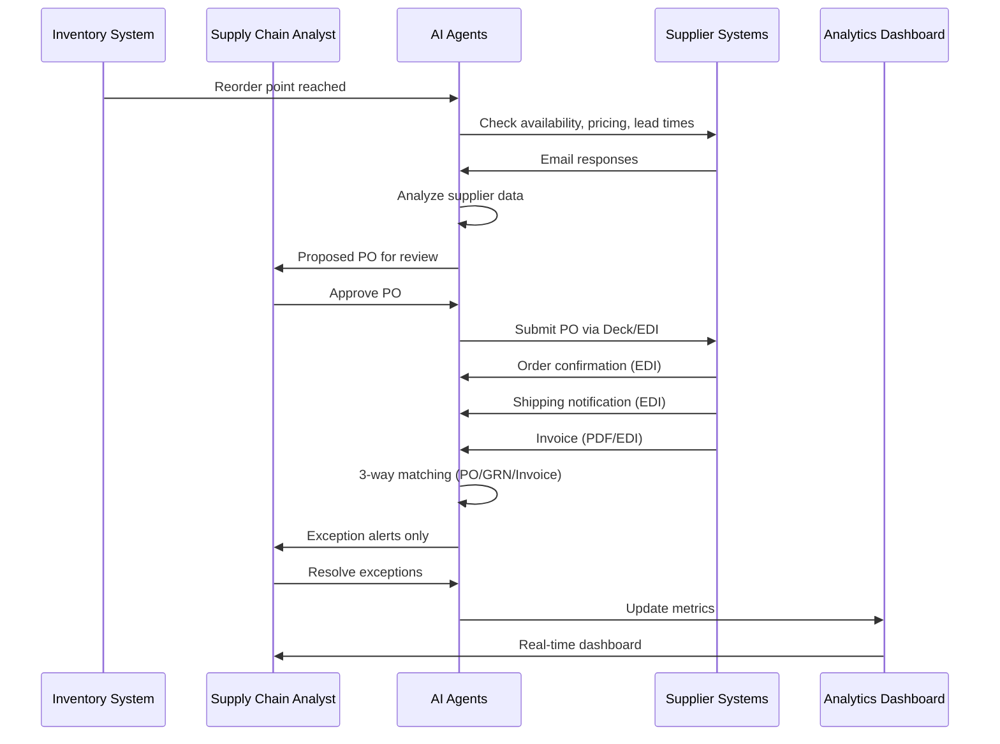
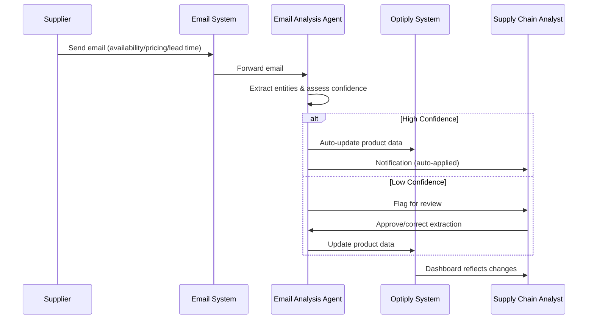
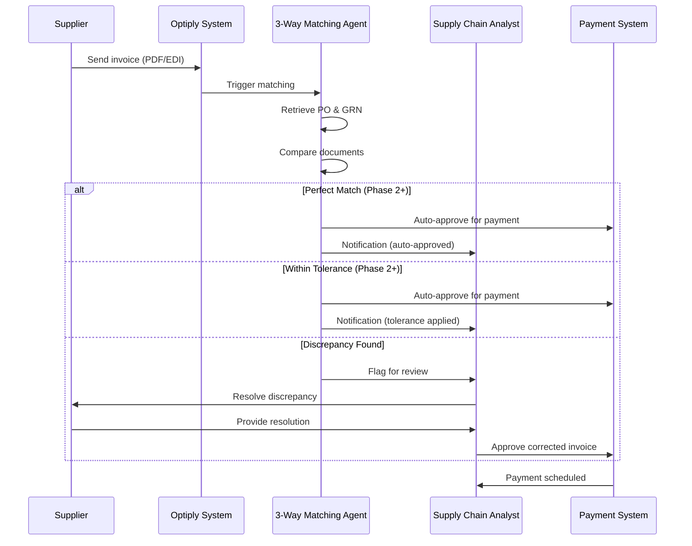
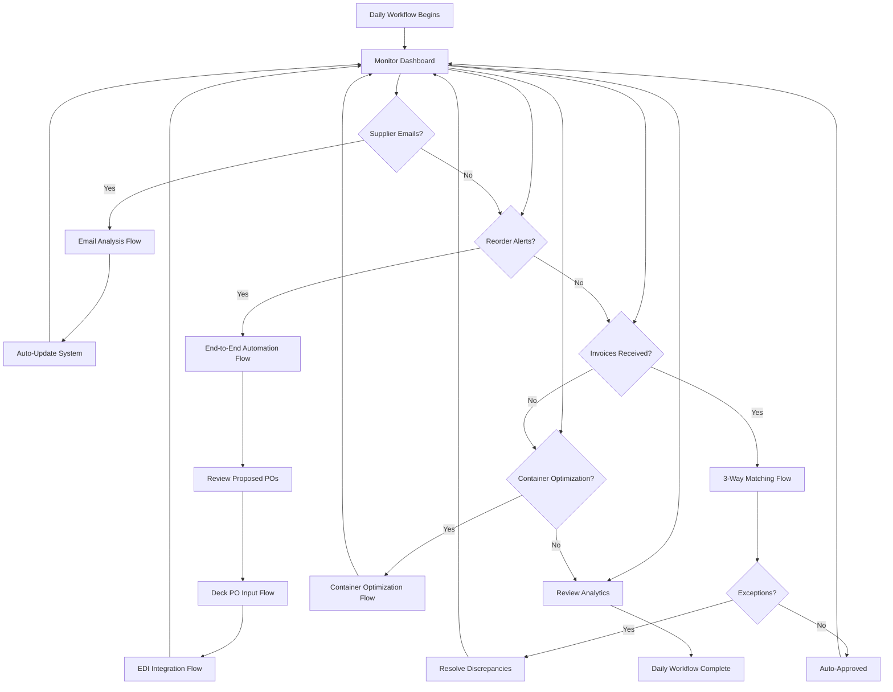

# Core Flows: Customer Value Journeys

## Overview

This spec documents the core customer value flows for Optiply's Product Growth Roadmap 2026, showing how end users experience the transformation from manual, time-consuming processes to AI-powered, end-to-end automation.

**About Optiply:** Optiply is an **inventory optimization SaaS** that provides intelligent purchase order (PO) advice to customers. The platform already integrates with customer ERPs—when customers place orders in Optiply, they automatically sync to their ERP systems. However, customers still face manual work in supplier portals, email processing, invoice matching, and logistics coordination.

Each flow demonstrates the current state pain points and the future state benefits, emphasizing the **70%+ reduction in manual work** that drives competitive differentiation.

**Primary User Persona:** Supply Chain Analyst who monitors and manages automated supply chain operations, intervening only when necessary.

**Flow Structure:** Each flow shows Current State → Future State transformation with 5-7 high-level steps.

---

## Flow 1: End-to-End Automation Flow

**Description:** Complete supply chain workflow from supplier communication through invoice matching, monitored by Supply Chain Analyst.

**Trigger:** Inventory reaches reorder point (system-initiated)

**Outcome:** Analytics updated with complete order-to-payment cycle data

### Current State (Manual Process)

1. **Optiply PO Advice**: Optiply's inventory optimization generates PO recommendations
2. **Analyst Review**: Analyst reviews and verifies PO advice in Optiply
3. **Place in Optiply**: Analyst places order in Optiply → automatically syncs to ERP ✓
4. **Manual Supplier Portal Entry**: Analyst manually logs into supplier portal, re-enters same PO data ✗ (double data entry)
5. **Supplier Communication**: Analyst manually checks emails for availability, pricing, lead time updates
6. **Order Tracking**: Analyst manually tracks order status via emails and phone calls
7. **Invoice Processing**: Analyst receives invoice (often PDF), manually compares with PO and GRN
8. **Payment Approval**: Analyst resolves discrepancies, approves payment manually

**Pain Points:** 4-6 hours per order cycle, double data entry (Optiply + supplier portal), high error rate, delayed insights

### Future State (AI-Powered Automation)

1. **Optiply PO Advice**: Optiply's inventory optimization generates intelligent PO recommendations
2. **Analyst Review**: Analyst reviews and verifies PO advice in Optiply
3. **Place in Optiply**: Analyst places order in Optiply → automatically syncs to ERP ✓
4. **Automated Supplier Portal Entry**: Deck AI automatically enters PO data in supplier portal (analyst reviews before submission) ✓ (eliminates double data entry)
5. **AI Supplier Communication**: Email analysis agent extracts availability, pricing, lead times from supplier responses
6. **Real-time Tracking**: EDI integration provides automatic order confirmations and shipping updates
7. **Automated Matching**: 3-way matching agent compares PO, GRN, invoice (flags discrepancies only)
8. **Smart Approval**: System auto-approves matches within tolerance, analyst handles exceptions only

**Benefits:** 30-45 minutes analyst time per order cycle (90% reduction), eliminates double data entry, near-zero errors, real-time insights

---

## Flow 2: AI-Powered PO Data Input Flow (Deck Partnership)

**Description:** Automated entry of purchase order data into supplier portals using Deck AI agent.

**Trigger:** Analyst approves PO in Optiply

**Outcome:** PO successfully submitted to supplier portal, confirmation received

### Current State (Manual Portal Entry - Double Data Entry Problem)

1. **PO Approval**: Analyst approves PO in Optiply
2. **ERP Sync**: Order automatically syncs to customer's ERP ✓
3. **Portal Login**: Analyst manually logs into supplier portal (credentials, 2FA) ✗
4. **Form Navigation**: Analyst navigates complex portal forms ✗
5. **Data Entry**: Analyst manually re-enters same PO data field by field (SKUs, quantities, delivery dates) ✗
6. **Verification**: Analyst double-checks entries for errors
7. **Submission**: Analyst submits order, waits for confirmation

**Pain Points:** 20-30 minutes per PO, double data entry (already in Optiply + ERP, now manual portal entry), frequent errors, portal navigation complexity

### Future State (Deck AI Automation - Eliminates Double Data Entry)

1. **PO Approval**: Analyst approves PO in Optiply
2. **ERP Sync**: Order automatically syncs to customer's ERP ✓
3. **Deck Activation**: System triggers Deck AI agent with PO data from Optiply
4. **Automated Portal Entry**: Deck logs in, navigates portal, populates all fields automatically
5. **Review Interface**: Analyst reviews Deck's portal entry in side-by-side view
6. **Confirmation**: Analyst confirms submission (or makes minor edits)
7. **Auto-Submit**: Deck submits order, captures confirmation, updates Optiply

**Benefits:** 2-3 minutes analyst time per PO (90% reduction), **eliminates double data entry**, zero errors, consistent process across all supplier portals

---

## Flow 3: Supplier Email Analysis Flow

**Description:** Automated extraction and processing of critical information from supplier emails.

**Trigger:** Supplier sends email (availability change, pricing update, order confirmation, lead time change)

**Outcome:** Optiply system updated with extracted information, analyst notified of changes

### Current State (Manual Email Processing)

1. **Email Received**: Supplier email arrives in analyst's inbox
2. **Manual Reading**: Analyst reads email to identify key information
3. **Information Extraction**: Analyst manually notes availability, pricing, lead time changes
4. **System Update**: Analyst logs into Optiply, navigates to relevant products/orders
5. **Data Entry**: Analyst manually updates product data, order status, or pricing
6. **Verification**: Analyst double-checks updates for accuracy
7. **Follow-up**: Analyst may need to email supplier for clarification

**Pain Points:** 10-15 minutes per email, information easily missed, delayed updates

### Future State (AI Email Analysis)

1. **Email Received**: Supplier email arrives, automatically forwarded to AI agent
2. **AI Analysis**: Email analysis agent extracts entities (products, prices, dates, availability)
3. **Confidence Assessment**: AI assigns confidence score to each extraction
4. **High Confidence Auto-Apply**: System automatically updates Optiply for high-confidence extractions
5. **Low Confidence Review**: Analyst reviews flagged extractions, approves or corrects
6. **Notification**: Analyst receives summary of all changes (auto-applied + reviewed)
7. **Analytics Update**: Dashboard reflects updated supplier data in real-time

**Benefits:** 1-2 minutes analyst time per email (90% reduction), no missed information, immediate updates

**Email Types Handled:**
- Product availability changes (out of stock, discontinued, back in stock)
- Pricing updates (promotions, price increases, volume discounts)
- Lead time changes (delays, expedited shipping, schedule updates)
- Order confirmations and modifications

---

## Flow 4: EDI Integration Flow

**Description:** In-house processing of EDI messages (order confirmations, ASNs, invoices) replacing expensive third-party processor.

**Trigger:** Supplier sends EDI message (850 PO, 855 PO Acknowledgment, 856 ASN, 810 Invoice)

**Outcome:** EDI message processed, Optiply updated, cost savings realized

### Current State (Third-Party EDI Processor)

1. **EDI Sent**: Supplier sends EDI message to third-party processor
2. **Processing Delay**: Third-party processes message (hours to days)
3. **Data Translation**: Third-party translates EDI to readable format
4. **Manual Reconciliation**: Analyst receives translated data, manually reconciles with Optiply
5. **System Update**: Analyst manually updates order status, inventory, invoices
6. **Fee Payment**: Monthly fees paid to third-party processor
7. **Limited Visibility**: Analyst has no direct access to raw EDI messages

**Pain Points:** High monthly costs ($X,XXX), processing delays, manual reconciliation, no transparency

### Future State (In-House EDI Processing)

1. **EDI Received**: Supplier sends EDI message directly to Optiply
2. **Real-Time Processing**: In-house EDI engine processes message immediately
3. **Automatic Translation**: System translates EDI to structured data
4. **Auto-Reconciliation**: System automatically matches EDI data with existing orders/invoices
5. **System Update**: Optiply auto-updates order status, inventory, invoices
6. **Cost Savings**: Zero third-party fees
7. **Full Visibility**: Analyst can view raw EDI messages and processing logs in dashboard

**Benefits:** Eliminate third-party fees (100% cost savings), real-time processing, full transparency

---

## Flow 5: 3-Way Matching Flow (PO/GRN/Invoice Verification)

**Description:** Automated verification of Purchase Order, Goods Receipt Note, and Invoice with progressive automation maturity.

**Trigger:** Invoice received from supplier (PDF or structured format)

**Outcome:** Invoice approved for payment or discrepancies flagged for resolution

### Current State (Manual 3-Way Matching)

1. **Invoice Received**: Supplier sends invoice (often PDF)
2. **Document Gathering**: Analyst manually retrieves PO and GRN from system
3. **Manual Comparison**: Analyst compares line items (SKUs, quantities, prices) across three documents
4. **Discrepancy Identification**: Analyst manually identifies mismatches
5. **Supplier Contact**: Analyst emails/calls supplier to resolve discrepancies
6. **Resolution**: Analyst manually adjusts invoice or requests credit note
7. **Approval**: Analyst approves corrected invoice for payment

**Pain Points:** 30-60 minutes per invoice (especially PDFs), high error rate, payment delays

### Future State (AI-Powered 3-Way Matching)

**Phase 1: Auto-Flag (Initial Implementation)**
1. **Invoice Received**: System receives invoice (PDF parsed via OCR)
2. **Automated Retrieval**: AI agent automatically retrieves matching PO and GRN
3. **AI Comparison**: Agent compares all line items across three documents
4. **Discrepancy Flagging**: System flags ALL discrepancies for analyst review
5. **Analyst Resolution**: Analyst reviews flagged items, resolves with supplier
6. **Manual Approval**: Analyst approves invoice after verification
7. **Analytics Update**: System logs matching results for continuous improvement

**Phase 2: Tolerance-Based (Mid-Term)**
1. **Invoice Received**: System receives invoice
2. **Automated Matching**: AI agent performs 3-way comparison
3. **Tolerance Rules**: System auto-approves matches within defined tolerances (e.g., ±2% price variance, ±5% quantity for partial deliveries)
4. **Exception Flagging**: System flags only major discrepancies for analyst review
5. **Analyst Handles Exceptions**: Analyst focuses only on significant issues
6. **Auto-Approval**: System approves invoices within tolerance
7. **Analytics Update**: Dashboard shows approval rate, exception trends

**Phase 3: Intelligent Resolution (Long-Term, Customer-Specific)**
1. **Invoice Received**: System receives invoice
2. **AI Matching**: Agent performs 3-way comparison with business rules
3. **Smart Resolution**: System automatically contacts supplier for clarification on discrepancies
4. **Supplier Response**: Supplier responds (email/EDI), AI extracts resolution
5. **Auto-Adjustment**: System applies corrections based on supplier response
6. **Analyst Oversight**: Analyst receives summary, intervenes only for complex cases
7. **Payment Automation**: System schedules payment for approved invoices

**Benefits:** 
- Phase 1: 50% time reduction (15-30 min per invoice)
- Phase 2: 80% time reduction (5-10 min per invoice)
- Phase 3: 95% time reduction (1-2 min per invoice)

---

## Flow 6: Container Optimization Flow (Pilot/Exploration Phase)

**Description:** Smart container filling and freight forwarder partnerships to reduce logistics costs and optimize supply chain efficiency.

**Trigger:** Multiple POs ready for same supplier/region, or analyst initiates container optimization review

**Outcome:** Optimized container booking with cost savings, integrated with Optiply's inventory optimization

**Phase:** Pilot/Exploration (Q3-Q4 2026) with 5-10 customers

### Current State (Manual Logistics Coordination)

1. **Individual Orders**: Analyst places orders in Optiply, each order ships separately
2. **Manual Container Booking**: Analyst contacts freight forwarders for quotes
3. **No Optimization**: Orders ship as-is, no consideration for container filling efficiency
4. **High Costs**: Customers pay full freight forwarder rates, partial containers common
5. **Disconnected from Inventory**: Logistics decisions made separately from inventory optimization

**Pain Points:** High shipping costs, inefficient container utilization, manual coordination, no integration with inventory planning

### Future State (Smart Container Optimization - Pilot)

1. **Optiply Analysis**: System identifies multiple POs for same supplier/region that could be combined
2. **Container Recommendation**: Optiply suggests combining orders into shared container for cost savings
3. **Smart Filling**: System calculates optimal container filling based on PO priorities and inventory needs
4. **Freight Forwarder Partnership**: Optiply offers pre-negotiated container rates (lower than direct booking)
5. **Analyst Review**: Analyst reviews container optimization recommendation, approves booking
6. **Integrated Booking**: System coordinates container booking through Optiply platform
7. **Cost Tracking**: Dashboard shows container utilization, cost savings vs. individual shipments

**Benefits (Pilot Phase):** 15-30% logistics cost reduction, improved container utilization, integrated supply chain optimization

**Revenue Model (Hybrid):**
- **Markup**: Optiply negotiates bulk rates, charges customers less than direct rates, keeps margin
- **Commission**: Freight forwarders pay Optiply commission for bookings
- **Subscription Add-on**: Premium feature for customers who want container optimization

**Integration with Optiply Core:**
- Leverages inventory optimization intelligence to suggest optimal order timing for container filling
- Factors container costs into PO advice (e.g., "wait 2 days to fill container vs. ship partial")
- Provides end-to-end supply chain optimization (inventory + logistics)

**Pilot Success Criteria:**
- 5-10 customers actively using container optimization
- Demonstrated 15-30% cost savings vs. direct freight forwarder booking
- Positive customer feedback on integration with inventory optimization
- Validated revenue model (hybrid approach generates sustainable margin)

---

## Master Integration Diagram: Customer Daily Workflow

This diagram shows how all flows integrate into the Supply Chain Analyst's daily workflow, demonstrating end-to-end automation from supplier communication through payment.

**Daily Workflow Summary:**

1. **Morning**: Analyst reviews dashboard, sees overnight email analysis results auto-applied to system
2. **Mid-Morning**: Analyst reviews AI-proposed POs for reorder alerts, approves with one click
3. **Late Morning**: Deck AI submits POs to supplier portals (analyst reviews before submission)
4. **Afternoon**: EDI confirmations arrive, system auto-updates order status
5. **Late Afternoon**: Invoices processed via 3-way matching, analyst handles exceptions only
6. **End of Day**: Analytics dashboard shows complete order-to-payment cycle metrics

**Transformation Metrics:**
- **Current State**: 6-8 hours/day of manual work
- **Future State**: 1-2 hours/day of exception handling and strategic oversight
- **Efficiency Gain**: 75-85% reduction in manual work

---

## Summary: Customer Value Transformation

| Flow | Current Time | Future Time | Time Savings | Key Benefit |
|------|-------------|-------------|--------------|-------------|
| End-to-End Automation | 4-6 hours | 30-45 min | 90% | Real-time insights, eliminates double data entry |
| AI-Powered PO Input (Deck) | 20-30 min | 2-3 min | 90% | Eliminates double data entry, zero errors |
| Supplier Email Analysis | 10-15 min | 1-2 min | 90% | No missed information, immediate updates |
| EDI Integration | N/A | N/A | 100% cost savings | Eliminate third-party fees, real-time processing |
| 3-Way Matching (Phase 3) | 30-60 min | 1-2 min | 95% | Near-zero payment delays, automated resolution |
| Container Optimization (Pilot) | N/A | N/A | 15-30% logistics cost | Smart container filling, integrated supply chain |

**Overall Impact:**
- **70%+ reduction in manual work** across all supply chain operations
- **Near-zero error rates** through AI-powered automation
- **Real-time visibility** into entire order-to-payment cycle
- **Significant cost savings** from eliminated third-party fees
- **Scalability** to support larger enterprise customers without proportional headcount increase

These flows demonstrate Optiply's competitive differentiation through **end-to-end automation**, **AI-first platform capabilities**, **comprehensive ecosystem integration**, and **operational efficiency** that transforms the customer experience from manual, error-prone processes to intelligent, autonomous operations.
