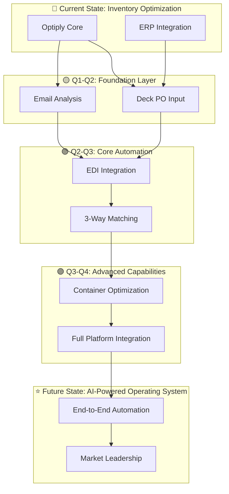

# Optiply Product Growth Roadmap 2026

## Product Growth Strategy: 1-Minute Overview

---

## 🎯 Product Growth Vision

**Transform Optiply from inventory optimization tool → AI-powered operating system for end-to-end supply chain management**

### Growth Strategy Ecosystem

---

## ❌ The Problem

Customers love our inventory optimization, but still waste **6-8 hours/day** on manual work:

- ❌ Double data entry (Optiply → ERP ✓, but manual supplier portal entry ✗)
- ❌ Manual email processing (supplier updates, availability, pricing)
- ❌ Expensive third-party EDI ($XXX,XXX/year)
- ❌ Time-consuming invoice matching (30-60 min each)
- ❌ No logistics optimization (high shipping costs)

**Result:** We're losing enterprise deals to competitors promising complete automation.

---

## ✅ The Solution: 5 Strategic Initiatives (All Starting February 2026)

| #   | Initiative                                         | Impact                                                      |
| --- | -------------------------------------------------- | ----------------------------------------------------------- |
| 1️⃣ | **AI-Powered PO Data Input** (Deck Partnership)    | Eliminate double data entry, 90% time savings, €75-100K ARR |
| 2️⃣ | **Supplier Email Analysis** (AI extraction)        | Auto-apply updates, 90% time savings, €60-90K ARR           |
| 3️⃣ | **In-House EDI Integration** (replace third-party) | 100% cost savings, real-time processing, €50-75K ARR        |
| 4️⃣ | **3-Way Matching Automation** (PO/GRN/Invoice)     | 95% time savings, near-zero errors, €45-75K ARR             |
| 5️⃣ | **Container Optimization** (freight partnerships)  | €1,000 customer savings/container, €120-288K gross profit   |

---

## 📊 Business Impact & Revenue Model

**Current State:**

- ARR: €2.5-3M
- Target EOY Impact: **+€250-300K (10% growth)**

**Revenue Split by Initiative:**

| Initiative                 | Revenue Driver                                                | Annual Contribution | % of €250-300K Target |
| -------------------------- | ------------------------------------------------------------- | ------------------- | --------------------- |
| **Deck PO Automation**     | Enterprise upsells (5-10 customers @ €10-20K increase)        | €75-100K            | **30-35%**            |
| **Email Analysis**         | Churn reduction (save 3-5 customers @ €20-30K ARR each)       | €60-90K             | **25-30%**            |
| **EDI Integration**        | Premium feature upsells (10-15 customers @ €5-10K)            | €50-75K             | **20-25%**            |
| **3-Way Matching**         | Enterprise expansion (3-5 new customers @ €15-25K)            | €45-75K             | **15-20%**            |
| **Container Optimization** | NEW revenue stream (20-30 containers/month @ €500-800 margin) | €120-288K/year      | **40-50%**            |

**Container Optimization Economics:**

- Customer pays: €2,000 (vs. €3,000 direct) = **€1,000 savings (33%)**
- Optiply pays freight forwarder: €1,500
- Gross profit per container: **€500-800**
- Target: 20-30 containers/month across 10-15 customers
- Annual gross profit: **€120-288K**

**Customer Efficiency:**

- Current: 6-8 hrs/day manual work
- Future: 1-2 hrs/day
- Reduction: **70%+ efficiency gain**

---

## 🗓️ 2026 Aggressive Timeline

**February 2026 (NOW - All Initiatives Start):**

- ✅ **Deck PO Input**: Contract signed, pilot testing started
- 🚀 **Email Analysis**: Prototype development begins
- 🚀 **EDI Integration**: Partnership discussions, architecture planning
- 🚀 **3-Way Matching**: Proof-of-concept with PDF parsing
- 🚀 **Container Optimization**: Freight forwarder outreach

**Q1 2026 (Mar-Apr): Rapid Pilots & Customer Validation**

- Deck: 3-5 pilot customers live (working with Joren on opt-ins)
- Email Analysis: Beta with 5-10 customers
- EDI: Pilot with 1-2 customers
- 3-Way Matching: Alpha testing
- Container Optimization: Partnership signed, pilot design

**Q2-Q3 2026 (May-Sep): Scale & Revenue Generation**

- All initiatives in production with growing customer base
- Revenue tracking and attribution
- Continuous optimization based on customer feedback

**Q4 2026 (Oct-Dec): Full Rollout & Target Achievement**

- All initiatives available to full customer base
- **Target: €250-300K additional ARR (10% of current €2.5-3M ARR)**

---

## 🎁 Competitive Differentiation

**Only inventory SaaS delivering:**

- ✅ End-to-end automation (supplier communication → invoice matching → logistics)
- ✅ AI-first platform (leveraging latest AI for every workflow)
- ✅ Ecosystem integration (EDI, email, portals, ERPs, freight forwarders)
- ✅ 70%+ operational efficiency gains

**Market Position:** From "inventory optimization tool" → "AI-powered supply chain operating system"

---

## 🌟 Product Growth Impact

**Revenue Opportunities (EOY 2026 Target: €250-300K):**

- **Deck PO Automation**: €75-100K (enterprise upsells, reduced churn)
- **Email Analysis**: €60-90K (churn reduction, retention)
- **EDI Integration**: €50-75K (premium feature upsells)
- **3-Way Matching**: €45-75K (enterprise expansion)
- **Container Optimization**: €120-288K (NEW marketplace revenue)

**Strategic Value:**

- Market leadership in AI-powered supply chain
- Defensible competitive moat (platform network effects)
- Customer lifetime value increase (70%+ efficiency gains drive retention)
- New revenue stream (container marketplace) with high margins

---

## 🎯 Product Growth Role: Driving Strategic Initiatives

**As Product Growth Lead, I will:**

1. **Orchestrate Partnerships:** Deck (PO automation), freight forwarders (container optimization), EDI standards
2. **Drive Market Differentiation:** Position Optiply as AI-first, end-to-end automation leader
3. **Enable Revenue Growth:** Unlock enterprise segment, reduce churn, create new revenue streams
4. **Coordinate Cross-Functional Execution:** Align engineering, product, sales, customer success teams

---

## 📈 Success Metrics

**North Star:** 70%+ reduction in customer manual work

**Key Indicators:**

- +25-40% ARR growth
- +15-20% retention improvement
- +10-15 NPS increase
- 80%+ customer adoption of new capabilities

---

## 🚀 Current Progress & Next Steps

**Completed (February 2026):**

- ✅ Deck contract signed
- ✅ Kick-off meeting with Deck completed
- ✅ Pilot testing started (supplier portal cart flow)
- ✅ Customer opt-in campaign launched (working with Joren - CS team)

**This Month (February 2026):**

- 🎯 Customer discovery calls (identify pain points, validate value)
- 🎯 Pilot customer recruitment (3-5 for Deck, 1-2 for EDI)
- 🎯 Email analysis prototype development
- 🎯 Freight forwarder partnership discussions
- 🎯 3-way matching proof-of-concept

**This Quarter (Q1 2026 - Move the Needle):**

- 🚀 Deck: 3-5 customers live, validate time savings
- 🚀 Email Analysis: Beta with 5-10 customers
- 🚀 EDI: 1-2 pilot customers (replace third-party)
- 🚀 Container Optimization: Partnership signed, first containers booked
- 🚀 Revenue tracking: Measure contribution to €250-300K target

---

**Full Details:** See spec:1984c48c-49c6-4764-ba8d-45fcab477126/a46c2cc7-9a1c-4ef1-8b7c-629653046ccc (Management Presentation: 8-page comprehensive plan)

**Questions?** Contact Product Growth Leadership

---

**TL;DR:** Product Growth roadmap for 2026 delivers end-to-end AI-powered supply chain automation through 5 strategic initiatives (all starting February 2026), targeting **€250-300K additional ARR (10% growth)** by EOY, with 70%+ customer efficiency gains and establishing Optiply as market leader. Container optimization alone could contribute €120-288K annually through marketplace model.